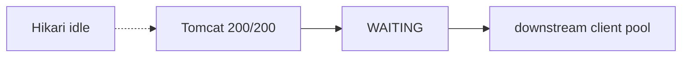

# AEJE-D-036 — Thread-pool exhaustion

- Type: incident
- Module: 8
- Maps to: INCIDENT-804
- Complexity: 3

```mermaid
flowchart LR
  HTTP[Tomcat 200/200] --> Wait[WAITING]
  Wait --> Down[downstream client pool]
  DB[Hikari idle] -.-> HTTP
```
