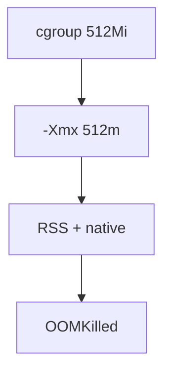

# AEJE-D-037 — Container OOM

- Type: incident
- Module: 8
- Maps to: INCIDENT-806
- Complexity: 3

```mermaid
flowchart TB
  Limit[cgroup 512Mi] --> Xmx[-Xmx 512m]
  Xmx --> RSS[RSS + native]
  RSS --> Kill[OOMKilled]
```
