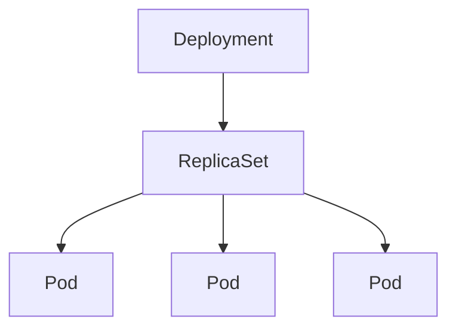

# AEJE-D-042 — Pods, Deployments and ReplicaSets

- Type: concept
- Module: 10
- Maps to: L-10.1
- Complexity: 1

```mermaid
flowchart TB
  D[Deployment] --> RS[ReplicaSet]
  RS --> P1[Pod]
  RS --> P2[Pod]
  RS --> P3[Pod]
```
