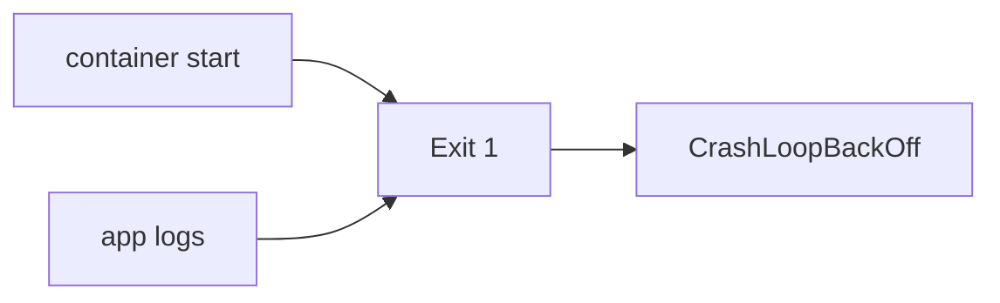

# AEJE-D-044 — CrashLoopBackOff

- Type: incident
- Module: 10
- Maps to: INCIDENT-1001
- Complexity: 3

```mermaid
flowchart LR
  Start[container start] --> Exit[Exit 1]
  Exit --> CLB[CrashLoopBackOff]
  Logs[app logs] --> Exit
```
