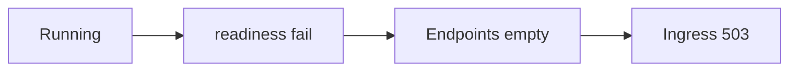

# AEJE-D-046 — Readiness failure

- Type: incident
- Module: 10
- Maps to: INCIDENT-1003
- Complexity: 3

```mermaid
flowchart LR
  Pod[Running] --> Probe[readiness fail]
  Probe --> EP[Endpoints empty]
  EP --> S503[Ingress 503]
```
