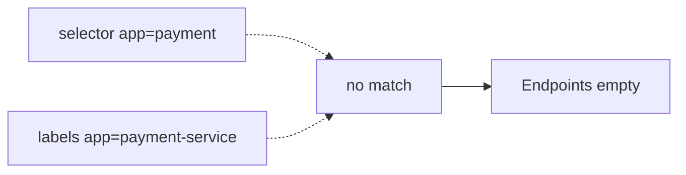

# AEJE-D-047 — Service routing failure

- Type: network
- Module: 10
- Maps to: INCIDENT-1006
- Complexity: 3

```mermaid
flowchart LR
  Svc[selector app=payment] -.-> X[no match]
  Dep[labels app=payment-service] -.-> X
  X --> Empty[Endpoints empty]
```
