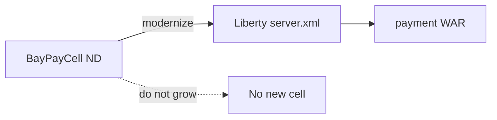

# AEJE-D-023 — Traditional WebSphere vs Liberty

- Type: current-state-target-state
- Module: 6
- Maps to: L-6.1
- Complexity: 2

```mermaid
flowchart LR
  ND[BayPayCell ND] -->|modernize| LIB[Liberty server.xml]
  ND -.->|do not grow| X[No new cell]
  LIB --> WAR[payment WAR]
```
