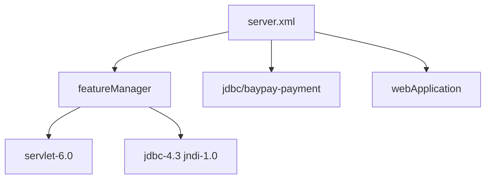

# AEJE-D-024 — Liberty features and server.xml

- Type: component
- Module: 6
- Maps to: L-6.2
- Complexity: 2

```mermaid
flowchart TB
  XML[server.xml] --> FM[featureManager]
  FM --> S[servlet-6.0]
  FM --> J[jdbc-4.3 jndi-1.0]
  XML --> DS[jdbc/baypay-payment]
  XML --> WAR[webApplication]
```
