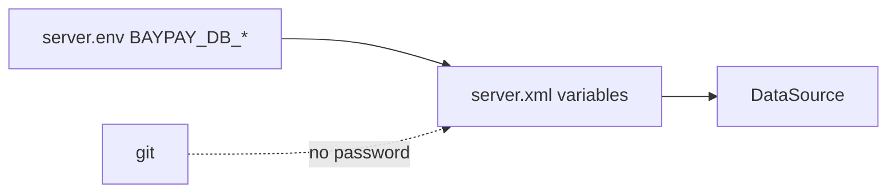

# AEJE-D-026 — Configuration externalization

- Type: modernization
- Module: 6
- Maps to: MODERNIZE-603
- Complexity: 3

```mermaid
flowchart LR
  ENV[server.env BAYPAY_DB_*] --> XML[server.xml variables]
  XML --> DS[DataSource]
  GIT[git] -.->|no password| XML
```
