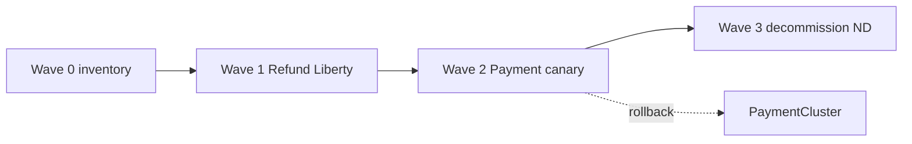

# AEJE-D-027 — Migration waves and rollback

- Type: modernization
- Module: 6
- Maps to: ARCHITECT-604
- Complexity: 4

```mermaid
flowchart LR
  W0[Wave 0 inventory] --> W1[Wave 1 Refund Liberty]
  W1 --> W2[Wave 2 Payment canary]
  W2 --> W3[Wave 3 decommission ND]
  W2 -.->|rollback| PC[PaymentCluster]
```
