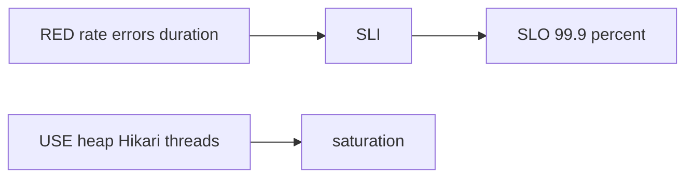

# AEJE-D-060 — RED, USE, SLI and SLO

- Type: concept
- Module: 13
- Maps to: L-13.2
- Complexity: 2

```mermaid
flowchart LR
  RED[RED rate errors duration] --> SLI[SLI]
  USE[USE heap Hikari threads] --> Sat[saturation]
  SLI --> SLO[SLO 99.9 percent]
```
