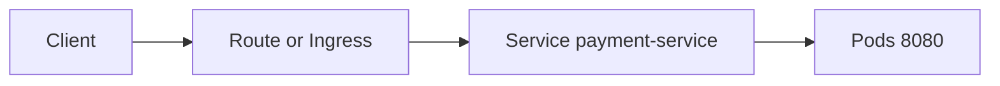

# AEJE-D-043 — OpenShift Routes vs Ingress

- Type: deployment
- Module: 10
- Maps to: L-10.2
- Complexity: 2

```mermaid
flowchart LR
  Client --> Route[Route or Ingress]
  Route --> Svc[Service payment-service]
  Svc --> Pods[Pods 8080]
```
