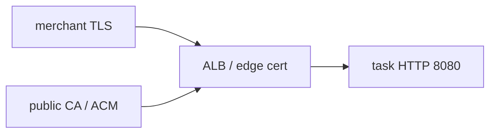

# AEJE-D-063 — TLS and PKI trust boundary

- Type: security-trust-boundary
- Module: 14
- Maps to: L-14.1
- Complexity: 2

```mermaid
flowchart LR
  Merch[merchant TLS] --> Edge[ALB / edge cert]
  Edge --> Task[task HTTP 8080]
  CA[public CA / ACM] --> Edge
```
