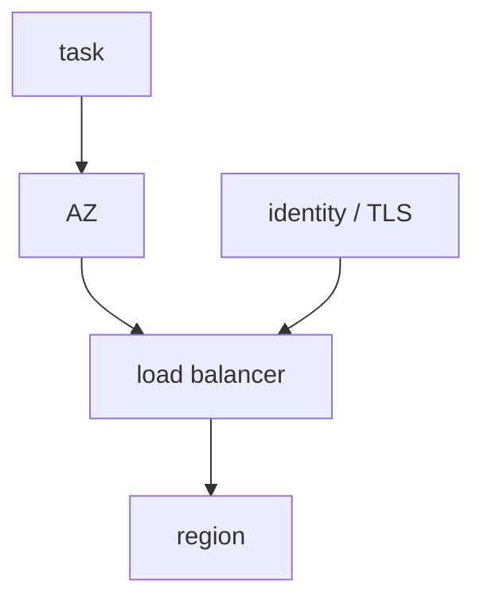

# AEJE-D-064 — 99.99 percent HA failure domains

- Type: deployment
- Module: 14
- Maps to: ARCHITECT-1401
- Complexity: 4

```mermaid
flowchart TB
  Task[task] --> AZ[AZ]
  AZ --> LB[load balancer]
  LB --> Reg[region]
  Id[identity / TLS] --> LB
```
