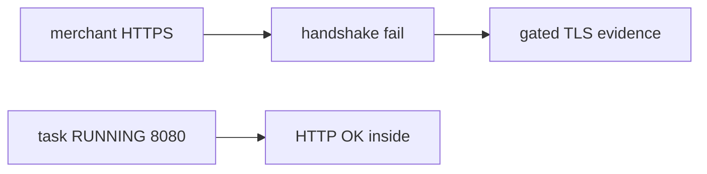

# AEJE-D-065 — Certificate expiration

- Type: incident
- Module: 14
- Maps to: INCIDENT-1402
- Complexity: 3

```mermaid
flowchart LR
  Merch[merchant HTTPS] --> HS[handshake fail]
  Task[task RUNNING 8080] --> OK[HTTP OK inside]
  HS --> Gate[gated TLS evidence]
```
