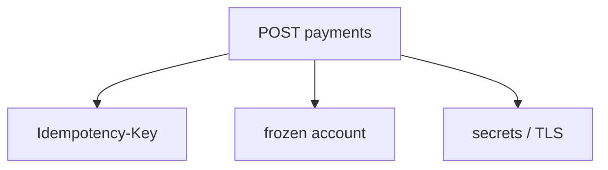

# AEJE-D-067 — BayPay threat model

- Type: security-trust-boundary
- Module: 14
- Maps to: SECURITY-1404
- Complexity: 4

```mermaid
flowchart TB
  API[POST payments] --> Idk[Idempotency-Key]
  API --> Frz[frozen account]
  API --> Sec[secrets / TLS]
```
