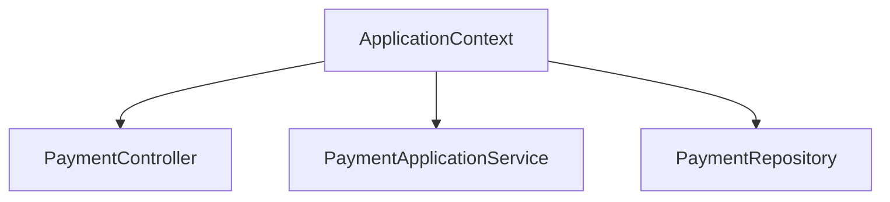

# AEJE-D-009 — Spring IoC container

- Type: concept
- Module: 3
- Maps to: L-3.1
- Complexity: 1

```mermaid
flowchart TB
  Ctx[ApplicationContext] --> Ctrl[PaymentController]
  Ctx --> Svc[PaymentApplicationService]
  Ctx --> Repo[PaymentRepository]
```
