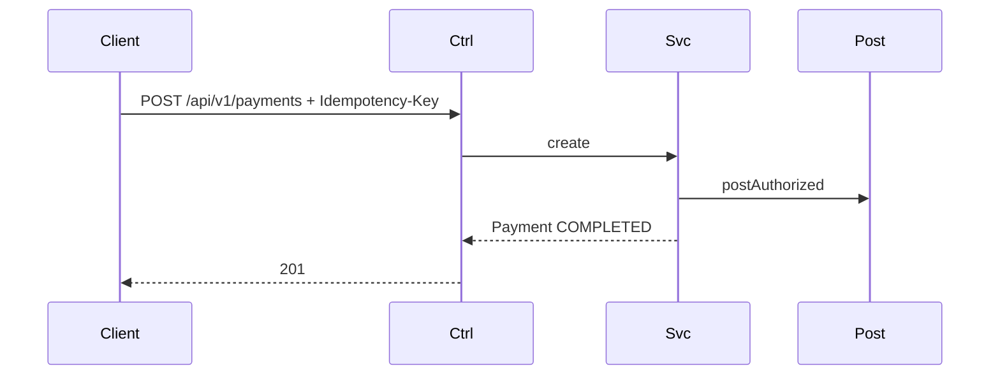

# AEJE-D-010 — Payment REST API request flow

- Type: request-flow
- Module: 3
- Maps to: BUILD-301
- Complexity: 2

```mermaid
sequenceDiagram
  Client->>Ctrl: POST /api/v1/payments + Idempotency-Key
  Ctrl->>Svc: create
  Svc->>Post: postAuthorized
  Svc-->>Ctrl: Payment COMPLETED
  Ctrl-->>Client: 201
```
