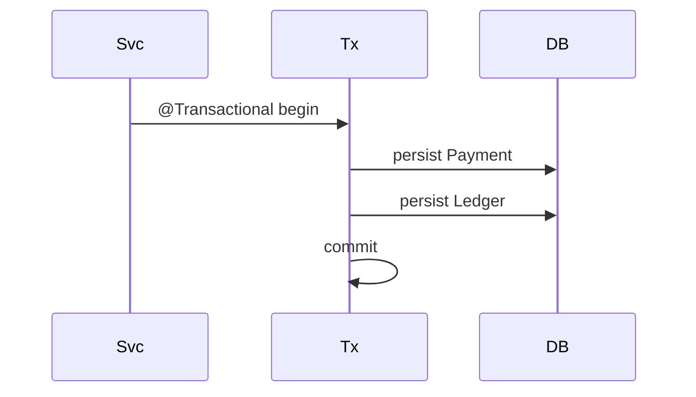

# AEJE-D-011 — JPA transaction boundary

- Type: sequence
- Module: 3
- Maps to: L-3.4
- Complexity: 2

```mermaid
sequenceDiagram
  Svc->>Tx: @Transactional begin
  Tx->>DB: persist Payment
  Tx->>DB: persist Ledger
  Tx->>Tx: commit
```
