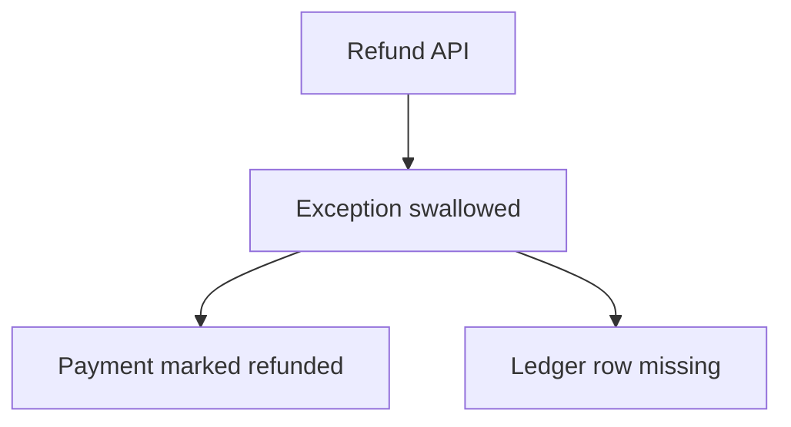

# AEJE-D-013 — Transaction rollback bug

- Type: incident
- Module: 3
- Maps to: FIX-304
- Complexity: 3

```mermaid
flowchart TB
  Refund[Refund API] --> Catch[Exception swallowed]
  Catch --> Pay[Payment marked refunded]
  Catch --> Gap[Ledger row missing]
```
