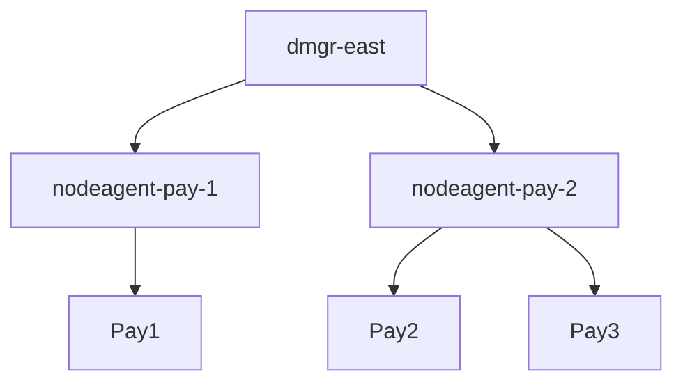

# AEJE-D-018 — WebSphere ND cell, DMGR, node, server

- Type: concept
- Module: 5
- Maps to: L-5.1
- Complexity: 1

```mermaid
flowchart TB
  DMGR[dmgr-east] --> NA1[nodeagent-pay-1]
  DMGR --> NA2[nodeagent-pay-2]
  NA1 --> Pay1[Pay1]
  NA2 --> Pay2[Pay2]
  NA2 --> Pay3[Pay3]
```
