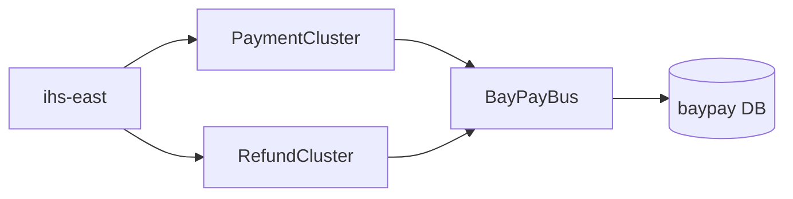

# AEJE-D-019 — BayPay WebSphere ND current state

- Type: deployment
- Module: 5
- Maps to: ARCHITECT-501
- Complexity: 3

```mermaid
flowchart LR
  IHS[ihs-east] --> PC[PaymentCluster]
  IHS --> RC[RefundCluster]
  PC --> BUS[BayPayBus]
  RC --> BUS
  BUS --> DB[(baypay DB)]
```
