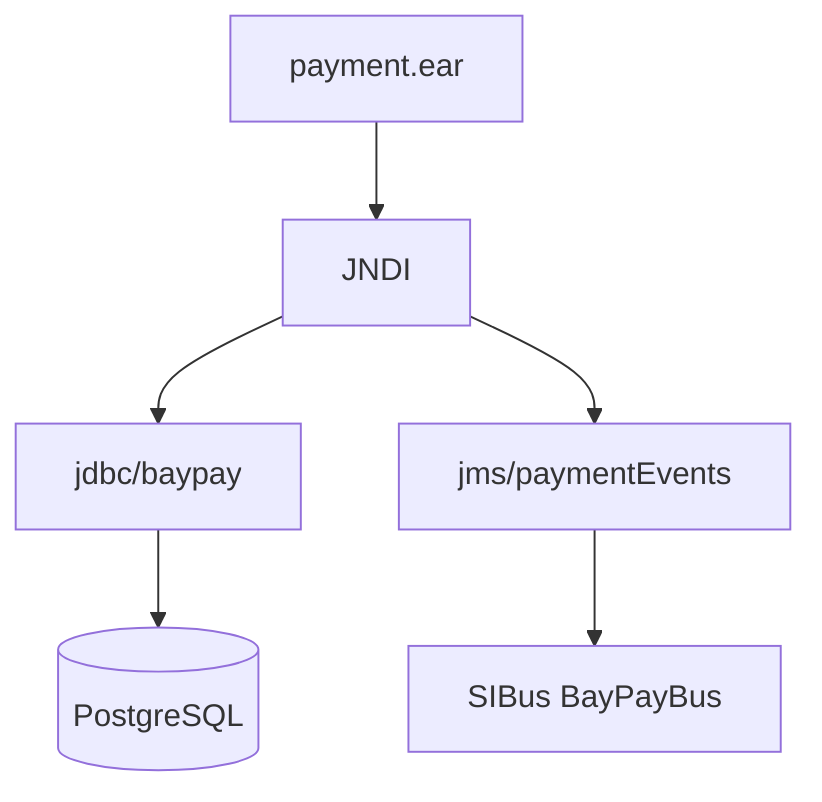

# AEJE-D-020 — JDBC, JNDI and JMS

- Type: component
- Module: 5
- Maps to: L-5.3
- Complexity: 2

```mermaid
flowchart TB
  App[payment.ear] --> JNDI[JNDI]
  JNDI --> JDBC[jdbc/baypay]
  JNDI --> JMS[jms/paymentEvents]
  JDBC --> DB[(PostgreSQL)]
  JMS --> BUS[SIBus BayPayBus]
```
