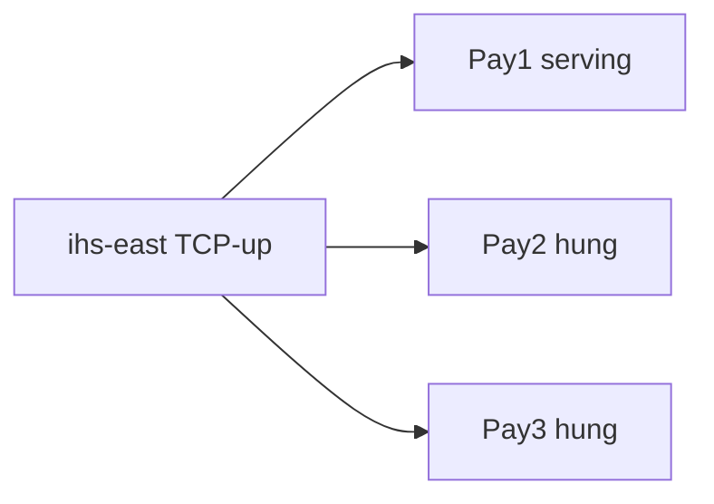

# AEJE-D-021 — Cluster members stop processing

- Type: incident
- Module: 5
- Maps to: INCIDENT-502
- Complexity: 3

```mermaid
flowchart LR
  IHS[ihs-east TCP-up] --> Pay1[Pay1 serving]
  IHS --> Pay2[Pay2 hung]
  IHS --> Pay3[Pay3 hung]
```
