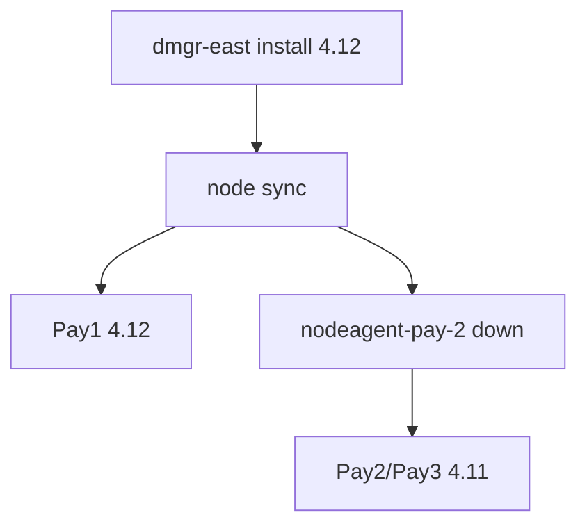

# AEJE-D-022 — Deployment failure

- Type: incident
- Module: 5
- Maps to: INCIDENT-504
- Complexity: 3

```mermaid
flowchart TB
  DMGR[dmgr-east install 4.12] --> Sync[node sync]
  Sync --> Pay1[Pay1 4.12]
  Sync --> Stuck[nodeagent-pay-2 down]
  Stuck --> Old[Pay2/Pay3 4.11]
```
