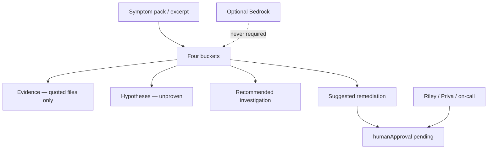

# AI-1501 — Incident summarization

**Type:** AI  
**Module:** 15 — BayOps AI — AI-Assisted Operations  
**Duration:** 45–60 minutes  
**Cost:** **$0**  
**awsLab:** no  
**Region:** `us-west-2` if AWS is sketched  
**Lessons:** L-15.1, L-15.2  
**Diagram:** AEJE-D-069 (BayOps AI architecture) · AEJE-D-068 (Evidence vs hypothesis)  
**Starter fixture:** [infrastructure/bayops-ai/fixtures/ai-1501-mixed-summary.json](../../infrastructure/bayops-ai/fixtures/ai-1501-mixed-summary.json)  
**Evidence excerpt:** [starter/evidence-excerpt.txt](starter/evidence-excerpt.txt)  
**Contract:** [datasets/baypay-ai/BAYOPS.md](../../datasets/baypay-ai/BAYOPS.md)  
**Schema:** [infrastructure/bayops-ai/schema/output.schema.json](../../infrastructure/bayops-ai/schema/output.schema.json)  
**Worksheet:** [student/worksheets/PF-ai.md](../../student/worksheets/PF-ai.md)

This lab is **file-first**. You rewrite a mixed BayOps dump into the four-bucket JSON contract. You are **not** calling Amazon Bedrock. You are **not** standing up Lambda, API Gateway, or DynamoDB. Reading the excerpt and writing valid JSON is enough to pass.

**Cost warning:** Live Bedrock is optional extra credit only. It is never required. If you ignore that and invoke a model in `us-west-2`, you pay for tokens and you still destroy the sketch the same day. The grade path stays paper plus JSON.

---

## Scenario

18:22 UTC on a synthetic `baypay-prod` afternoon, **2026-12-18**. Harbor Market reports that `POST /api/v1/payments` feels stuck. Completions dropped. P99 left the teaching SLO. 5xx are **not** what merchant success is calling about. Morgan Hale pasted a BayOps summary that says, in a proven tone, “the database is down.” Priya Nair will not page from that sentence. Riley Okonkwo wants the four buckets. You are the engineer on call. The excerpt is synthetic BayPay data.

---

## Business context

Avery Chen (`11111111-1111-1111-1111-111111111111`, active USD account `22222222-2222-2222-2222-222222222221`, written `…221`) posts `POST /api/v1/payments` with an `Idempotency-Key`. Example payment for this lab: `c1501d33-0000-4000-8000-111111111501`. A late **201** is still a missed authorization window for Harbor Market. Finance does not care that a model wrote “proven RCA.” They care that throughput collapsed and P99 left 400 ms.

The teaching process is `payment-service` (Java 21, Spring Boot 3.5.5) on port `8080` in `us-west-2` when AWS is named. A live AWS account is **not** required. A live model is **not** required.

Do not bounce Postgres. Do not bounce `dmgr-east`. Do not treat the mixed summary as if it already solved the page. Optional prior pack for the same **symptom class** (completions down, P99 up, 5xx quiet): `incidents/production/INC-PROD-1301`. This lab ships its own excerpt so you can finish without that folder.

---

## Learning objectives

- Separate **Evidence**, **Hypotheses (unproven)**, **Recommended investigation**, and **Suggested remediation**.
- Quote only files you opened. Refuse an invented path and a proven-RCA field.
- Rewrite a mixed “the database is down” summary of a **throughput drop + P99 rise** pack into schema-valid JSON.
- Leave `humanApproval` as `pending` until a named human (Riley Okonkwo, Priya Nair, or you on call) writes `approved` or `rejected`.
- Keep PAN, `BAYPAY_DB_PASSWORD`, and live keys out of the fixture.
- Record the four-bucket rewrite on PF-ai.md in your words.

---

## Architecture

Course diagram **AEJE-D-069** is the paper BayOps sketch. **AEJE-D-068** is the evidence-versus-hypothesis split. Until the PNGs are on disk, use the mermaid below plus BAYOPS.md.



Alt text: An operator reads a synthetic excerpt and writes four labeled buckets. Evidence may quote only opened files. Hypotheses stay unproven. Remediation waits on a named human. Amazon Bedrock is optional and not on the grade path.

### Service list

| Piece | In this lab? | Live apply? |
|---|---|---|
| Evidence excerpt | Yes — `starter/evidence-excerpt.txt` | No |
| Mixed BayOps starter | Yes — `ai-1501-mixed-summary.json` | No |
| Output schema | Yes — paper validate | No |
| Amazon Bedrock | Named only | Extra credit; destroy same day |
| API Gateway / Lambda / S3 / DynamoDB | Paper sketch on AEJE-D-069 | Do not apply |
| RDS / `dmgr-east` | Not in the excerpt | Do not bounce |

### Region assumptions

`us-west-2` when AWS is named. Service `payment-service`. Golden URI `POST /api/v1/payments`. Teaching SLO: P99 **< 400 ms**, availability **99.9%**.

### Least-privilege / security notes

- On-call needs read on the excerpt and the schema. Not `AdministratorAccess`.
- Do not send PAN or `BAYPAY_DB_PASSWORD` to a model.
- Do not put Avery’s UUID on a metric label in any extra-credit prompt.

### Failure scenario

Copying “the database is down” as proven RCA, auto-approving a bounce, or inventing `invented/db-down.txt` fails Diagnostic method and Production awareness even if your JSON parses.

---

## Prerequisites

- [BAYOPS.md](../../datasets/baypay-ai/BAYOPS.md) — four buckets, `humanApproval`, refusals.
- [output.schema.json](../../infrastructure/bayops-ai/schema/output.schema.json).
- Ability to read a short RED excerpt (rate, P99, 5xx, Hikari pending).
- Lessons L-15.1–L-15.2 if present. They stand alone; this lab does not wait on a live model.
- Diagrams AEJE-D-068 and AEJE-D-069.

---

## Environment setup

Copy the starter and the excerpt:

```bash
mkdir -p /tmp/aeje-ai-1501
cp infrastructure/bayops-ai/fixtures/ai-1501-mixed-summary.json /tmp/aeje-ai-1501/mixed.json
cp labs/AI-1501/starter/evidence-excerpt.txt /tmp/aeje-ai-1501/evidence-excerpt.txt
cp infrastructure/bayops-ai/schema/output.schema.json /tmp/aeje-ai-1501/output.schema.json
cd /tmp/aeje-ai-1501
```

Open BAYOPS.md in another pane. Edit a **new** file, `/tmp/aeje-ai-1501/output.json`. Leave the class fixture mixed.

You will **not** run Bedrock, `aws`, or Terraform. Optional JSON parse (skip if `python3` is missing):

```bash
# extra credit — not the grade path
python3 -c "import json; json.load(open('output.json')); print('ok')"
```

Do not open `solutions/AI-1501/` until your checklist is green. Do not create an AMP workspace or a Bedrock provisioned throughput “to summarize better.”

---

## Challenge/tasks

1. **Read the excerpt first.** `starter/evidence-excerpt.txt` is a **throughput drop + P99 rise** symptom pack. List rate, P99, whether 5xx dominate, Hikari pending, and Avery’s late 201. Write those quotes before you touch the mixed JSON.
2. **Read the mixed starter.** `ai-1501-mixed-summary.json` collapses the page into “the database is down,” marks a hypothesis `proven`, cites `invented/db-down.txt`, auto-approves a bounce of Postgres and `dmgr-east`, and sets `provenRootCause` to a string. Circle every contract violation.
3. **Rewrite four buckets** into `output.json` that matches the schema:
   - **Evidence** — path, timestamp, quote from the excerpt you opened. No invented file.
   - **Hypotheses** — ranked, `status` only `unproven`, `weakened`, or `withdrawn`. Withdraw or weaken “the database is down” if the excerpt contradicts it (Hikari pending **0**; no database metrics file).
   - **Recommended investigation** — the *next* omitted evidence kind or gate, and why. Do not skip to bounce.
   - **Suggested remediation** — stabilize first. Every mutating action has `approvalRequired: true`.
4. **humanApproval.** Status `pending` unless *you* (named) write `approved` or `rejected` with a time. BayOps-auto is not a human.
5. **No proven RCA field.** Omit `provenRootCause` or set it to `null`. Never emit `status: "proven"`.
6. **No secrets.** No PAN, no `BAYPAY_DB_PASSWORD`, no access keys.
7. **Optional prior pack.** If you already worked INC-PROD-1301, you may use it as extra symptom context. You still quote *this* excerpt. Do not paste an instructor folder.
8. **Worksheet.** Fill the four-bucket rewrite section of PF-ai.md in your words.

---

## Validation

- [ ] `output.json` has `incidentId`, `service`=`payment-service`, `evidence`, `hypotheses`, `recommendedInvestigation`, `suggestedRemediation`, `humanApproval`.
- [ ] Every evidence `source` is a file you opened. `invented/db-down.txt` is gone.
- [ ] Every hypothesis `status` is `unproven`, `weakened`, or `withdrawn`. None is `proven`.
- [ ] The rewrite describes completions down and P99 up. It does not announce “the database is down” as RCA.
- [ ] Suggested remediations set `approvalRequired: true`. You did not bounce Postgres or `dmgr-east`.
- [ ] `humanApproval.status` is `pending`, or a named human `approved`/`rejected` with a note. Not `BayOps-auto`.
- [ ] `provenRootCause` is absent or `null`.
- [ ] JSON parses. You did not require Bedrock or an AWS apply to pass.
- [ ] PF-ai.md four-bucket section is filled in your words.

Instructor scores with [instructor/rubrics/AI-1501.md](../../instructor/rubrics/AI-1501.md).

---

## Troubleshooting

| Symptom | What to check |
|---|---|
| Starter says proven RCA | That is the defect. Split into four buckets. |
| Tempted to keep “database is down” because models sound sure | Quote Hikari pending and the omitted-metrics line. Weaken or withdraw that hypothesis. |
| Only one hypothesis and it is a bounce | Rank at least two unproven statements that fit the excerpt. |
| Set `humanApproval` to approved so the file “looks finished” | Pending is correct until a named human signs. |
| Wanted Bedrock to rewrite it | Optional extra credit. The grade is your JSON. |
| Copied a prior module’s instructor RCA into the summary | Stop. This lab grades method on the excerpt, not a hallway label. |
| JSON invalid after an edit | Trailing commas. Re-parse with `python3` if you have it. |
| Put Avery’s PAN or a password in a prompt | Delete it. Synthetic ids only. |

---

## Expected outcome

A schema-shaped `output.json` a Staff engineer could brief from: quoted rate and P99, unproven hypotheses, a next investigation that is not a bounce, remediations that wait on a human. Files match the intent of `solutions/AI-1501/` even if you named hypothesis ids differently or kept `humanApproval` pending instead of a signed reject of the mixed bounce.

---

## Interview questions

1. Why is a single “Root cause: the database is down” sentence illegal under the BayOps contract?
2. What may **Evidence** contain, and what must it never invent?
3. Why can throughput and P99 move together while 5xx stay boring?
4. When does `humanApproval` leave `pending`?
5. Why is live Bedrock not the grade bar for a summarization lab?

---

## Architecture/trade-off questions

1. Paper JSON plus a schema versus retrieve → Bedrock → validate on Lambda — what does each cost, and what does this lab refuse to require?
2. Why keep hypotheses unproven even when a model writes in a confident tone?
3. Why is bouncing `dmgr-east` unrelated to a RED excerpt that never names the leftover cell?
4. Should `provenRootCause` exist on the schema at all, or only as a forbidden null?
5. What belongs in logs or traces for Avery’s payment, and what must never go into a model prompt?

---

## Cleanup

No cloud resources on the grade path. Delete `/tmp/aeje-ai-1501` if you used it. Leave the class fixture mixed. Do not commit PAN or a live key.

```bash
rm -rf /tmp/aeje-ai-1501
```

If you ignored the cost warning and invoked Bedrock or applied API Gateway / DynamoDB in `us-west-2`, destroy those tagged resources (`Course=AEJE`, `Module=15`) the same day.

---

## Cost estimate

**Grade path: $0.** Paper excerpt plus JSON. No AWS API. No required model.

**Extra-credit live Bedrock:** tokens plus any idle API Gateway or DynamoDB if you sketched the AEJE-D-069 path. Estimate before invoke. Prefer on-demand, short-lived, tagged, destroy-after-lab. Do **not** apply NAT Gateway, EKS, OpenSearch, or provisioned throughput “for realism.”

---

## Hidden/revealable solution

Edit your copy first. Instructor files: `solutions/AI-1501/`. Opening them before you rewrite the four buckets is a failed Diagnostic method score.

<details>
<summary>Reveal checklist — after you have rewritten the mixed JSON</summary>

Required: four buckets; quotes from `evidence-excerpt.txt` for rate and P99; no `invented/db-down.txt`; no `status: proven`; no string `provenRootCause`; Hikari pending used to weaken or withdraw “database is down”; remediations `approvalRequired: true`; no Postgres or `dmgr-east` bounce; `humanApproval` pending or signed by a named human; JSON parses; PF-ai.md in your words. If any fail, fix your file before `solutions/`.

</details>

---

## What you learned

A mixed summary that says “the database is down” in a proven tone is not an incident write-up. AEJE-D-068 is the split between a quoted file and an unproven hypothesis. AEJE-D-069 is the paper architecture that still waits on a human. You did not need Bedrock to enforce the contract.

---

## Portfolio deliverable

Complete the **identity** and **four-bucket rewrite** sections of [PF-ai.md](../../student/worksheets/PF-ai.md). Cite AEJE-D-068 / AEJE-D-069. Attach your `output.json`. Do not paste `solutions/AI-1501/`.
