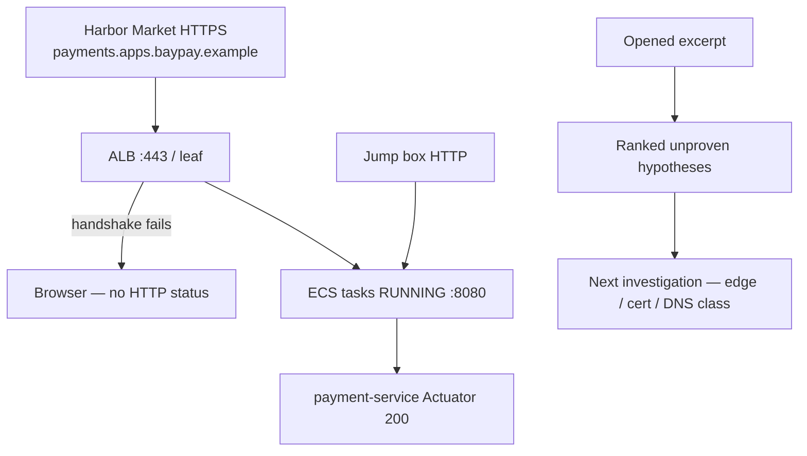

# AI-1502 — RCA hypotheses

**Type:** AI  
**Module:** 15 — BayOps AI — AI-Assisted Operations  
**Duration:** 45–60 minutes  
**Cost:** **$0**  
**awsLab:** no  
**Region:** `us-west-2`  
**Lessons:** L-15.2, L-15.3  
**Diagram:** AEJE-D-068 (Evidence vs hypothesis)  
**Starter:** [starter/hypotheses.json](starter/hypotheses.json)  
**Evidence excerpt:** [starter/evidence-excerpt.txt](starter/evidence-excerpt.txt)  
**Contract:** [datasets/baypay-ai/BAYOPS.md](../../datasets/baypay-ai/BAYOPS.md)  
**Schema:** [infrastructure/bayops-ai/schema/output.schema.json](../../infrastructure/bayops-ai/schema/output.schema.json)  
**Worksheet:** [student/worksheets/PF-ai.md](../../student/worksheets/PF-ai.md)

This lab is **file-first**. You replace a too-thin, too-sure hypothesis list with ranked **unproven** statements and a next investigation. You are **not** calling Amazon Bedrock. You are **not** requesting ACM or editing Route 53. Reading the excerpt and writing valid JSON is enough to pass.

**Cost warning:** Live Bedrock is optional extra credit only. It is never required. Do not `aws acm` or `aws route53` against a paid account “to confirm.” If leftover Module 11–12 resources exist, destroy them on those labs’ cleanup paths — not as an experiment during this write-up.

---

## Scenario

00:15 Pacific on a synthetic `baypay-prod` night (**2026-09-02**, 07:15 UTC). Harbor Market cannot complete HTTPS to `payments.apps.baypay.example`. The pager names `payment-service` on ECS in `us-west-2`. Priya Nair says the tasks are still **RUNNING**. A jump box reaches HTTP `:8080`. Morgan Hale’s BayOps dump has **one** hypothesis, marked **proven**: bounce `dmgr-east`. Riley Okonkwo wants ranked unproven hypotheses and a next gate. You are the engineer on call. The excerpt is synthetic BayPay data.

---

## Business context

Avery Chen’s client (`11111111-1111-1111-1111-111111111111`, active USD account `22222222-2222-2222-2222-222222222221`) never leaves the browser when the handshake fails. Example payment `c1502e44-0000-4000-8000-111111111502` is stuck client-side. A handshake failure is not a domain decline and not a 502 from an empty target group.

Do not bounce Postgres. Do not bounce `dmgr-east`. Do not disable TLS to “restore HTTP.” HTTP from a jump box to task `:8080` can succeed while merchants fail TLS. That is a **symptom class**, not an RCA. Quote this lab’s excerpt.

Optional prior pack for the same symptom class: `incidents/production/INC-SEC-1402`. This lab ships its own excerpt so you can finish without opening that folder’s later gates.

---

## Learning objectives

- Write **more than one** hypothesis and keep every one `unproven` (or `weakened` / `withdrawn`).
- Refuse “bounce the cell” as the only statement, and refuse `status: proven`.
- Separate “tasks are RUNNING” and “`:8080` answers” from “merchants can complete HTTPS.”
- Name the **next investigation** (edge / certificate / DNS *class*) without skipping to a mutate.
- Leave `humanApproval` `pending` on any mutating suggestion.
- Record ranked hypotheses on PF-ai.md in your words, not by pasting an instructor folder.

---

## Architecture

Course diagram **AEJE-D-068** is the evidence-versus-hypothesis split. Until the PNG is on disk, use the mermaid below plus BAYOPS.md.



Alt text: Merchants fail HTTPS at the edge while ECS tasks stay RUNNING and HTTP on 8080 answers. The student writes ranked unproven hypotheses and names the next investigation. The student guide does not name a proven root cause.

### Service list

| Service | In this excerpt? | Live apply? |
|---|---|---|
| Client TLS / handshake paste | Yes — excerpt | No |
| ECS tasks RUNNING | Yes — quoted | No |
| HTTP `:8080` Actuator | Yes — 200 | No |
| ACM describe / Route 53 list | **Not in this excerpt** | Do not request or change |
| RDS / `dmgr-east` | No | Do not bounce |
| Bedrock | Named only | Extra credit only |

### Region assumptions

`us-west-2`. Cluster `baypay-prod-west`. Service `payment-service`. Teaching host `payments.apps.baypay.example`.

### Least-privilege / security notes

- On-call needs read on the excerpt. Paper `acm:Describe*` / `route53:List*` are the *next* investigation — not an apply.
- Do not paste a private key into the JSON.
- Do not turn TLS off on the listener.

### Failure scenario

One hypothesis marked proven, “bounce the cell,” or a lucky “cert expired” marked proven with no quotes from the excerpt, fails Diagnostic method even if the catalog title sounds like TLS.

---

## Prerequisites

- AI-1501 literacy (four buckets) helps; you may still start here.
- [BAYOPS.md](../../datasets/baypay-ai/BAYOPS.md) and [output.schema.json](../../infrastructure/bayops-ai/schema/output.schema.json).
- Lessons L-15.2–L-15.3 if present.
- Diagram AEJE-D-068.

---

## Environment setup

```bash
mkdir -p /tmp/aeje-ai-1502
cp labs/AI-1502/starter/hypotheses.json /tmp/aeje-ai-1502/hypotheses.json
cp labs/AI-1502/starter/evidence-excerpt.txt /tmp/aeje-ai-1502/evidence-excerpt.txt
cp infrastructure/bayops-ai/schema/output.schema.json /tmp/aeje-ai-1502/output.schema.json
cd /tmp/aeje-ai-1502
```

Write a **new** `/tmp/aeje-ai-1502/output.json`. Leave the class starter thin and “proven.”

You will **not** run `aws acm`, `aws route53`, or Bedrock on the grade path. Optional parse:

```bash
# extra credit — not the grade path
python3 -c "import json; json.load(open('output.json')); print('ok')"
```

Do not open `solutions/AI-1502/` until the checklist is green.

---

## Challenge/tasks

1. **Read the excerpt.** Quote the merchant HTTPS failure, `lastStatus=RUNNING`, and the `:8080` **200**. Note what the excerpt does **not** contain (no ACM paste, no zone dump, no database file).
2. **Read the starter.** `hypotheses.json` has too few hypotheses, marks one `proven`, and only wants to bounce the leftover cell. Circle the contract breaks: `status: proven`, empty `fitsEvidence`, auto-approve, `approvalRequired: false`.
3. **Write ranked unproven hypotheses** (at least three) that fit the opened lines, for example:
   - Edge / leaf / handshake problem on `:443` (unproven until more files).
   - App-down is a weak fit because tasks are RUNNING and `:8080` answers (weaken or withdraw).
   - Leftover ND cell as the path (withdraw — the excerpt never puts `dmgr-east` on HTTPS).
   - Database outage (withdraw or weaken — no metrics file; handshake never reached Spring).
4. **Recommended investigation.** Name the *next* evidence kind in the certificate / ACM / DNS **class** and why. Do not skip to bounce. Do not present that next file as already opened.
5. **Suggested remediation.** Stabilize the merchant HTTPS path in words that still need approval. `approvalRequired: true`. No TLS disable. No ND bounce. No Postgres bounce.
6. **humanApproval.** `pending` (or a named reject of the cell bounce). Not `BayOps-auto`.
7. **Lucky labels.** If you write “the cert expired,” you must quote the excerpt line you used, and you must still leave the hypothesis **unproven**. A proven stamp without quotes does not max Diagnostic method.
8. **Worksheet.** Add your ranked list to PF-ai.md in your words.

---

## Validation

- [ ] At least three hypotheses. None uses `status: proven`.
- [ ] “Bounce the cell” is not the only statement. If present, it is `withdrawn` or clearly not the path.
- [ ] Evidence quotes handshake failure, RUNNING tasks, and `:8080` 200 from the excerpt.
- [ ] Recommended investigation names a certificate / ACM / DNS **next step**, not a mutate.
- [ ] No `provenRootCause` string. Schema-shaped JSON parses.
- [ ] Remediations `approvalRequired: true`. TLS stays on. No `dmgr-east`. No Postgres bounce.
- [ ] `humanApproval` is `pending` or a named human decision.
- [ ] You did not require Bedrock, ACM request, or Route 53 apply.
- [ ] PF-ai.md includes this ranked list in your words.

Instructor scores with [instructor/rubrics/AI-1502.md](../../instructor/rubrics/AI-1502.md).

---

## Troubleshooting

| Symptom | What to check |
|---|---|
| Starter has one proven bounce | That is the gap. Rank unproven statements. |
| “Cert expired” feels obvious | Quote the openssl / curl line. Keep `unproven`. Name the next file you would open. |
| Wanted to open INC-SEC-1402 gate 3 first | Optional prior pack. This excerpt is enough. Do not skip to a later folder to steal an answer. |
| Tempted to disable TLS | Rejected stabilize. Merchants need HTTPS. |
| Tempted to bounce `dmgr-east` because Morgan offered | Leftover cell is not on the merchant path. |
| Only two hypotheses | Add a withdrawn or weakened one that the excerpt actually rules down. |
| Marked proven so the schema “has an RCA” | The schema forbids proven. That is the point. |

---

## Expected outcome

A schema-shaped `output.json` with ranked **unproven** hypotheses, a next investigation in the cert / ACM / DNS class, and no proven RCA. Instructors can score method even if your first hypothesis is wrong. The student guide will not tell you what a later ACM or DNS file would say.

---

## Interview questions

1. Why is “tasks are RUNNING” not the same sentence as “merchants can pay”?
2. Why must a hypothesis that fits the handshake still stay unproven?
3. What does a jump-box `:8080` 200 tell you, and what does it not tell you?
4. Why is a single “bounce the cell” hypothesis a production-awareness fail?
5. How would you explain unproven versus proven to a Staff interviewer using AEJE-D-068?

---

## Architecture/trade-off questions

1. Investigate ACM / DNS next versus bounce tasks now — who is faster, what do you still owe Harbor Market?
2. Paper excerpt versus live `openssl` against prod — what does this lab refuse to require?
3. Why is HTTP-only “so merchants work” a failed stabilize even if it is fast?
4. How many hypotheses are enough, and when do you withdraw one?
5. Why is leftover `PaymentCluster` still in the estate but out of this path?

---

## Cleanup

```bash
rm -rf /tmp/aeje-ai-1502
```

No cloud resources on the grade path. If you invoked Bedrock or touched ACM / Route 53 in a paid account, stop and destroy leftovers in `us-west-2` now.

---

## Cost estimate

**Grade path: $0.** Excerpt plus JSON.

**Misuse path:** live ACM request, Route 53 change, or Bedrock tokens are dollars. Do not do that to pass. Extra-credit Bedrock stays short-lived, tagged `Course=AEJE`, `Module=15`, destroy the same day. No NAT, EKS, or OpenSearch.

---

## Hidden/revealable solution

Submit your `output.json` first. Instructors use `solutions/AI-1502/` and `instructor/rubrics/AI-1502.md`. Opening the solution before you rank unproven hypotheses is a failed Diagnostic method score.

<details>
<summary>Reveal checklist — after you have rewritten the starter</summary>

Required: ≥3 hypotheses; no `proven`; cell bounce withdrawn or absent; quotes for HTTPS fail + RUNNING + `:8080` 200; next investigation in the cert / ACM / DNS class; remediations need approval; no TLS-off; no Postgres bounce; `humanApproval` pending or named; JSON parses. A lucky “cert expired” as proven without those quotes does not pass the checklist.

</details>

---

## What you learned

RUNNING tasks and a green Actuator do not restore HTTPS. Ranked unproven hypotheses plus a next investigation are the job. A model that marks “bounce the cell” proven has already failed the contract. AEJE-D-068 is that split.

---

## Portfolio deliverable

Add this lab’s **ranked hypotheses** and **next investigation** to [PF-ai.md](../../student/worksheets/PF-ai.md) in your words. Attach `output.json`. Do not paste `solutions/AI-1502/`.
