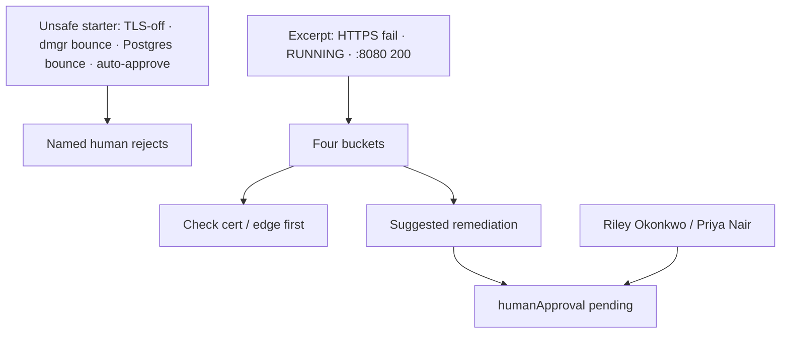

# AI-1503 — Runbook recommendation

**Type:** AI  
**Module:** 15 — BayOps AI — AI-Assisted Operations  
**Duration:** 45–60 minutes  
**Cost:** **$0**  
**awsLab:** no  
**Region:** `us-west-2`  
**Lessons:** L-15.4, L-15.5  
**Diagram:** AEJE-D-070 (Human approval and hallucination detection)  
**Starter:** [starter/runbook.json](starter/runbook.json)  
**Evidence excerpt:** [starter/evidence-excerpt.txt](starter/evidence-excerpt.txt)  
**Contract:** [datasets/baypay-ai/BAYOPS.md](../../datasets/baypay-ai/BAYOPS.md)  
**Schema:** [infrastructure/bayops-ai/schema/output.schema.json](../../infrastructure/bayops-ai/schema/output.schema.json)  
**Worksheet:** [student/worksheets/PF-ai.md](../../student/worksheets/PF-ai.md)

This lab is **file-first**. You replace an unsafe auto-approved runbook with a four-bucket recommendation that **checks the cert / edge**, **requires human approval**, and refuses TLS-off and leftover-ND bounces. You are **not** applying a listener change. You are **not** calling Bedrock.

**Cost warning:** Live Bedrock is optional extra credit only. It is never required. Do not disable TLS on a real ALB “to see if Harbor Market returns.” Do not bounce a leftover cell. Grade path is paper plus JSON.

---

## Scenario

Same synthetic night as AI-1502. Merchants still fail HTTPS to `payments.apps.baypay.example`. Tasks stay **RUNNING**. `:8080` still answers. Morgan Hale’s BayOps runbook now says: disable TLS, bounce `dmgr-east`, bounce Postgres, and **auto-approve**. Priya Nair will reject that on sight. Riley Okonkwo wants a runbook a Staff engineer could sign. You are the engineer on call. The excerpt is synthetic BayPay data.

---

## Business context

Avery Chen (`11111111-1111-1111-1111-111111111111`, account `…221` / `22222222-2222-2222-2222-222222222221`) still has payment `c1502e44-0000-4000-8000-111111111502` stuck in the browser. Restoring HTTP by turning TLS off is not a stabilize — it is a trust failure. Bouncing Postgres when no database file shipped is theater. Bouncing `dmgr-east` recycles a leftover cell that is not on the Fargate path. Jordan Voss will not sign an auto-approve.

The teaching host remains `payments.apps.baypay.example` in `us-west-2`. A live AWS account is **not** required.

---

## Learning objectives

- Rewrite an unsafe runbook into the four-bucket contract.
- Put **cert / edge checks** in recommended investigation (or as non-mutating first actions).
- Require `humanApproval` on every mutating suggestion (`approvalRequired: true`).
- Refuse disable-TLS, `dmgr-east` / PaymentCluster bounce, and Postgres bounce.
- Keep hypotheses unproven. Do not stamp the runbook as proven RCA.
- Record the approval-aware runbook on PF-ai.md in your words.

---

## Architecture

Course diagram **AEJE-D-070** is human approval in front of mutate. Until the PNG is on disk, use the mermaid below plus BAYOPS.md.



Alt text: An unsafe auto-approved runbook is rejected. The operator writes four buckets that check the certificate and edge first. Any mutate waits on a named human. Leftover ND and TLS-off are not on the path.

### Service list

| Piece | In this lab? | Live apply? |
|---|---|---|
| Unsafe runbook starter | Yes — `starter/runbook.json` | No |
| HTTPS / RUNNING excerpt | Yes | No |
| ALB listener mutate | Named only | Do not apply |
| ACM / DNS | Next-check class | Do not request or edit |
| Postgres / `dmgr-east` | Not in path | Do not bounce |
| Bedrock | Named only | Extra credit only |

### Region assumptions

`us-west-2`. Service `payment-service`. Port `8080`. Merchant path is HTTPS `:443`.

### Least-privilege / security notes

- Paper runbook may name `acm:Describe*`, listener read, and a signed attach of a valid leaf. Not `AdministratorAccess`.
- Do not paste a private key.
- Do not send PAN to a model.

### Failure scenario

Shipping the starter with `humanApproval.approved` by `BayOps-auto`, or “fixing” prod by TLS-off / cell bounce / Postgres bounce, fails Production awareness and Security / reliability even if JSON parses.

---

## Prerequisites

- AI-1502 (ranked unproven hypotheses) helps; the excerpt here is enough to start.
- [BAYOPS.md](../../datasets/baypay-ai/BAYOPS.md) fifth field: `humanApproval`.
- Lessons L-15.4–L-15.5 if present.
- Diagram AEJE-D-070.

---

## Environment setup

```bash
mkdir -p /tmp/aeje-ai-1503
cp labs/AI-1503/starter/runbook.json /tmp/aeje-ai-1503/runbook.json
cp labs/AI-1503/starter/evidence-excerpt.txt /tmp/aeje-ai-1503/evidence-excerpt.txt
cp infrastructure/bayops-ai/schema/output.schema.json /tmp/aeje-ai-1503/output.schema.json
cd /tmp/aeje-ai-1503
```

Write `/tmp/aeje-ai-1503/output.json`. Leave the class starter unsafe.

You will **not** apply a listener, request ACM, or bounce anything. Optional parse:

```bash
# extra credit — not the grade path
python3 -c "import json; json.load(open('output.json')); print('ok')"
```

Do not open `solutions/AI-1503/` until the checklist is green.

---

## Challenge/tasks

1. **Read the unsafe starter.** `runbook.json` disables TLS, bounces `dmgr-east`, bounces Postgres, marks a hypothesis proven, and auto-approves. List each mutate and why Priya would reject it.
2. **Read the excerpt.** Quote handshake failure, RUNNING tasks, `:8080` 200, and the lines that say leftover ND is out of path and TLS must stay on.
3. **Rewrite four buckets:**
   - **Evidence** — only the excerpt (and AI-1502 excerpt if you still have it). No invented DB file.
   - **Hypotheses** — unproven edge / leaf statements; withdraw TLS-off-as-fix, cell-as-path, and database-as-RCA.
   - **Recommended investigation** — check the cert / edge (describe the leaf, confirm what the listener presents, decide what DNS or ACM file you would open next). Non-mutating.
   - **Suggested remediation** — restore HTTPS without TLS-off; each action `mutatesProduction` as appropriate and `approvalRequired: true`.
4. **humanApproval.** `pending` until Riley Okonkwo or Priya Nair (or you, named) signs. Reject the starter’s auto-approve in the `note` if you want that on the record.
5. **Hard refusals.** No `Disable TLS`. No `Bounce dmgr-east`. No `Bounce Postgres`. No `approvalRequired: false`.
6. **incidentId.** Use `INC-AI-1503` (this write-up) or `INC-AI-1502` if you treat it as the same page — say which, and keep `service`=`payment-service`.
7. **Worksheet.** Record the approval-aware runbook on PF-ai.md.

---

## Validation

- [ ] Four buckets present. JSON parses against the intent of `output.schema.json`.
- [ ] Recommended investigation includes a **cert / edge check** before any mutate.
- [ ] Every `suggestedRemediation` item has `approvalRequired: true`.
- [ ] No TLS disable. No `dmgr-east` / PaymentCluster bounce. No Postgres bounce.
- [ ] Hypotheses are not `proven`. `provenRootCause` absent or `null`.
- [ ] `humanApproval.status` is `pending` or a named `rejected` of the unsafe starter (not `BayOps-auto` approved).
- [ ] No PAN, private key, or `BAYPAY_DB_PASSWORD`.
- [ ] No Bedrock or AWS apply required.
- [ ] PF-ai.md runbook / approval lines are in your words.

Instructor scores with [instructor/rubrics/AI-1503.md](../../instructor/rubrics/AI-1503.md).

---

## Troubleshooting

| Symptom | What to check |
|---|---|
| Starter auto-approved | That is the defect. Pending or named reject. |
| “Disable TLS just for an hour” | Still a fail. Teaching stabilize restores HTTPS. |
| Bounce Postgres “while we wait on the cert” | No database file. Theater. |
| Bounce `dmgr-east` because Morgan is the cell admin | Leftover ND is not on Fargate HTTPS. |
| Investigation section lists only mutates | Put describe / read checks first. |
| Copied AI-1502 output unchanged | Add the runbook refusals and approval field explicitly. |
| Marked the runbook proven so someone can execute | Status stays unproven. A human still signs. |

---

## Expected outcome

A schema-shaped runbook JSON that checks cert / edge, waits on a named human, and contains none of the four unsafe starter moves. Files match the intent of `solutions/AI-1503/` even if you listed two investigation bullets instead of three.

---

## Interview questions

1. Why is auto-approve a failed lab even when the recommended action happens to be safe?
2. Why is “disable TLS to restore merchants” not a stabilize?
3. What must a mutating remediation carry in the JSON besides the action text?
4. Who is allowed to move `humanApproval` off `pending` in the teaching story?
5. Why does leftover `PaymentCluster` still tempt on-call, and why must this runbook refuse it?

---

## Architecture/trade-off questions

1. Signed attach of a still-valid leaf versus wait for a replacement to issue — who is faster, what do you still owe merchants?
2. Paper runbook versus a Lambda that executes the first action — what does AEJE-D-070 refuse?
3. Why keep `approvalRequired` a constant `true` on the teaching schema?
4. Investigation-as-code (describe calls) versus mutate-as-code (listener update) — which may run unattended in this course?
5. Cost of an unused API Gateway approval sketch versus `$0` paper — what does this lab require?

---

## Cleanup

```bash
rm -rf /tmp/aeje-ai-1503
```

No cloud resources on the grade path. If you applied a listener change or invoked Bedrock in `us-west-2`, destroy tagged leftovers (`Course=AEJE`, `Module=15`) the same day.

---

## Cost estimate

**Grade path: $0.** JSON on disk.

**Extra-credit live Bedrock:** tokens only if you choose it; still not required. Idle API Gateway / DynamoDB from an AEJE-D-069 sketch still bill — do not apply them for this runbook. No NAT, EKS, OpenSearch, or always-on GPU.

---

## Hidden/revealable solution

Edit your copy first. Instructor files: `solutions/AI-1503/`. Opening them before you refuse TLS-off and auto-approve is a failed Diagnostic method score.

<details>
<summary>Reveal checklist — after you have rewritten the runbook</summary>

Required: cert / edge check in investigation; every mutate `approvalRequired: true`; `humanApproval` pending or named reject of the starter; no TLS disable; no `dmgr-east` / PaymentCluster; no Postgres bounce; hypotheses unproven; JSON parses; PF-ai.md in your words.

</details>

---

## What you learned

A runbook that mutates prod without a named human is not operations help. AEJE-D-070 puts approval in front of TLS-off, leftover-ND bounces, and database theater. The contract is the same four buckets plus `humanApproval`.

---

## Portfolio deliverable

Record this lab’s **approval-aware runbook** (what you refused, who must sign) on [PF-ai.md](../../student/worksheets/PF-ai.md). Attach `output.json`. Do not paste `solutions/AI-1503/`.
