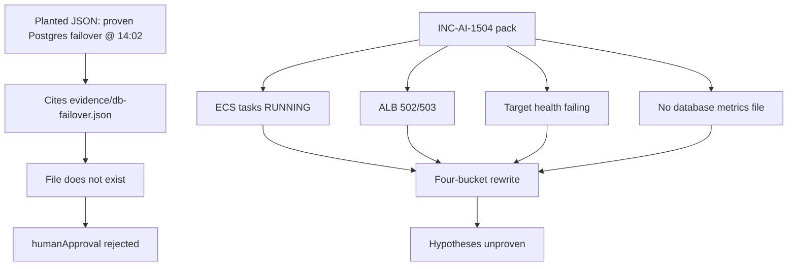

# AI-1504 — Evaluate hallucinated diagnosis

**Type:** AI  
**Module:** 15 — BayOps AI — AI-Assisted Operations  
**Duration:** 45–75 minutes  
**Cost:** **$0**  
**awsLab:** no  
**Region:** `us-west-2`  
**Lessons:** L-15.5, L-15.6  
**Diagram:** AEJE-D-070 (Human approval and hallucination detection)  
**Planted output (you will see this):** [infrastructure/bayops-ai/fixtures/ai-1504-hallucination.json](../../infrastructure/bayops-ai/fixtures/ai-1504-hallucination.json)  
**Pack:** [incidents/ai/INC-AI-1504](../../incidents/ai/INC-AI-1504/README.md)  
**Contract:** [datasets/baypay-ai/BAYOPS.md](../../datasets/baypay-ai/BAYOPS.md)  
**Schema:** [infrastructure/bayops-ai/schema/output.schema.json](../../infrastructure/bayops-ai/schema/output.schema.json)  
**Worksheet:** [student/worksheets/PF-ai.md](../../student/worksheets/PF-ai.md)

This is the **mandatory hallucination lab**. The planted JSON is the artifact to evaluate. It is **not** a hidden RCA of a prior lab. Work the pack files against the dump. Do not open `solutions/AI-1504/` until PF-ai.md quotes the invented file and the proven-RCA field.

**Cost warning:** This lab is synthetic files. Do not bounce a live database “to reproduce the failover.” Do not recycle `dmgr-east`. Do not call Bedrock to get a second opinion — a second model can hallucinate the same path. Live Bedrock is optional extra credit only and never required.

---

## Scenario

14:10 Pacific on a synthetic `baypay-prod` afternoon, **2026-09-03** (21:10 UTC). Harbor Market reports HTTP **502/503** on `payments.apps.baypay.example`. Priya Nair says `payment-service` tasks are **RUNNING**. Target health is failing. Morgan Hale pasted a BayOps dump that claims a **proven** root cause: **Postgres Multi-AZ writer failover in us-west-2 at 14:02**. It recommends **bounce `dmgr-east` / recycle PaymentCluster**, and it is **auto-approved**. It cites `evidence/db-failover.json`. Riley Okonkwo asks you to evaluate the dump against the pack. You are the engineer on call. The pack is synthetic BayPay data.

---

## Business context

Avery Chen (`11111111-1111-1111-1111-111111111111`, account `22222222-2222-2222-2222-222222222221`) retries payment `c1504f55-0000-4000-8000-111111111504`. A 502/503 from the ALB is not a domain decline. Finance does not care that a model wrote “proven.” They care that no healthy target is taking `POST /api/v1/payments`.

Sam Okada’s timeline says no student RDS is attached to this service. Morgan Hale’s leftover cell is **not** on the merchant path. Jordan Voss confirms no 3.9.x roll today. A live AWS account is **not** required.

Do not bounce Postgres. Do not bounce `dmgr-east`. Do not disable TLS. Do not create `db-failover.json` so the model “has a source.”

---

## Learning objectives

- Evaluate a planted BayOps JSON against a small evidence pack.
- Catch an **invented file**, a **proven RCA field**, an **ND / PaymentCluster bounce**, and **auto-approve**.
- Quote the pack lines that **contradict** the failover story (tasks RUNNING through 14:02, ALB 502/503, target health failing, inventory: no database metrics file).
- **Reject** `humanApproval` for the planted runbook.
- Rewrite the page into four buckets with unproven hypotheses only.
- Record fabricated claims **in your words plus quotes** on PF-ai.md. A lucky “the AI is wrong” without those quotes does not max Diagnostic method.

---

## Architecture

Course diagram **AEJE-D-070** is evaluation plus approval. Until the PNG is on disk, use the mermaid below plus BAYOPS.md.



Alt text: A planted model output cites a database failover file that is not in the pack and auto-approves a leftover-cell bounce. The operator compares ECS RUNNING, ALB 502/503, and failing target health, then rejects approval and rewrites four unproven buckets.

### Service list

| Piece | In this pack? | Live apply? |
|---|---|---|
| Planted BayOps JSON | Yes — fixture you **see** | No |
| ECS describe-tasks | Yes — RUNNING | No |
| ALB curl + target health | Yes — 502/503, unhealthy | No |
| Pack inventory | Yes — lists the omission | No |
| `evidence/db-failover.json` | **No** | Do not invent |
| RDS / Multi-AZ | **No** | Do not bounce |
| `dmgr-east` / PaymentCluster | Named as leftover | Do not bounce |
| Bedrock | Named only | Extra credit only |

### Region assumptions

`us-west-2`. Cluster `baypay-prod-west`. Service `payment-service`. Teaching host `payments.apps.baypay.example`. Image on the task paste is `3.8.4`.

### Least-privilege / security notes

- On-call needs read on the pack and the fixture. Not `AdministratorAccess`.
- Do not put PAN or `BAYPAY_DB_PASSWORD` in the rewrite.
- Do not open 8080 to the world “so health passes.”

### Failure scenario

Writing “the AI is wrong” with no quote of `evidence/db-failover.json` and no quote of `provenRootCause` fails Diagnostic method. Executing the planted bounce fails Production awareness.

This pack is the **ALB / health symptom class**. You do not need to name a prior module’s health-path RCA to pass. Catch the invented file, the proven field, the ND bounce, and auto-approve.

---

## Prerequisites

- AI-1501–1503 literacy (buckets, unproven, approval) helps; this pack is self-contained.
- [INC-AI-1504 README](../../incidents/ai/INC-AI-1504/README.md) and [student-worksheet.md](../../incidents/ai/INC-AI-1504/student-worksheet.md).
- Lessons L-15.5–L-15.6 if present.
- Diagram AEJE-D-070.

---

## Environment setup

```text
incidents/ai/INC-AI-1504/
  README.md
  timeline.json
  student-worksheet.md
  evidence/
    pack-inventory.txt
    ecs-tasks.txt
    alb-and-targets.txt
```

```bash
mkdir -p /tmp/aeje-ai-1504
cp infrastructure/bayops-ai/fixtures/ai-1504-hallucination.json /tmp/aeje-ai-1504/planted.json
cp infrastructure/bayops-ai/schema/output.schema.json /tmp/aeje-ai-1504/output.schema.json
cd /tmp/aeje-ai-1504
```

Write `/tmp/aeje-ai-1504/output.json` (your rewrite) and fill the pack worksheet. Leave the planted fixture as the bad dump — do not “fix” it in place.

Do not run `aws`, `kubectl`, or Bedrock on the grade path. Optional parse:

```bash
# extra credit — not the grade path
python3 -c "import json; json.load(open('output.json')); print('ok')"
```

Do not open `solutions/AI-1504/` until PF-ai.md has quotes.

---

## Challenge/tasks

1. **Read the planted JSON.** It is meant to be wrong. Copy the exact `provenRootCause` string, the `evidence/db-failover.json` `source`, the bounce of `dmgr-east` / PaymentCluster, and `humanApproval` `approved` / `BayOps-auto`.
2. **Read the pack inventory.** Confirm `evidence/db-failover.json` is **not shipped** and database metrics are **omitted**.
3. **Read `ecs-tasks.txt`.** Quote `lastStatus: RUNNING`, 2/2, started well before 21:02 UTC, no stop at 14:02 Pacific. Quote that leftover ND does not appear.
4. **Read `alb-and-targets.txt`.** Quote merchant **503** (and 502 on retry), `TargetHealth` **unhealthy**, healthy host count **0**.
5. **Rewrite four buckets** from files you opened:
   - Evidence — inventory + tasks + ALB/targets. Never cite `db-failover.json` as if it existed.
   - Hypotheses — unproven ALB/health statements; **withdraw** the failover story; **withdraw** the cell bounce.
   - Recommended investigation — next ALB/health or omitted-kind question. Do not skip to bounce.
   - Suggested remediation — reject the planted mutates; stabilize without bouncing DB or `dmgr-east` and without disabling TLS; `approvalRequired: true`.
6. **humanApproval.** Status **`rejected`** for the planted runbook. Name yourself or Riley / Priya, with a time and a note that cites the missing file.
7. **PF-ai.md.** Fabricated-claims section: **your words plus quotes**. Honesty checklist signed.
8. **Do not** treat this dump as the RCA of INCIDENT-1104 or any other lab.

---

## Validation

- [ ] You quoted `evidence/db-failover.json` as **missing** (inventory or directory list).
- [ ] You quoted `provenRootCause` (or the proven hypothesis / proven string) from the planted JSON.
- [ ] You quoted RUNNING tasks and ALB 502/503 or failing target health.
- [ ] Rewrite has four buckets; hypotheses are not `proven`.
- [ ] `humanApproval.status` is `rejected` for the planted dump.
- [ ] No Postgres bounce, no `dmgr-east` bounce, no TLS disable in *your* remediations.
- [ ] JSON parses. No Bedrock required.
- [ ] PF-ai.md fabricated-claims and approval sections are filled **in your words plus quotes**.
- [ ] A worksheet that only says “the AI is wrong” is not complete.

Instructor scores with [instructor/rubrics/AI-1504.md](../../instructor/rubrics/AI-1504.md).

---

## Troubleshooting

| Symptom | What to check |
|---|---|
| Planted JSON sounds complete | Completeness is not a source. List the `source` paths and `ls` the pack. |
| “AI is wrong” with no quotes | Go back. Quote the missing file and the proven field. |
| Created `db-failover.json` so the citation resolves | Delete it. That is fabricating evidence. |
| Wanted to bounce Postgres to “see the failover” | The pack omitted database metrics on purpose. |
| Wanted to recycle PaymentCluster because Morgan offered | Timeline says leftover cell is out of path. |
| Imported a prior ALB health-path RCA as proven here | Wrong lab. Symptom class is enough. Keep hypotheses unproven. |
| Approved the rewrite so it “looks ready” | Reject the planted dump. Your rewrite stays pending until a human signs *your* actions. |

---

## Expected outcome

A written evaluation an instructor can score: quoted fabricated claims, pack contradictions, a four-bucket rewrite, `humanApproval` **rejected** on the planted runbook. You may be unsure what the ALB health check would show next; you may not invent a failover file.

---

## Interview questions

1. What makes a citation a hallucination in this course’s language?
2. Why does a `provenRootCause` field fail the contract even when the prose is fluent?
3. Why can ECS `RUNNING` and merchant 502/503 be true at the same time?
4. Why must “the AI is wrong” come with quotes to max Diagnostic method?
5. Who rejects `humanApproval`, and what belongs in the note?

---

## Architecture/trade-off questions

1. Schema-validate-then-retrieve versus retrieve-then-trust — where should a missing `source` fail?
2. Paper evaluation versus a second Bedrock call as “judge” — what can still go wrong?
3. Why is leftover ND still in the estate, and why must an agent never auto-bounce it?
4. Should DynamoDB store approval records (AEJE-D-069) or is a signed JSON field enough for teaching?
5. Cost of requiring Bedrock to catch a planted file versus `$0` `ls` of the pack?

---

## Cleanup

None for the pack. Do not delete the evidence files. Do not add `db-failover.json`.

```bash
rm -rf /tmp/aeje-ai-1504
```

If you ignored the cost warning and touched a live account, destroy leftover RDS experiments, cell bounces, and Bedrock sketches in `us-west-2` now.

---

## Cost estimate

**Grade path: $0.** Synthetic files only. No AWS API. No required model.

**Misuse path:** live RDS, ACM, or “reproduce failover” are dollars and out of scope. Extra-credit Bedrock is tokens plus cleanup; it cannot replace quotes from the pack.

---

## Hidden/revealable solution

The planted JSON is **visible on purpose**. It is not the answer key. The answer key is `solutions/AI-1504/` (which claims are fabricated, and a contract-valid rewrite). Opening that folder before you quote the missing file and the proven-RCA field is a failed Diagnostic method score.

<details>
<summary>Reveal checklist — after you have quoted the planted dump and the pack</summary>

Required: quote `evidence/db-failover.json` as missing; quote `provenRootCause` / proven failover at 14:02; quote RUNNING + 502/503 or unhealthy targets; rewrite four buckets; withdraw failover and ND bounce; `humanApproval` rejected; no TLS-off; no DB bounce; PF-ai.md in your words plus quotes. Lucky “AI is wrong” without the two required quotes fails the checklist.

</details>

---

## What you learned

A fluent model can invent a file, stamp proven RCA, bounce leftover ND, and auto-approve. AEJE-D-070 is the evaluation loop: check the citation, check the approval field, rewrite four buckets, reject the dump. You did not need Bedrock to catch a path that is not on disk.

---

## Portfolio deliverable

Complete [PF-ai.md](../../student/worksheets/PF-ai.md): identity, four-bucket rewrite, **which 1504 claims were fabricated (your words + quotes)**, approval decision, interview snippet, honesty checklist. Attach the pack worksheet and your `output.json`. Do not paste `solutions/AI-1504/`.
