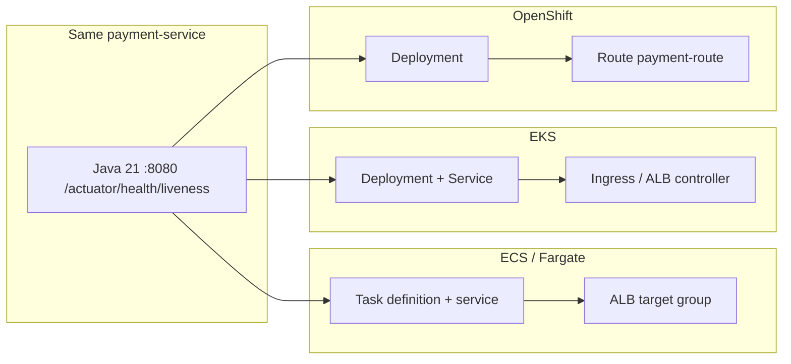

# ARCHITECT-1102 — ECS vs EKS vs OpenShift

**Type:** ARCHITECT  
**Module:** 11 — AWS Container Platforms  
**Duration:** 60–90 minutes  
**Cost:** $0 (paper — **not** an awsLab apply)  
**Lessons:** L-11.3  
**Diagram:** AEJE-D-049 (ECS vs EKS vs OpenShift)  
**Account notes:** [datasets/baypay-aws/ACCOUNT.md](../../datasets/baypay-aws/ACCOUNT.md)  
**Worksheet:** [student/worksheets/PF-aws-platform.md](../../student/worksheets/PF-aws-platform.md)

This is **paper architecture**. You do not apply EKS, create a ROSA cluster, or decommission `baypay-prod`. ECS on Fargate is BayPay’s **student apply default**. Kubernetes and OpenShift from Module 10 remain **valid homes**.

---

## Scenario

Jordan Voss can put `payment-service` on ECS/Fargate this week (BUILD-1101). Riley Okonkwo already has a Deployment and a Route in `baypay-prod` that Harbor Market understands. Priya Nair wants one page she can read at 02:00 that says **when** ECS wins, **when** EKS wins, and **when you stay on OpenShift** — not a slogan that “AWS is the only correct platform.”

Sam Okada will try to “just stand up EKS so we look production.” You write the decision so that sentence fails.

The page is [PF-aws-platform.md](../../student/worksheets/PF-aws-platform.md).

---

## Business context

Avery Chen (`11111111-1111-1111-1111-111111111111`) is payment volume. The process is still Java 21 / Spring Boot 3.5.5 on port `8080` with `/actuator/health/liveness`. The **control plane** is what this lab chooses: ECS, EKS, or OpenShift (self-managed or ROSA). Harbor Bike Co does not pay for your preference. Finance pays for an EKS control plane (~dollars/day) and for a ROSA cluster fee if you create one “to compare.”

Module 10 did not become wrong because Module 11 uses Fargate. ACCOUNT.md says treat ECS as the default **student apply**, and say when EKS or OpenShift wins.

---

## Learning objectives

- Fill a Staff-readable decision table: ECS/Fargate vs EKS vs OpenShift across ops model, networking, IAM, cost, and lock-in.
- Pick **one** home for BayPay’s *next* production payment replica and write why the other two lost **this quarter**.
- Write a sentence that refuses EKS (or ROSA) as a 90-minute lab “for realism.”
- Keep Module 10 objects mapped: Deployment ≈ task+service, Service/Route ≈ ALB target group, Secret ≈ Secrets Manager (SECURITY-1103).
- Record the decision on AEJE-D-049 and on PF-aws-platform.md.

---

## Architecture

Course diagram **AEJE-D-049** is this comparison. Until the PNG is on disk, use the mermaid plus ACCOUNT.md. Do not add a fourth platform (Cloud Run, App Runner, “ECS on EC2 always-on”) as the BayPay default.



Alt text: The same payment-service process can sit behind ECS/Fargate and an ALB, behind EKS Ingress, or behind an OpenShift Route. The application contract does not change; the control plane does.

```text
ECS/Fargate   student apply default     ALB + task role / execution role
EKS           Kubernetes API on AWS     you still own add-ons and YAML
OpenShift     Module 10 home            Routes, SCCs, operators — still valid
```

Serving path never becomes “operator → EKS control plane → money.” Merchants still enter at an HTTP edge (ALB, Ingress, or Route).

---

## Prerequisites

- BUILD-1101 attempted (you know the Fargate + ALB shape, even on paper).
- Module 10: Deployment / Service / Ingress-or-Route in `baypay-prod`.
- ACCOUNT.md compute default: **ECS on Fargate**. EKS is literacy, not apply.
- L-11.3 if present. This lab stands alone without a live cluster.

---

## Environment setup

```bash
test -f datasets/baypay-aws/ACCOUNT.md && echo "account notes present"
test -f student/worksheets/PF-aws-platform.md && echo "worksheet present"
```

No runtime. No `eksctl`. No ROSA. Copy the worksheet or fill it in place. Do not open `solutions/ARCHITECT-1102/` until the decision table has sentences, not blank cells.

---

## Challenge/tasks

1. **Decision table.** On the worksheet, compare ECS/Fargate, EKS, and OpenShift for: control plane you operate, networking edge, IAM model (task role vs IRSA vs service account), deploy artifact (task def vs Deployment), health probe owner, and **unit cost you would refuse in a 90-minute lab**.
2. **When ECS wins.** Write a paragraph for BayPay *this quarter*: one Spring Boot service, AWS-native IAM, no custom controllers. Name the ALB + Fargate objects from BUILD-1101.
3. **When EKS wins.** Write a paragraph that requires a reason Module 10 already had: existing Kubernetes estate, CRDs, sidecars you do not want to rewrite as task defs. Do **not** say “EKS is more production.”
4. **When OpenShift wins.** Write a paragraph that keeps `payment-route` / SCCs / operators as a reason to **stay**. Module 10 is not a legacy to escape this week.
5. **Refusal.** One sentence: you will not apply EKS, ROSA, or NAT “for realism” in a 90-minute lab. COST-1105 will price that sentence.
6. **Mapping inset.** Table Module 10 objects to AWS objects (Deployment, Service, Ingress/Route, Secret, probe path). Health path stays `/actuator/health/liveness` in every home.
7. **Greenfield refusal.** No “run traditional WebSphere ND on EKS worker nodes” as the modernization path. No second control plane as a rollback environment.
8. Transfer the table and paragraphs into [PF-aws-platform.md](../../student/worksheets/PF-aws-platform.md).

---

## Validation

Self-check before you open the instructor folder:

- Three columns (ECS, EKS, OpenShift), not “AWS vs not-AWS.”
- ECS is the student apply default; EKS and OpenShift have honest win conditions.
- “EKS is always more production” does not appear.
- You did not apply EKS or ROSA to “test” the table.
- Health path is the same contract in every column.
- Greenfield sentence refuses ND-on-EKS and a second control plane as rollback.
- Mapping inset names Module 10 objects and AWS objects.

Instructor scores with [instructor/rubrics/ARCHITECT-1102.md](../../instructor/rubrics/ARCHITECT-1102.md).

---

## Troubleshooting

- You only wrote “use ECS because this is the AWS module”: expand win/lose conditions. Slogan-only fails Communication and Diagnostic method.
- EKS as the default “because Kubernetes is the industry”: that ignores ACCOUNT.md and the EKS control-plane bill.
- OpenShift as “legacy we must leave”: Module 10 is a valid production home.
- You opened the AWS console to create a cluster: stop. Paper is the grade path.
- AEJE-D-049 PNG missing: the mermaid on this page is enough.
- You added App Runner or Lambda as a fourth default: out of scope for this table.

---

## Expected outcome

A one- to two-page platform decision a Staff engineer could run a working session from without opening `solutions/`. Together with the BUILD-1101 Terraform notes this is the Module 11 portfolio artifact.

---

## Interview questions

1. What is the first sentence you say if someone asks to “just create EKS so we match production”?
2. Which IAM model do you get “for free” on ECS that EKS makes you design (IRSA)?
3. Why can OpenShift remain the right home after BUILD-1101 succeeds in a sandbox?
4. What does Avery Chen’s POST actually depend on — control plane brand, or port 8080 plus a correct health path?

---

## Architecture/trade-off questions

1. ECS task definition versus a Deployment — which team already owns YAML in BayPay, and what do you throw away if you switch?
2. ALB target group health versus kubelet probes — same Actuator URL, different object. Who owns the contract?
3. Fargate (no nodes) versus EKS managed node groups versus OpenShift workers — where does the patching load sit?
4. Why is a second control plane a bad rollback environment (same lesson as ARCHITECT-604’s second ND cell)?

---

## Cleanup

No cloud resources. No clusters to delete. Leave the worksheet in `student/worksheets/`. Do not delete ACCOUNT.md. If a teammate applied EKS “to compare,” that is out of scope — destroy it; this lab did not ask for it.

---

## Cost estimate

**$0.** Paper decision, locked synthetic account notes, worksheet. No AWS. No EKS control plane. No ROSA. No required Terraform apply.

If someone still creates EKS, the control plane alone is on the order of **$0.10/hour (~$2.40/day, ~$73/month)** before nodes. That is a lab failure, not extra credit.

---

## Hidden/revealable solution

Write the table first. The full narrative lives in `solutions/ARCHITECT-1102/`. Opening that folder before you write is a failed Diagnostic method score. After you have attempted the worksheet, you may reveal the compact pick — it is not the scored narrative.

<details>
<summary>Reveal compact pick — after you have attempted the table</summary>

| Home | BayPay pick this quarter |
|---|---|
| ECS/Fargate | Student apply default; one Spring Boot service on AWS |
| EKS | When the estate is already Kubernetes and needs the API / CRDs |
| OpenShift | When Module 10 Routes/SCCs/operators are already the production home |

If your table says “always EKS” or “OpenShift is legacy,” fix the worksheet before you read `solutions/`. The scored work is the win/lose paragraphs and the mapping inset — not this row.

</details>

---

## What you learned

The process contract (8080, Actuator liveness, no secrets in git) survives the control plane. ECS/Fargate is the cheap, honest AWS default for this course. EKS wins when you already need Kubernetes. OpenShift wins when you already run it well. A 90-minute lab does not create a third cluster to prove a slogan.

---

## Portfolio deliverable

Completed [student/worksheets/PF-aws-platform.md](../../student/worksheets/PF-aws-platform.md) platform decision table plus the three win/lose paragraphs. This is the Module 11 portfolio artifact: **AWS architecture decision (ECS vs EKS vs OpenShift)**.
