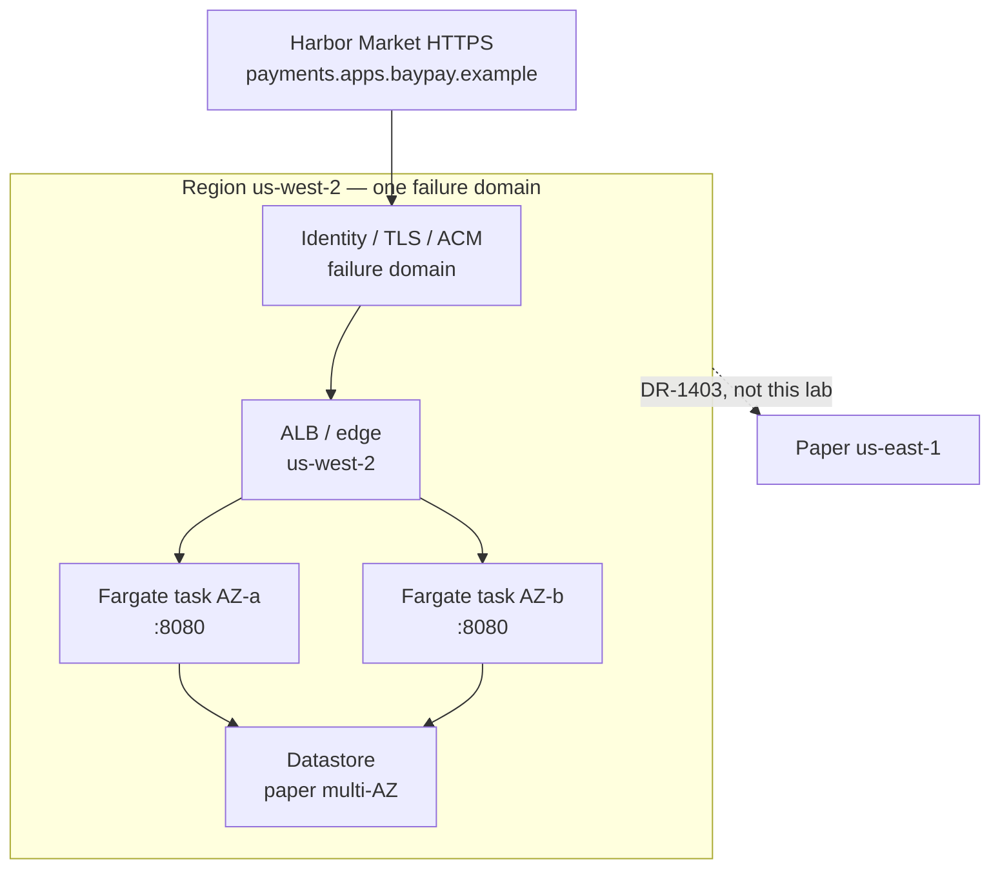

# ARCHITECT-1401 — Design BayPay for 99.99 percent

**Type:** ARCHITECT  
**Module:** 14 — Security, High Availability and Disaster Recovery  
**Duration:** 60–90 minutes  
**Cost:** $0 (paper — **not** an awsLab apply)  
**Lessons:** L-14.5 (HA and failure domains). Stands alone with TRUST.md.  
**Diagram:** AEJE-D-064 (99.99 percent HA failure domains)  
**Trust notes:** [datasets/baypay-security/TRUST.md](../../datasets/baypay-security/TRUST.md)  
**Ops notes:** [datasets/baypay-ops/OBSERVABILITY.md](../../datasets/baypay-ops/OBSERVABILITY.md)  
**Worksheet:** [student/worksheets/PF-security.md](../../student/worksheets/PF-security.md)

This is **paper architecture**. You do not apply multi-AZ RDS, a NAT Gateway, EKS, ACM, Route 53, or a second region. ECS on Fargate in `us-west-2` remains the teaching compute default. `PaymentCluster` on `BayPayCell` is **not** the HA design.

---

## Scenario

Priya Nair wants one page she can read at 02:00 that says **which failure domains** `POST /api/v1/payments` can survive, and **what 52 minutes per year** actually buys. Jordan Voss will try to answer “add a region.” Sam Okada will try to apply NAT and multi-AZ RDS “so the slide is honest.” Riley Okonkwo will ask whether the Module 13 dashboard SLO just became 99.99%.

You write the decision so those three sentences fail.

Harbor Market still posts as Avery Chen (`11111111-1111-1111-1111-111111111111`, active USD account `22222222-2222-2222-2222-222222222221`). Example payment id for this module: `c1402b22-0000-4000-8000-111111111402`. The public name is `payments.apps.baypay.example`.

The page is [PF-security.md](../../student/worksheets/PF-security.md) section 2–5.

---

## Business context

Avery Chen’s client retries when a create payment does not return. A 60-minute regional outage, a single-AZ datastore, or a leaf certificate that merchants cannot handshake all eat the **same** 52-minute year. Finance does not pay for a second-region `terraform apply` in a 90-minute lab. Finance also does not pay for `PaymentCluster` / `dmgr-east` to be “the HA story we already have.”

[OBSERVABILITY.md](../../datasets/baypay-ops/OBSERVABILITY.md) locks the Module 13 SLI/SLO at **99.9%** (~43 minutes of equivalent downtime per 30-day month). [TRUST.md](../../datasets/baypay-security/TRUST.md) locks the **architecture goal** at **99.99%** for `POST /api/v1/payments`. Those are different contracts. Do not silently upgrade the Grafana SLO because this lab exists.

---

## Learning objectives

- Fill a Staff-readable **failure-domain table**: task, AZ, ALB, identity/TLS, datastore, region.
- Write what **~52 minutes/year** allows and what it does **not** allow (one 90-minute region loss, one forgotten cert, one single-AZ RDS).
- Design **multi-AZ, single-region** `us-west-2` as a valid 99.99% shape. Multi-region is DR-1403, not a free upgrade.
- Refuse NAT / EKS / multi-AZ RDS **apply**, refuse `PaymentCluster` as HA, and refuse “just add a region” as the only answer.
- Keep the Module 13 SLO at **99.9%** unless you write an explicit contract change (who, when, and the new error budget).
- Record the design on AEJE-D-064 and on PF-security.md.

---

## Architecture

Course diagram **AEJE-D-064** is this failure-domain map. Until the PNG is on disk, use the mermaid plus TRUST.md. Do not add a second DNS zone, a second KMS alias, or a live ACM apply.



Alt text: Merchants enter HTTPS at payments.apps.baypay.example. TLS and identity sit in front of a regional ALB. The ALB spreads payment-service tasks across two Availability Zones onto a paper multi-AZ datastore. The whole drawing is one region. A second region is a DR conversation, not the 99.99 percent design.

```text
Task            one JVM dies; ECS replaces it
AZ              one data center in us-west-2
ALB / edge      regional load balancer and DNS name
Identity / TLS  ACM leaf, validation, IAM, KMS alias/baypay-payments
Datastore       teaching Postgres; paper multi-AZ — do not apply RDS
Region          us-west-2 gone → DR-1403, not “add a region” as HA
```

Serving path never becomes “operator → second region → money.” Merchants still enter at `payments.apps.baypay.example`. Health stays `/actuator/health/liveness` and `/actuator/health/readiness` on port `8080`.

---

## Prerequisites

- TRUST.md HA table and “What you must not do.”
- OBSERVABILITY.md SLI/SLO: **99.9%** unless you change the contract in writing.
- ARCHITECT-1102 literacy (ECS default; EKS/OpenShift remain homes). You may still sit this lab first.
- L-14.5 if present. This lab stands alone without a live account.
- You will **not** apply Terraform, ACM, Route 53, RDS, or `us-east-1`.

---

## Environment setup

```bash
test -f datasets/baypay-security/TRUST.md && echo "trust notes present"
test -f datasets/baypay-ops/OBSERVABILITY.md && echo "ops notes present"
test -f student/worksheets/PF-security.md && echo "worksheet present"
```

No runtime. No `terraform apply`. No ACM request. No Route 53 change. Copy the worksheet or fill it in place. Do not open `solutions/ARCHITECT-1401/` until the failure-domain table has sentences, not blank cells.

Optional PAKS (literacy only): `docs/18-reliability-and-resilience/overview.md`, `docs/16-cloud-architecture/multi-region-architecture.md`. Lessons stand alone without them.

---

## Challenge/tasks

1. **Failure-domain table.** On PF-security.md, fill six rows: **task**, **AZ**, **ALB**, **identity/TLS**, **datastore**, **region**. For each row write: what fails, what merchants see, what already survives in a multi-AZ single-region design, and what still kills the year.
2. **Fifty-two minutes.** Write a short paragraph: 99.99% ≈ **52 minutes/year**. Name two events that **fit** (a failed task, a 10-minute AZ blip if you are multi-AZ) and two that **do not** (a 90-minute region loss; a leaf that merchants cannot handshake for a day).
3. **Multi-AZ single-region.** Sketch the `us-west-2` shape: ALB across AZs, Fargate tasks in at least two AZs, paper multi-AZ datastore, TLS at the edge. Name the teaching host and port. This **is** allowed to be the 99.99% design.
4. **Region is not HA.** One paragraph: why “just add `us-east-1`” is the wrong *only* answer. Point DR-1403 at RTO/RPO. Point this lab at in-region domains. 99.99% ≠ automatic multi-region.
5. **SLO contract.** Quote OBSERVABILITY.md: Module 13 dashboards stay **99.9%**. If you want 99.99% as the *operated* SLO, write who changes it, what the new monthly budget is, and why you would not do that in this lab.
6. **Refusals.** Four sentences, one each: you will not apply NAT, EKS, or multi-AZ RDS in a 90-minute lab; you will not recreate `PaymentCluster` / `dmgr-east` as HA; you will not treat a second region as the only 99.99% answer; you will not apply ACM or Route 53 to “prove” TLS.
7. **Identity/TLS row.** Explicitly treat ACM / leaf / validation / IAM as a **failure domain**. HTTP to task `:8080` from a jump box can succeed while merchants fail HTTPS. That is a symptom class (TRUST.md), not an RCA for INCIDENT-1402.
8. Transfer the table and paragraphs into [PF-security.md](../../student/worksheets/PF-security.md). Cite AEJE-D-064.

---

## Validation

Self-check before you open the instructor folder:

- Six failure-domain rows, not “add a region.”
- 52 minutes/year is named and contrasted with 99.9% (~43 minutes/month).
- Multi-AZ single-region is a complete design, not a placeholder until DR.
- Module 13 SLO is still 99.9% unless you wrote an explicit change.
- `PaymentCluster` is not the HA target.
- You did not apply NAT, EKS, RDS, ACM, Route 53, or `us-east-1`.
- Identity/TLS is a row, not a footnote.
- Avery’s POST still depends on `8080` + Actuator + a handshake merchants can complete.

Instructor scores with [instructor/rubrics/ARCHITECT-1401.md](../../instructor/rubrics/ARCHITECT-1401.md).

---

## Troubleshooting

- You only wrote “add a region because 99.99% is hard”: expand the six domains. Slogan-only fails Communication and Diagnostic method.
- You upgraded the Module 13 SLO in a dashboard sentence: that violates OBSERVABILITY.md. Architecture goal ≠ operated SLO.
- You used `PaymentCluster` / two WAS members as HA: TRUST.md forbids it. Module 6 is a decommission path.
- You opened the AWS console to create multi-AZ RDS: stop. Paper is the grade path.
- AEJE-D-064 PNG missing: the mermaid on this page is enough.
- You designed NAT “for realism”: refuse it; COST-1105 already priced that sentence.
- You treated INCIDENT-1402 as proof that 99.99% requires multi-region: TLS is an in-region identity domain.

---

## Expected outcome

A one- to two-page HA design a Staff engineer could run a working session from without opening `solutions/`. Together with SECURITY-1404 this is the **security model** half of the Module 14 portfolio artifact. DR numbers live on PF-dr.md after DR-1403.

---

## Interview questions

1. What is the first sentence you say if someone asks to “just add a region so we hit four nines”?
2. Why can HTTP to `:8080` succeed while Harbor Market cannot POST?
3. How many minutes is 99.99% per year, and what does a 60-minute regional outage do to that budget?
4. Why is the Module 13 dashboard still 99.9% after you finish this page?
5. What does Avery Chen’s POST actually depend on — a second region, or tasks in two AZs plus a leaf merchants can handshake?

---

## Architecture/trade-off questions

1. Multi-AZ single-region versus pilot-light `us-east-1` — which conversation is 99.99%, which is RTO?
2. ALB is multi-AZ and still a **regional** object. What do you tell Jordan when he treats the ALB as “already multi-region”?
3. Why is identity/TLS a first-class failure domain instead of “platform will renew it”?
4. Why is a second `PaymentCluster` in `BayPayCell` a bad HA answer (same lesson as ARCHITECT-604’s second ND cell)?
5. If you *did* change the operated SLO to 99.99%, what monthly error budget would Priya page on?

---

## Cleanup

No cloud resources. No clusters to delete. Leave the worksheet in `student/worksheets/`. Do not delete TRUST.md. If a teammate applied multi-AZ RDS or a second-region stack “to compare,” that is out of scope — destroy it; this lab did not ask for it.

---

## Cost estimate

**$0.** Paper decision, locked synthetic trust notes, worksheet. No AWS. No ACM. No Route 53. No RDS. No required Terraform apply.

If someone still creates multi-AZ RDS or a NAT Gateway, that is a **lab failure**, not extra credit. An idle ALB left from Module 11 is still on the order of **$0.0225/hour (~$0.54/day)** — destroy leftovers; this lab did not need them.

---

## Hidden/revealable solution

Write the table first. The full narrative lives in `solutions/ARCHITECT-1401/`. Opening that folder before you write is a failed Diagnostic method score. After you have attempted the worksheet, you may reveal the compact shape — it is not the scored narrative.

<details>
<summary>Reveal compact shape — after you have attempted the table</summary>

| Domain | BayPay 99.99% this quarter |
|---|---|
| Task / AZ / ALB / datastore | Multi-AZ single-region `us-west-2`; paper only |
| Identity / TLS | First-class domain; HTTP `:8080` ≠ merchant HTTPS |
| Region | DR-1403 (RTO/RPO), not the only 99.99% answer |
| Operated SLO | Still **99.9%** unless you change the contract |

If your table says “always add a region” or “PaymentCluster is HA,” fix the worksheet before you read `solutions/`. The scored work is the six-row table, the 52-minute paragraph, and the refusals — not this row.

</details>

---

## What you learned

99.99% is a **failure-domain design**, not a second-region slogan. About 52 minutes/year is enough for a replaced task and a short AZ blip if you are already multi-AZ. It is not enough for a forgotten leaf, a single-AZ datastore, or a 90-minute region loss. Multi-AZ single-region is allowed to be the design. Module 13’s 99.9% SLO stays until someone changes the contract on purpose. `PaymentCluster` is not coming back as HA.

---

## Portfolio deliverable

Completed **99.99% / failure-domain** sections of [student/worksheets/PF-security.md](../../student/worksheets/PF-security.md). This is part of the Module 14 portfolio artifact: **security model and 99.99% HA**. DR-1403 writes PF-dr.md. Do not paste `solutions/ARCHITECT-1401/`.
