# ARCHITECT-401 — Map Spring to Jakarta concepts

**Type:** ARCHITECT  
**Module:** 04 — Jakarta EE and Enterprise Runtime Concepts  
**Duration:** 60–90 minutes  
**Cost:** $0  
**Portfolio:** [PF-spring-jakarta.md](../../student/worksheets/PF-spring-jakarta.md)

---

## Scenario

BayPay’s platform lead asks you to brief two audiences in one artifact: Spring-fluent engineers who will keep extending `reference-apps/baypay`, and operators who still run payment and refund ears on a traditional application-server cell (Module 5). You must map the Spring types they already use onto Jakarta contracts — and state, in writing, that traditional WAS is a **source** estate, not a greenfield target.

---

## Business context

Avery Chen’s payments already flow through Jakarta types even though the code says `@RestController` and `@Transactional`. If the mapping stays tribal knowledge, every WAS-to-Boot conversation becomes a translation meeting. The brief will be reused in Capstone 2.

---

## Learning objectives

- Produce a complete mapping for IoC↔CDI, `@Transactional`↔JTA, `JpaRepository`↔`EntityManager`, `RestController`↔JAX-RS, and `application.yml`↔JNDI.
- Ground each row in a BayPay type or config file you can point at.
- Record what the servlet container and DataSource pool still own under Spring Boot.
- Write an explicit greenfield recommendation that is **not** traditional WebSphere ND.

---

## Architecture

```mermaid
flowchart LR
  subgraph Boot[payment-service today]
    RC["@RestController"]
    TX["@Transactional"]
    REPO[JpaRepository]
    YML[application.yml]
    IOC[Spring IoC]
  end
  subgraph Spec[Jakarta contracts]
    JAX[JAX-RS]
    JTA[JTA]
    EM[EntityManager]
    JNDI[JNDI]
    CDI[CDI]
  end
  RC --- JAX
  TX --- JTA
  REPO --- EM
  YML --- JNDI
  IOC --- CDI
```



Read `PaymentController`, `PaymentApplicationService`, `PaymentPostingService`, `PaymentRepository`, `CorrelationIdFilter`, and `application-prod.yml`.

---

## Prerequisites

- Lessons L-4.1, L-4.2, and L-4.5.
- JDK 21 and the reference app (read-only is enough; you are not changing production behavior).

---

## Environment setup

```bash
export JAVA_HOME="${JAVA_HOME:-/opt/homebrew/opt/openjdk@21}"
cd reference-apps/baypay
./mvnw -q -DskipTests compile
```

Optional: `./mvnw -pl payment-service -am spring-boot:run` if you want to click OpenAPI while you map. No cloud account.

---

## Challenge/tasks

1. Open the five required pairs and write **your** mapping table before you look at any spoiler: Spring concept, Jakarta concept, BayPay evidence (type or file), notes.
2. Add at least three extra rows that matter for BayPay (suggestions: `Filter` / Servlet Filter, `ApplicationEventPublisher` / JMS or CDI events, Hikari / server DataSource, fat JAR / EAR class loading).
3. Walk `create()` → `postAuthorized()`. State whether posting joins the caller’s transaction, and what Jakarta annotation would express the same rule.
4. Write a short paragraph: what a traditional WAS operator bound in JNDI that Boot now binds in YAML. End with one sentence on why you would **not** create a new ND cell for a new BayPay service.
5. Copy the table and paragraph into [PF-spring-jakarta.md](../../student/worksheets/PF-spring-jakarta.md).

---

## Validation

Self-check before you open the revealable table:

- Five required pairs are present and not synonyms-only (“Spring tx = JTA” with no BayPay evidence).
- `CorrelationIdFilter` appears somewhere as a Jakarta `Filter`.
- Ledger posting is described as joining `create()` unless you found a contrary annotation (you should not, in the reference app).
- Greenfield sentence exists and does not recommend traditional WAS.

Instructor scores the brief with [instructor/rubrics/ARCHITECT-401.md](../../instructor/rubrics/ARCHITECT-401.md) after you submit.

---

## Troubleshooting

- Cannot find JPA annotations: they live on entities in `shared`, not on the controller.
- `PaymentPostingService` looks like a worker: it is in-process. Read the class comment.
- Prod YAML has no Hikari block: defaults still apply; L-4.3 shows the keys you would add.

---

## Expected outcome

A one- to two-page mapping brief a Staff engineer could use in a WAS-to-Boot working session without opening the solution folder.

---

## Interview questions

1. If JAX-RS and Spring MVC both sit on servlets, why did BayPay pick `@RestController`?
2. What breaks if you explain JNDI as “the database”?
3. How would you say `REQUIRED` vs `REQUIRES_NEW` in an interview using the ledger as the example?

---

## Architecture/trade-off questions

1. When is Liberty a better wave-1 target than a Boot rewrite?
2. Which mappings are *equivalences* and which are *approximations* (in-process events vs JMS)?
3. What shared resource would you refuse to put on a cell-wide JNDI tree for a new service?

---

## Cleanup

No cloud resources. Stop the local app with Ctrl+C if you started it.

---

## Cost estimate

**$0.** Paper architecture plus the local reference app.

---

## Hidden/revealable solution

Attempt the table first. The instructor solution is `solutions/ARCHITECT-401/`. A compact check table is below for self-review after you have written your own.

<details>
<summary>Reveal mapping table — after you have attempted the brief</summary>

| Spring (BayPay today) | Jakarta / Java EE contract | BayPay evidence |
|---|---|---|
| Spring IoC (`@Service`, `@Component`, constructor injection) | CDI (`@ApplicationScoped`, `@Inject`) | `PaymentApplicationService`, `BayPayConfig` |
| `@Transactional` | JTA (`UserTransaction`, `@TransactionAttribute`) | `PaymentApplicationService.create` |
| `JpaRepository` | JPA `EntityManager` | `PaymentRepository`, `@Entity Payment` |
| `@RestController` | JAX-RS (`@Path`, `@POST`) | `PaymentController` |
| `application.yml` / env vars | JNDI resource binds | `application-prod.yml` vs historical `jdbc/baypay` |
| `OncePerRequestFilter` | Servlet `Filter` | `CorrelationIdFilter` |
| `ApplicationEventPublisher` | JMS or CDI events (approximation) | `PaymentCompletedEvent` — not crash-safe |
| Hikari via `spring.datasource` | Server `DataSource` | Same `javax.sql.DataSource` contract |

Greenfield: Spring Boot or Liberty with externalized config. Traditional WAS ND is the estate Module 5 documents so you can leave it.

</details>

---

## What you learned

Spring annotations are facades over Jakarta contracts. BayPay already is a Jakarta HTTP and JPA application. Naming, transactions, and pools are runtime services whether Boot or an application server packages them. Traditional WAS remains literacy, not a target.

---

## Portfolio deliverable

Completed [student/worksheets/PF-spring-jakarta.md](../../student/worksheets/PF-spring-jakarta.md). This is the Module 4 portfolio artifact.
