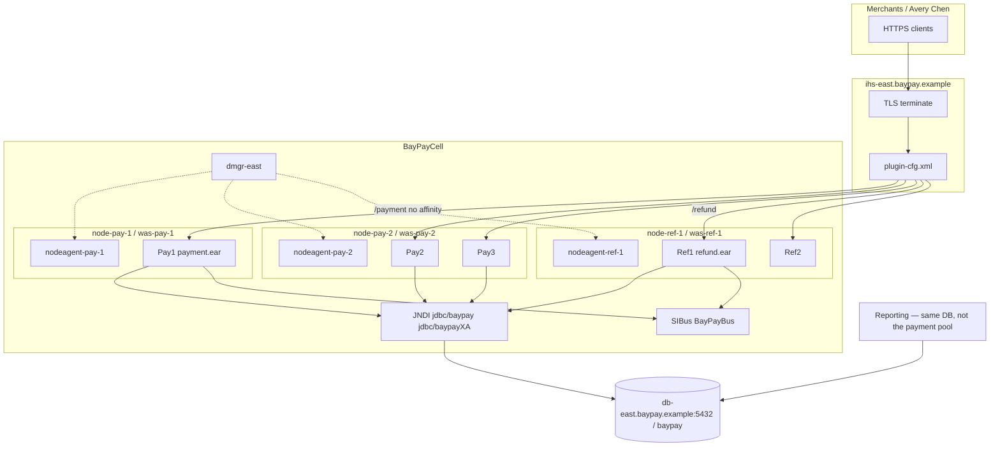

# ARCHITECT-501 — Design WebSphere ND BayPay

**Type:** ARCHITECT  
**Module:** 05 — WebSphere Network Deployment  
**Duration:** 60–90 minutes  
**Cost:** $0  
**Portfolio:** [PF-was-nd.md](../../student/worksheets/PF-was-nd.md)  
**Diagram:** AEJE-D-019 (BayPay WebSphere ND current state)

This is **paper architecture**. You do not install a Deployment Manager, federate a node, or start a node agent. Traditional WebSphere ND is BayPay’s **source estate**, not a greenfield target.

---

## Scenario

BayPay’s platform lead wants a single page that a Staff engineer, a WAS administrator, and a Spring engineer can share in Capstone 2. The page must draw `BayPayCell` as it exists today — cell, `dmgr-east`, nodes, node agents, cluster members, `ihs-east`, JNDI, and SIBus — and it must say, in writing, what you would **not** build if Harbor Bike Co asked for a new FX quote service tomorrow.

You produce that page as [PF-was-nd.md](../../student/worksheets/PF-was-nd.md). Names come only from [datasets/baypay-cell/TOPOLOGY.md](../../datasets/baypay-cell/TOPOLOGY.md).

---

## Business context

Avery Chen (`11111111-1111-1111-1111-111111111111`) still pays Harbor Market through `payment.ear` on `PaymentCluster`. Refunds still ride `refund.ear` on `RefundCluster`. Merchants do not talk to `dmgr-east`. If the drawing collapses the management plane into the serving plane, the next outage will bounce the wrong JVM. If the drawing recommends a second traditional cell, Module 6 has nothing to migrate toward.

Finance cares that authorizations complete. Operations cares that Jordan Voss can deploy without splitting editions across `Pay1` and `Pay2`. Modernization cares that this artifact is an inventory of what to leave, not a pattern to copy into Kubernetes.

---

## Learning objectives

- Draw `BayPayCell` as cell → deployment manager → node → node agent → application server, using locked hostnames.
- Place `PaymentCluster` (`Pay1`, `Pay2`, `Pay3`) and `RefundCluster` (`Ref1`, `Ref2`) behind `ihs-east` / `plugin-cfg.xml`.
- Bind `jdbc/baypay`, `jdbc/baypayXA`, `jms/paymentEvents`, `jms/refundEvents`, and SIBus `BayPayBus` on the same page, and mark cell-scoped sharing as a smell.
- Label blast radius: `dmgr-east` down, `nodeagent-pay-2` down, host `was-pay-2.baypay.example` down.
- Show three security domains (merchant TLS, application authn, cell admin / LTPA) and a sessionless `/payment` URI group.
- Write an operations inset (evidence to collect, what to bounce, what never to bounce).
- State an explicit greenfield refusal: no new traditional ND cell.

---

## Architecture

Course diagram **AEJE-D-019** is the current-state deployment drawing this lab matches. Until the PNG is on disk, use the mermaid below plus TOPOLOGY.md. Do not invent a fourth payment member or a federated IHS node.



Alt text: Merchants terminate TLS at ihs-east and reach Pay1, Pay2, Pay3 and Ref1, Ref2; dmgr-east talks only to node agents; reporting sits on the database, not inside Pay1.

Control path: operator → `dmgr-east` → node agent → server. Serving path: merchant → `ihs-east` → cluster member → DataSource / bus → `db-east`.

---

## Prerequisites

- Lessons L-5.1, L-5.2, and L-5.3 completed. L-5.4–L-5.6 improve the operations and security insets; you may finish those the same day.
- [datasets/baypay-cell/TOPOLOGY.md](../../datasets/baypay-cell/TOPOLOGY.md) open beside the worksheet.
- Optional read-only look at `reference-apps/baypay` so you can contrast YAML binds with JNDI. No IBM Installation Manager.

---

## Environment setup

No runtime. No AWS account. No `manageprofiles`.

```bash
# Confirm you can read the locked inventory only
test -f datasets/baypay-cell/TOPOLOGY.md && echo "topology present"
```

Copy [student/worksheets/PF-was-nd.md](../../student/worksheets/PF-was-nd.md) or fill it in place. Draw in mermaid, ASCII, or a linked image you created — reviewers need names, not art quality.

Do not open `solutions/ARCHITECT-501/` until you have filled the worksheet through the greenfield paragraph.

---

## Challenge/tasks

1. **Cell drawing.** On the worksheet, draw `BayPayCell` with `dmgr-east` (`was-dmgr-east.baypay.example`), `node-pay-1`, `node-pay-2`, `node-ref-1`, their node agents, and the five application servers. Place `ihs-east` **outside** the cell as the plugin edge, not as a federated node.
2. **Clusters.** Table `PaymentCluster` / `RefundCluster` with member, node, ear, and context root (`/payment`, `/refund`). Mark that `Pay2` and `Pay3` share a host. Do not collapse the two clusters to save space.
3. **JNDI and messaging.** List `jdbc/baypay` (max 50 — write `3 × 50` as a **question** until scope is confirmed), `jdbc/baypayXA` (not on every node), `jms/paymentEvents`, `jms/refundEvents`, `baypayDbAlias`, and SIBus `BayPayBus`. Draw reporting next to the database, not inside `Pay1`.
4. **Blast radius.** Three sentences: what still serves Avery Chen if `dmgr-east` is down; what Jordan cannot do if `nodeagent-pay-2` is down; what capacity you lose if `was-pay-2.baypay.example` dies.
5. **Security and sessions.** Three domains: merchant TLS at `ihs-east`, application authn on `payment.ear`, cell admin + LTPA keys. State that `/payment` is sessionless and that sticky `JSESSIONID` is a smell on that URI group.
6. **Operations inset.** Copy the bounce-decision idea from L-5.6 into your own words: evidence first, drain one member, recycle one JVM, never bounce `dmgr-east` to fix merchant HTTP, never bounce `db-east` because a WAS pool is full.
7. **Greenfield refusal.** One paragraph: what you would **not** do for a new BayPay service (no new traditional ND cell, no cell-wide shared pool, no SIBus for a blank-page queue). Name Boot or Liberty as the exit.
8. Transfer the drawing, tables, and paragraphs into [PF-was-nd.md](../../student/worksheets/PF-was-nd.md).

---

## Validation

Self-check before you open the instructor folder:

- Every locked name from the cell inventory table appears at least once.
- `ihs-east` is not drawn as a WAS node.
- Reporting is not a module inside `Pay1`.
- `jdbc/baypayXA` is marked incomplete / not universal.
- A greenfield sentence exists and does **not** recommend traditional ND.
- Session affinity is not enabled on `/payment` as a “best practice.”

Instructor scores the artifact with [instructor/rubrics/ARCHITECT-501.md](../../instructor/rubrics/ARCHITECT-501.md) after you submit.

---

## Troubleshooting

- You cannot find hostnames: they are in TOPOLOGY.md, not in the reference app YAML.
- The drawing is crowded: use two figures (serving path, control path) rather than dropping `RefundCluster`.
- You want to “just install ND locally to verify”: stop. This lab is scored on the paper artifact. A live cell is out of scope and not $0 in license terms.
- `3 × 50` versus one shared 50: write the uncertainty. L-5.4 told you to treat it as a question for Morgan Hale.
- AEJE-D-019 PNG missing: the mermaid on this page and TOPOLOGY.md are sufficient.

---

## Expected outcome

A one- to two-page ND current-state brief a Staff engineer could reuse in a WAS-to-Liberty working session without opening `solutions/`. The worksheet is the Module 5 portfolio artifact.

---

## Interview questions

1. Avery Chen’s client still gets HTTP 201 while Priya cannot open the admin console. Which process is down, and why is “the cell is down” the wrong first sentence?
2. Why is `STARTED` on `Pay2` not the same fact as “`Pay2` is running the same `payment.ear` edition as `Pay1`”?
3. What do you say when a candidate calls JNDI “the database”?
4. Why would you refuse sticky sessions on `/payment` even if the plugin supports them?

---

## Architecture/trade-off questions

1. `Pay2` and `Pay3` share `node-pay-2`. What did BayPay buy (density) and what did it spend (correlated failure)?
2. When is an application-scoped DataSource worth the extra operator work versus cell-scoped `jdbc/baypay`?
3. Why is SIBus `BayPayBus` in the same availability domain as the node that hosts the messaging engine — and why is that a reason not to add a new bus for greenfield?
4. Liberty `server.xml` versus a second DMGR: which blast radius do you want for a new refund-like service, and why?

---

## Cleanup

No cloud resources. No profiles to delete. Leave the worksheet in `student/worksheets/`. Do not delete TOPOLOGY.md.

---

## Cost estimate

**$0.** Paper architecture, locked synthetic topology, optional local read of the Spring Boot reference app. No AWS. No licensed WebSphere ND install.

---

## Hidden/revealable solution

Attempt the drawing and the greenfield paragraph first. The instructor solution is `solutions/ARCHITECT-501/`. That folder is the answer key; this student guide does not contain it. Opening the solution before you write is a failed Diagnostic method score.

<details>
<summary>Reveal self-check — after you have attempted the worksheet</summary>

Confirm you used only these serving names: `Pay1` on `node-pay-1`; `Pay2` and `Pay3` on `node-pay-2`; `Ref1` and `Ref2` on `node-ref-1`; edge `ihs-east`. Confirm reporting is beside `db-east`, not inside a payment JVM. Confirm the last sentence of the brief refuses a new traditional ND cell. If any of those are missing, fix the worksheet before you look at `solutions/`.

</details>

---

## What you learned

A WebSphere ND cell is a management domain plus a set of serving JVMs. Merchants depend on cluster members and the plugin, not on the deployment manager. Cell-scoped JNDI is convenient and scarce. Traditional ND is literacy so you can operate BayPay until cutover — it is not the shape of the next service.

---

## Portfolio deliverable

Completed [student/worksheets/PF-was-nd.md](../../student/worksheets/PF-was-nd.md) plus the cell drawing. This is the Module 5 portfolio artifact: **WebSphere ND architecture for BayPay**. Capstone 2 and Module 6 will assume you can point at this page.
