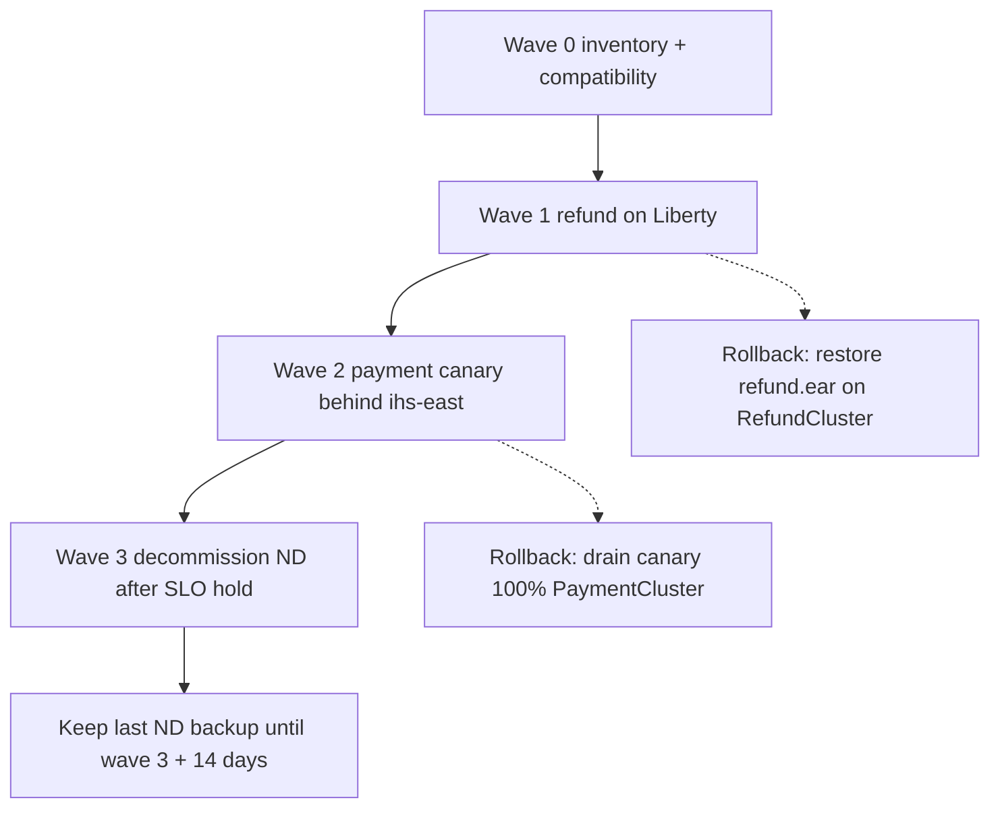

# ARCHITECT-604 — Migration waves and rollback

**Type:** ARCHITECT  
**Module:** 06 — WebSphere Liberty Modernization  
**Duration:** 60–90 minutes  
**Cost:** $0  
**Portfolio:** [PF-liberty-waves.md](../../student/worksheets/PF-liberty-waves.md)  
**Diagram:** AEJE-D-027 (Migration waves and rollback)

This is **paper architecture**. You do not cut live traffic, install Liberty, or decommission `node-pay-1`. Traditional WebSphere ND is BayPay’s **source estate**. Liberty (or the Spring Boot reference app) is the **target**. Wave numbers are locked in [datasets/baypay-cell/TOPOLOGY.md](../../datasets/baypay-cell/TOPOLOGY.md).

---

## Scenario

Jordan Voss can install `refund-service.war` on a Liberty directory this month. Riley Okonkwo will not let payment go dark while that happens. Priya Nair wants a rollback sentence she can read at 02:00. Morgan Hale wants to know when `dmgr-east` stops being how refunds are installed.

You write waves **0 through 3** — inventory, refund on Liberty, payment canary, then ND decommission after an SLO hold — including explicit rollback for Wave 1 (refund) and Wave 2 (payment canary). The page is [PF-liberty-waves.md](../../student/worksheets/PF-liberty-waves.md).

---

## Business context

Avery Chen (`11111111-1111-1111-1111-111111111111`) is payment volume. Harbor Market refunds are lower volume and live on `RefundCluster` (`Ref1`, `Ref2` on `node-ref-1`). That is why Wave 1 is refund, not payment. A big-bang flip of `Pay1`/`Pay2`/`Pay3` onto Liberty in one change window is how you create a Sev-1 with no ND to drain back to.

Finance cares that a refund rollback restores `refund.ear` on `RefundCluster`, not that someone “restarts the cell.” Operations cares that a payment canary drains at `ihs-east` and leaves 100% of `/payment` on `PaymentCluster`. Modernization cares that Wave 3 does not delete the last ND backup on the same night the SLO turns green.

---

## Learning objectives

- Expand TOPOLOGY’s four waves into a Staff-readable plan with success signals and owners.
- Write a Wave 1 rollback that restores `refund.ear` on `RefundCluster` and names evidence before the restore.
- Write a Wave 2 rollback that drains **one** Liberty payment replica and returns 100% of `/payment` to `PaymentCluster` — no DMGR bounce, no sticky `JSESSIONID`.
- Keep isolated binds (`jdbc/baypay-payment`, `jdbc/baypay-refund`) and `BAYPAY_DB_*` in the routing inset.
- Hold Wave 3 until SLOs stay green; retain the last ND backup until **wave 3 + 14 days**.
- Refuse a new traditional ND cell as a “rollback environment.”

---

## Architecture

Course diagram **AEJE-D-027** is this sequence. Until the PNG is on disk, use the mermaid plus TOPOLOGY.md. Do not add a Wave 4 that creates `BayPayCell-2`.



Alt text: Four locked waves from inventory through ND decommission; refund rollback restores the ear on RefundCluster; payment rollback drains the Liberty canary; backups last fourteen days after wave 3.

```text
Wave 0  MODERNIZE-601 assessment (this cohort already started)
Wave 1  refund-service.war  +  jdbc/baypay-refund   ||  RefundCluster still installed
Wave 2  one Liberty /payment replica + jdbc/baypay-payment  ||  Pay1 Pay2 Pay3 remain
Wave 3  drain ND members after hold; backup retained 14 days
```

Serving path never becomes “operator → `dmgr-east` → money.” Merchants still enter at `ihs-east`.

---

## Prerequisites

- MODERNIZE-601 worksheet filled (classifications you will schedule).
- MODERNIZE-602 / 603 concepts: isolated JNDI, `server.env`, no password in XML.
- ARCHITECT-501 cell drawing so rollback targets the right cluster.
- TOPOLOGY.md section **Migration waves (ARCHITECT-604)** — expand it; do not merely paste it.

---

## Environment setup

```bash
test -f datasets/baypay-cell/TOPOLOGY.md && echo "topology present"
test -f student/worksheets/PF-liberty-waves.md && echo "worksheet present"
```

No runtime. No plugin regenerate on a live IHS. Copy the worksheet or fill it in place. Do not open `solutions/ARCHITECT-604/` until Wave 1 and Wave 2 rollback cards have sentences, not blank templates.

---

## Challenge/tasks

1. **Wave table.** On the worksheet, write waves 0–3 in your own words. Wave 0 is inventory and compatibility (MODERNIZE-601). Wave 1 is refund on Liberty (lower volume). Wave 2 is **one** Liberty payment replica behind `ihs-east`. Wave 3 is decommission of ND nodes after an SLO hold. Success signal and owner (Jordan / Priya / Morgan / Riley) on every row.
2. **Wave 1 rollback.** Write a card: evidence (error rate, `/refund` latency, Liberty logs) → drain Liberty refund at the plugin → restore `refund.ear` on `RefundCluster` (`Ref1`, `Ref2`) → confirm context `/refund` → re-enter Liberty only after a named hold. Never bounce `dmgr-east` to “reset refunds.”
3. **Wave 2 rollback.** Write a card: evidence (payment 5xx, idempotent replay mismatch, canary pool errors) → drain the **canary only** → 100% `PaymentCluster` (`Pay1`/`Pay2`/`Pay3`) → do not bounce `db-east` or `dmgr-east` → confirm ND edition and `jdbc/baypay` still serve while you leave. Re-enter canary only after a named hold.
4. **Routing inset.** How `ihs-east` / `plugin-cfg.xml` sends a fraction of `/payment` to Liberty without sticky `JSESSIONID`. What JNDI the canary uses (`jdbc/baypay-payment`) and must not use (`jdbc/baypay`). Where `BAYPAY_DB_*` lives.
5. **Deferred messaging.** If you deferred `jms/paymentEvents` / SIBus in MODERNIZE-601, say what Wave 2 does: ND bus still used by `PaymentCluster`, Liberty canary must not pretend it lifted SIBus.
6. **Wave 3 hold.** Three measurable signals. Last ND backup retained until wave 3 + 14 days. Decommission is `node-pay-1`, `node-pay-2`, `node-ref-1` — not “delete backups tonight.”
7. **Greenfield refusal.** No second traditional cell as a rollback environment. No cell-wide pool on Liberty. No new SIBus. Boot or Liberty remains the exit.
8. Transfer tables and cards into [PF-liberty-waves.md](../../student/worksheets/PF-liberty-waves.md).

---

## Validation

Self-check before you open the instructor folder:

- Four waves, numbered 0–3, with locked scope (refund first, payment canary second).
- Wave 1 rollback names `refund.ear` and `RefundCluster`.
- Wave 2 rollback drains a canary and keeps `PaymentCluster` at 100% — not a cluster-wide Liberty flip.
- `dmgr-east` is not a bounce target on either card.
- `/payment` is not sticky.
- Wave 3 mentions a 14-day backup.
- Greenfield sentence refuses a new ND cell.
- You did not install Liberty or IHS to “test” the waves.

Instructor scores with [instructor/rubrics/ARCHITECT-604.md](../../instructor/rubrics/ARCHITECT-604.md).

---

## Troubleshooting

- You only pasted TOPOLOGY’s four-line table: expand success signals, owners, and cards. Paste-only fails Communication and Diagnostic method.
- Wave 1 as payment “because money matters more”: that is the opposite of a canary strategy. Refund is lower volume on `node-ref-1`.
- Wave 2 as “move all three payment members”: that is a cutover, not a canary. Rewrite the row.
- Rollback “restart dmgr-east”: serving path does not include the deployment manager (ARCHITECT-501).
- AEJE-D-027 PNG missing: the mermaid on this page is enough.
- Want a live plugin-cfg generate: out of scope. Paper the route.

---

## Expected outcome

A one- to two-page wave plan a Staff engineer could run a working session from at 02:00 without opening `solutions/`. Together with PF-liberty-assessment.md this is the Module 6 portfolio artifact.

---

## Interview questions

1. Why is refund Wave 1 even though payment is the product Harbor Market talks about?
2. What is the first sentence you say if the payment canary 5xx’s and someone asks to bounce `Pay1`?
3. When is “restore the ear” the rollback, and when is “drain the replica” the rollback?
4. What do you still need `Morgan Hale` for after Wave 2 succeeds?

---

## Architecture/trade-off questions

1. Liberty refund WAR versus a Boot rewrite of refund for Wave 1 — speed versus long-term shape?
2. Canary at `ihs-east` versus a DNS cut — blast radius and who can roll back at 02:00?
3. Why keep ND installed through Wave 2 instead of deleting `RefundCluster` the day Wave 1 looks green?
4. Fourteen days of ND backup versus “we have Git, that is enough” — what Git cannot restore?

---

## Cleanup

No cloud resources. No clusters to delete. Leave the worksheet in `student/worksheets/`. Do not delete TOPOLOGY.md.

---

## Cost estimate

**$0.** Paper waves, locked synthetic topology, worksheets. No AWS. No licensed ND. No required Liberty or IHS change.

---

## Hidden/revealable solution

Write the cards first. The full narrative lives in `solutions/ARCHITECT-604/`. Opening that folder before you write is a failed Diagnostic method score. After you have attempted the worksheet, you may reveal the compact wave table (same lock as TOPOLOGY) to check numbering — it is not the scored narrative.

<details>
<summary>Reveal compact wave table — after you have attempted the plan</summary>

| Wave | Scope | Rollback |
|---|---|---|
| 0 | Inventory + compatibility assessment | N/A |
| 1 | Refund on Liberty (lower volume) | Restore `refund.ear` on `RefundCluster` |
| 2 | Payment canary (one Liberty replica behind IHS) | Drain canary; 100% `PaymentCluster` |
| 3 | Decommission ND nodes after SLO hold | Keep last ND backup until wave 3+14 days |

If your Wave 1 is payment, or your Wave 2 flips all of `PaymentCluster`, fix the worksheet before you read `solutions/`. The scored work is the cards, owners, routing inset, and greenfield refusal — not this table.

</details>

---

## What you learned

Migration is a sequence of reversible serving-path changes, not a new cell. Refund leaves first because blast radius is smaller. Payment leaves as a canary because Avery Chen’s volume is not a rehearsal. ND remains until SLOs and a 14-day backup say you may decommission it. Liberty and Boot are the target; traditional ND is what you roll back **onto**, then leave.

---

## Portfolio deliverable

Completed [student/worksheets/PF-liberty-waves.md](../../student/worksheets/PF-liberty-waves.md) plus the Wave 1 and Wave 2 rollback cards. Together with [PF-liberty-assessment.md](../../student/worksheets/PF-liberty-assessment.md) this is the Module 6 portfolio artifact: **Liberty migration assessment**.
