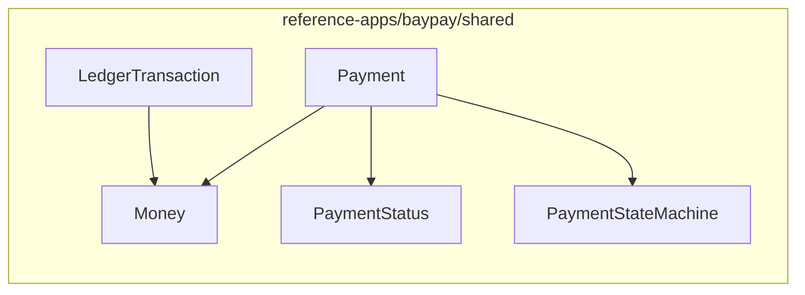

# BUILD-101 — Build the BayPay transaction domain model

**Type:** BUILD  
**Module:** 1 — Enterprise Java Engineering  
**Duration:** 60–90 minutes  
**Lessons:** [L-1.2](../../course/modules/01-enterprise-java-engineering/lessons/L-1.2.md), [L-1.3](../../course/modules/01-enterprise-java-engineering/lessons/L-1.3.md)  
**Reference:** `reference-apps/baypay/shared`

---

## Scenario

BayPay’s product team is locking the first version of the Enterprise Payment Platform. Finance has written the lifecycle on a whiteboard: a payment is received, validated, authorized, processed, and completed. Operations added the failure words: declined, failed, reversed. Your job is to turn that whiteboard into Java types that **cannot** represent an illegal payment.

You are not writing the REST API. You are writing the model every later module will call.

---

## Business context

Avery Chen (`11111111-1111-1111-1111-111111111111`) will send `25.00 USD` from the active account (`22222222-2222-2222-2222-222222222221`). A second client retry, a frozen account, a `JPY` amount, and a jump from `RECEIVED` to `COMPLETED` must all fail in the **domain**, not in a controller comment.

The spec name for a posted ledger row is Transaction. In Java you will see `LedgerTransaction` so the type does not collide with `jakarta.transaction.Transaction`. Your excerpt should mention that naming choice.

---

## Learning objectives

- Implement `Money` as an immutable value object (`amount > 0`, `USD|EUR|GBP`, scale 2).
- Implement `PaymentStatus` with `allowedNext()` using `EnumSet` (or equivalent).
- Implement `Payment.received(...)` and `transitionTo` so status cannot be assigned freely.
- Reject illegal transitions with a domain error, not a boolean ignore.
- Produce a portfolio excerpt that an interviewer can read in five minutes.

---

## Architecture



Study the production types, then re-implement the rules in your lab workspace (you may omit JPA annotations). The reference is the contract, not a file to paste blindly.

Happy path: `RECEIVED → VALIDATING → AUTHORIZED → PROCESSING → COMPLETED`.  
Also required: `VALIDATING → DECLINED`, `AUTHORIZED|PROCESSING → FAILED`, `COMPLETED → REVERSED`. Terminal states do not leave.

---

## Prerequisites

- JDK 21 and the repo cloned.
- Lessons L-1.2 and L-1.3 completed.
- Ability to run `javac` / JUnit or the BayPay Maven Wrapper.

---

## Environment setup

```bash
export JAVA_HOME="${JAVA_HOME:-/opt/homebrew/opt/openjdk@21}"
cd labs
../reference-apps/baypay/mvnw -pl BUILD-101 test
```

Stubs under `src/main/java/com/baypay/labs/build101/` compile and fail the contract tests until you implement them. Do not modify the reference app unless you are exploring; revert any experiment before you finish. Optional: `cd reference-apps/baypay && ./mvnw -pl shared test` still passes.

---

## Challenge/tasks

1. **Read** `Money`, `Payment`, `PaymentStatus`, `PaymentStateMachine`, `Account`, `LedgerTransaction` under `reference-apps/baypay/shared/src/main/java/com/baypay/shared/domain/`.
2. **Implement `Money`** with:
   - constructor / `of(String amount, String currency)`
   - reject null, zero, negative, and unsupported currency
   - `plus` / `minus` that require the same currency
   - `equals` / `hashCode` using numeric value (`compareTo`), not scale-sensitive `BigDecimal.equals`
3. **Implement `PaymentStatus`** with `isTerminal()`, `isRefundable()`, `allowedNext()`, `canTransitionTo()`.
4. **Implement `PaymentStateMachine.assertTransition`** that throws on an illegal edge (including `RECEIVED → COMPLETED`).
5. **Implement `Payment`** with factory `received(id, customerId, accountId, money, reference, idempotencyKey, now)` starting at `RECEIVED`, plus `transitionTo`, `decline`, and `fail`. No public `setStatus`.
6. **Write tests** that cover at least: good `plus`; currency mismatch; zero amount; `JPY`; every legal edge; `RECEIVED → COMPLETED` rejected; declined is terminal.
7. **Draft** the portfolio excerpt in [student/worksheets/PF-domain-model.md](../../student/worksheets/PF-domain-model.md).

---

## Validation

You pass when all of the following are true:

- `new Money(BigDecimal.ZERO, "USD")` throws.
- `Money.of("10.00", "JPY")` throws.
- `Money.of("10.00", "USD").plus(Money.of("1.00", "EUR"))` throws.
- `Money.of("10.0", "USD")` equals `Money.of("10.00", "USD")`.
- `Payment.received(...)` has status `RECEIVED` and the given idempotency key.
- `transitionTo(COMPLETED)` from `RECEIVED` throws.
- `VALIDATING → DECLINED` succeeds and stores a failure reason via `decline`.
- Your tests run on JDK 21 without using raw types.

- `../reference-apps/baypay/mvnw -pl BUILD-101 test` passes on your implementation.

Optional: `./mvnw -pl shared test` still passes (you did not break the reference).

---

## Troubleshooting

| Symptom | What to check |
|---|---|
| `UnsupportedClassVersionError` | `JAVA_HOME` is JDK 21 (see L-1.1) |
| `equals` tests fail on `10.0` vs `10.00` | Use `compareTo`, hash with `stripTrailingZeros` |
| `setScale` throws `ArithmeticException` | Amount has more than two decimal places; that is correct to reject |
| Illegal transition “works” | You assigned `status` directly instead of going through the machine |
| JPA `protected` constructor confusion | Lab copy does not need JPA; keep a private/protected no-arg only if you persist |

---

## Expected outcome

A small, tested domain package and a filled worksheet. A reviewer can see `Money` invariants, the eight statuses, and the transition table without opening Spring.

---

## Interview questions

1. Why is `Money` a value object and `Payment` an entity?
2. Why reject `RECEIVED → COMPLETED` even if a support engineer “knows” the money moved offline?
3. How would you add `CAD` without scattering `if` statements through the API?

---

## Architecture/trade-off questions

1. BayPay keeps JPA annotations on the domain type. When would you split a persistence model?
2. Why is the ledger type named `LedgerTransaction` in Java when the spec says Transaction?
3. Would you make `Payment` fully immutable (new instance per transition)? What would JPA `@Version` have to do?

---

## Cleanup

No cloud resources. Delete any scratch branches or edited reference files:

```bash
git checkout -- reference-apps/baypay
```

Local cost remains $0.

---

## Cost estimate

**$0.** JDK and the Maven Wrapper run on your machine. Do not create AWS resources for this lab.

---

## Hidden/revealable solution

Attempt the tasks first. The reference types in `shared` are the production shape. After you have tests of your own, you may open the instructor comparison notes.

<details>
<summary>Open after attempt</summary>

Compare your types with `reference-apps/baypay/shared/src/main/java/com/baypay/shared/domain/` and the write-up in `solutions/BUILD-101/`. Your lab copy does not need `@Entity` annotations if you are not persisting. It does need the same invariants and transition table.

</details>

---

## What you learned

- Invariants belong in constructors and factories.
- A state machine is a typed collection of legal edges, not a setter.
- Tests that name illegal transitions are part of the model.
- Naming (`LedgerTransaction`) is an architectural decision.

---

## Portfolio deliverable

Complete [student/worksheets/PF-domain-model.md](../../student/worksheets/PF-domain-model.md): transition table, `Money` rules, entity list, and a short defense of why `setStatus` is forbidden. This is the Module 1 portfolio artifact.
