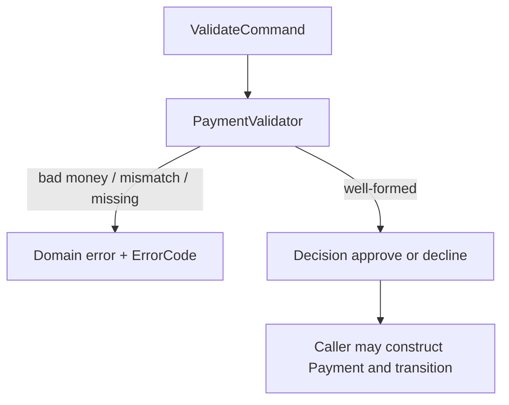

# BUILD-102 — Implement payment validation

**Type:** BUILD  
**Module:** 1 — Enterprise Java Engineering  
**Duration:** 60–90 minutes  
**Lessons:** [L-1.4](../../course/modules/01-enterprise-java-engineering/lessons/L-1.4.md), [L-1.5](../../course/modules/01-enterprise-java-engineering/lessons/L-1.5.md)  
**Reference:** `PaymentApplicationService`, `PaymentAuthorizer`, `Money`

---

## Scenario

BayPay’s API will soon accept `POST /api/v1/payments`. Before Spring enters the picture in Module 3, the platform needs a **pure validator** that answers: may this request become a `Payment` in `VALIDATING`, and if it is well-formed, should authorization approve or decline?

You will implement that validator against Avery Chen’s synthetic accounts. Frozen money must not authorize. A GBP payment must not attach to a USD account. A typo customer id is not a decline — it is not-found.

---

## Business context

Merchants retry. Support greps logs. Finance asks why a payment is `DECLINED` versus why it never existed. Those are different business outcomes:

| Situation | Outcome |
|---|---|
| Amount ≤ 0 or currency not USD/EUR/GBP | Validation failure — do not persist a payment |
| Customer or account id unknown | Not-found — do not persist a payment |
| Account exists but belongs to someone else | Validation failure (`ACCOUNT_CUSTOMER_MISMATCH`) |
| Account `FROZEN` or `CLOSED` | Well-formed request, **decline** |
| Account currency ≠ payment currency | **Decline** (authorizer) |
| Amount above `1000000.00` | **Decline** (authorization ceiling) |
| Active account, matching currency, amount in range | **Approve** |

Demo ids:

| Name | Value |
|---|---|
| Avery Chen | `11111111-1111-1111-1111-111111111111` |
| Active USD | `22222222-2222-2222-2222-222222222221` |
| Frozen USD | `22222222-2222-2222-2222-222222222222` |

---

## Learning objectives

- Throw typed errors for malformed money and missing / mismatched identities.
- Return a decision record for approve versus decline (do not throw for a freeze).
- Keep the validator free of HTTP, logging of secrets, and swallowed exceptions.
- Cover Avery’s active and frozen accounts in tests.

---

## Architecture



In production, `PaymentApplicationService` loads `Customer` and `Account` via repositories, constructs `Money`, then calls `PaymentAuthorizer`. Your lab validator can take already-loaded views (or `Optional`s) so you do not need Spring.

Study:

- `reference-apps/baypay/payment-service/src/main/java/com/baypay/payment/application/PaymentAuthorizer.java`
- `.../PaymentApplicationService.java`
- `reference-apps/baypay/shared/src/main/java/com/baypay/shared/domain/Money.java`
- `.../Account.java`

---

## Prerequisites

- BUILD-101 completed (you understand `Money` and statuses).
- L-1.4 and L-1.5 read.
- JDK 21.

---

## Environment setup

```bash
export JAVA_HOME="${JAVA_HOME:-/opt/homebrew/opt/openjdk@21}"
cd labs
../reference-apps/baypay/mvnw -pl BUILD-102 test
```

Implement `validate` in `src/main/java/com/baypay/labs/build102/PaymentValidator.java`. The records are the contract; contract tests live under `src/test/java`. Optional: `cd reference-apps/baypay && ./mvnw -pl payment-service -am test`.

---

## Challenge/tasks

Implement `PaymentValidator` with this behavior (names may match the solution; the contract matters more than the class name):

```java
public final class PaymentValidator {
    public record Command(
            UUID customerId,
            UUID accountId,
            BigDecimal amount,
            String currency,
            Optional<CustomerView> customer,
            Optional<AccountView> account) {}

    public record CustomerView(UUID id) {}

    public record AccountView(UUID id, UUID customerId, String currency, String status) {}

    public record Decision(boolean approved, String reason, String errorCode) {}

    public Decision validate(Command command);
}
```

Rules:

1. If `customer` is empty → fail with `CUSTOMER_NOT_FOUND` (throw or return a failure that tests can distinguish; throwing is preferred to match production).
2. If `account` is empty → `ACCOUNT_NOT_FOUND`.
3. If `account.customerId` ≠ `customerId` → `ACCOUNT_CUSTOMER_MISMATCH`.
4. Construct `Money` (or equivalent checks): amount > 0, currency in `{USD, EUR, GBP}`.
5. If account status is not `ACTIVE` → decline `ACCOUNT_NOT_ACTIVE` / `"account is not ACTIVE"`.
6. If account currency ≠ payment currency → decline currency mismatch.
7. If amount `> 1000000.00` → decline authorization ceiling.
8. Otherwise approve.

Do not catch `Exception`. Do not use raw types. Do not return `null`.

Write tests for: Avery active + `25.00 USD` approve; Avery frozen decline; unknown customer; account/customer mismatch; `JPY`; zero amount; `1000000.01` decline; `1000000.00` approve.

---

## Validation

- All tests above pass on JDK 21.
- Frozen account does **not** throw if the ids are valid; it declines.
- Unknown customer does **not** return `approved=false` without a not-found code.
- No `orElse(null)` on the `Optional` views.

---

## Troubleshooting

| Symptom | What to check |
|---|---|
| Frozen path throws | You used exceptions for a business decline |
| Unknown customer looks like a decline | You collapsed empty `Optional` into `approved=false` |
| `1000000.00` declines | Ceiling is exclusive-greater-than; equal is allowed |
| Currency `usd` accepted | Production set is exact `USD`, `EUR`, `GBP` |
| NPE on empty account | You called `account.get()` instead of `orElseThrow` |

---

## Expected outcome

A validator you could drop next to `PaymentAuthorizer`. Tests name Avery’s two accounts. No Spring context required.

---

## Interview questions

1. Why is a frozen account a decline and a missing account a not-found?
2. Why must ownership be checked after both `Optional`s are present?
3. Should the validator log Avery’s email? Why or why not?

---

## Architecture/trade-off questions

1. Production splits “construct `Money`” (throw) from `PaymentAuthorizer` (decision). What do you gain by keeping that split?
2. The ceiling is `1000000.00` in code. Where else should that number live before BayPay is real-money production?
3. Would you validate idempotency keys in this class or in a header filter? Why?

---

## Cleanup

```bash
git checkout -- reference-apps/baypay
```

No cloud resources.

---

## Cost estimate

**$0** local. No AWS.

---

## Hidden/revealable solution

Build and test first. Production behavior is in `PaymentAuthorizer` and `PaymentApplicationService`.

<details>
<summary>Open after attempt</summary>

Instructor comparison: `solutions/BUILD-102/`. Your decline reasons should be stable strings so HTTP mapping and tests stay aligned.

</details>

---

## What you learned

- Validation failures and authorization declines are different outcomes.
- `Optional` at the boundary becomes a typed exception or a typed view, never `null`.
- Avery’s frozen account is the canonical fail-closed demo.

---

## Portfolio deliverable

Add a short “Validation outcomes” table to your Module 1 notes (you may append it to [PF-domain-model.md](../../student/worksheets/PF-domain-model.md)): one row each for throw versus decline, with the error code you used.
