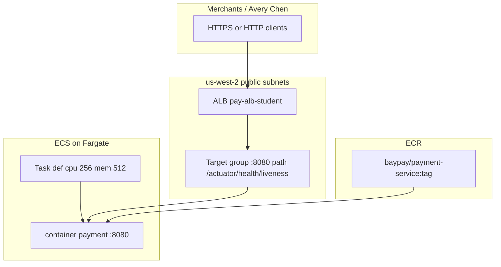

# BUILD-1101 — Deploy BayPay on ECS/Fargate

**Type:** BUILD (awsLab)  
**Module:** 11 — AWS Container Platforms  
**Duration:** 60–90 minutes  
**Cost:** $0 paper / `terraform validate`; **billable if you apply**  
**Lessons:** L-11.1, L-11.2  
**Diagram:** AEJE-D-048 (ECR and ECS/Fargate BayPay)  
**Account notes:** [datasets/baypay-aws/ACCOUNT.md](../../datasets/baypay-aws/ACCOUNT.md)  
**Starter:** [starter/](starter/)  
**Worksheet:** [student/worksheets/PF-aws-platform.md](../../student/worksheets/PF-aws-platform.md)

This lab is **file-first**. You finish Terraform that would place `payment-service` on ECS/Fargate behind an ALB in `us-west-2`. Live `terraform apply` is useful and **not required** to pass.

---

## Scenario

Sam Okada wants `baypay/payment-service` in ECR so Module 11 can talk about a running task without inventing a cluster. Jordan Voss left a starter that creates a VPC, an ALB, and a Fargate service — then forgot the process contract from ACCOUNT.md. Priya Nair will not sign a target group that health-checks `/`. Riley Okonkwo will not ship a task definition that does not declare port `8080`.

Your job is to finish parseable Terraform a Staff engineer could `validate` (and, if the cohort spends, `apply`) without a NAT Gateway, EKS, or RDS. You are not standing up Kubernetes. You are not opening a production account.

---

## Business context

Avery Chen (`11111111-1111-1111-1111-111111111111`) still posts through `/api/v1/payments` on port `8080`. Harbor Bike Co does not care whether the process started as a Module 10 Pod or as an ECS task. Finance cares that the image lives in ECR as `baypay/payment-service:<tag>` (never `:latest`), that the ALB does not sit idle overnight, and that nobody added a NAT Gateway “because Fargate in private subnets is how production looks.”

The application is still `reference-apps/baypay` (Java 21, Spring Boot 3.5.5). Liveness remains `/actuator/health/liveness`. The student apply profile is `local` (in-memory H2) so this lab does not create RDS. `BAYPAY_DB_*` from Secrets Manager is SECURITY-1103 — do not put a password in this task definition.

Teaching ALB host: `pay-alb-student.baypay.example`. A real apply uses the AWS-generated DNS name.

---

## Learning objectives

- Complete Terraform for ECR + ECS/Fargate + ALB in **`us-west-2`** with public subnets and an Internet Gateway.
- Set `containerPort = 8080` and target-group health check **`/actuator/health/liveness`** (matcher `200`). Never leave path `/`.
- Size the task at **0.25 vCPU / 512 MiB**. Refuse NAT, EKS, and RDS for this lab.
- Tag every resource `Course=AEJE`, `Module=11`, `Lab=BUILD-1101`, `Environment=student`, `Expiration=<ISO date>`.
- Validate with `terraform validate`. Treat `apply` as extra credit you destroy the same day.
- Start the Module 11 portfolio page: platform, image, health path.

---

## Architecture

Course diagram **AEJE-D-048** is this deploy. Until the PNG is on disk, use the mermaid below plus ACCOUNT.md.

**Region:** `us-west-2` only.

**Service list (student apply subset):** VPC, Internet Gateway, two public subnets, security groups, ECR, ECS cluster, Fargate service, task definition, IAM execution role + empty task role, ALB, target group, HTTP listener, CloudWatch log group (3-day retention). **Not in this lab:** NAT Gateway, EKS, RDS, NLB, Route 53 hosted zone, Secrets Manager (SECURITY-1103).



Alt text: Merchants reach an Application Load Balancer in us-west-2 public subnets. The target group health-checks /actuator/health/liveness on port 8080. A Fargate task (256 CPU, 512 MiB) runs payment-service from ECR. No NAT Gateway and no RDS appear.

**Least privilege:** the execution role uses `AmazonECSTaskExecutionRolePolicy` (pull + logs). The task role is a separate principal and stays empty here. Do not attach `AdministratorAccess` to either role. Your **console/sandbox user** is a different identity — do not copy that user’s admin policy onto the task.

**Failure scenario:** if health path stays `/`, ECS tasks can show `RUNNING` while the ALB marks targets unhealthy and merchants see 502/503. That is INCIDENT-1104, not a reason to add a security-group hole or a NAT Gateway.

---

## Prerequisites

- [datasets/baypay-aws/ACCOUNT.md](../../datasets/baypay-aws/ACCOUNT.md) open beside the starter.
- BUILD-305 / BUILD-901 contracts: port `8080`, liveness `/actuator/health/liveness`, no secrets in the image.
- Ability to read HCL (`resource`, `variable`, `jsonencode`).
- Optional: Terraform `>= 1.5` and an AWS sandbox in `us-west-2` you are allowed to spend in. **Not required to pass.**
- Lessons L-11.1 / L-11.2 if present. Lessons stand alone; this lab stands alone without a live account.
- Least-privilege note: do not use production account keys. Do not commit access keys. Student apply uses a sandbox; task roles stay narrow.

---

## Environment setup

Confirm the starter exists. You do **not** have to call AWS.

```bash
test -f labs/BUILD-1101/starter/main.tf && echo "starter present"
test -f datasets/baypay-aws/ACCOUNT.md && echo "account notes present"
```

Copy the starter so you can diff:

```bash
mkdir -p /tmp/aeje-build-1101
cp labs/BUILD-1101/starter/*.tf /tmp/aeje-build-1101/
```

Optional paper validate (no spend):

```bash
cd /tmp/aeje-build-1101
terraform init
terraform validate
```

`init` downloads the AWS provider. It does not create an ALB. `apply` is extra credit — read **Cost estimate** first.

If you apply:

```text
region:          us-west-2
subnets:         public only
assign_public_ip: true
forbidden:       NAT Gateway, EKS, RDS, always-on EC2
tags:            Course=AEJE Module=11 Lab=BUILD-1101 Environment=student Expiration=<ISO date>
```

The instructor key is `solutions/BUILD-1101/`. Do not open it until your checklist is green.

---

## Challenge/tasks

1. **Read the starter.** Open `labs/BUILD-1101/starter/main.tf`. List what is missing against ACCOUNT.md before you edit: health check path, `containerPort`.
2. **Health check.** On `aws_lb_target_group.pay`, add `health_check` with `path = "/actuator/health/liveness"`, `port = "8080"`, `protocol = "HTTP"`, `matcher = "200"`. Do not use `/` or `/health`.
3. **Container port.** In `portMappings`, set `containerPort = 8080`. That is the process port from ACCOUNT.md and the Boot app.
4. **Keep the cheap shape.** Fargate `cpu = "256"` and `memory = "512"`. `desired_count = 1`. Public subnets + IGW. `assign_public_ip = true`. Container Insights **disabled**.
5. **Refuse expensive extras.** No `aws_nat_gateway`. No EKS. No RDS. No second ALB. No `t3` instance “so we can SSH.”
6. **Tags.** `Course=AEJE`, `Module=11`, `Lab=BUILD-1101`, `Environment=student`, `Expiration` (ISO date you will honor).
7. **Secrets.** No `BAYPAY_DB_PASSWORD` in `environment`. Profile `local` is enough for a student apply (H2). SECURITY-1103 injects Secrets Manager.
8. **Roles.** Leave execution and task as **two** roles. Do not attach `AdministratorAccess`.
9. **Validate.** `terraform validate` on your copy. Do not require `apply` to pass.
10. **Worksheet.** Start [PF-aws-platform.md](../../student/worksheets/PF-aws-platform.md) sections for the deploy and the public-subnet trade-off.

---

## Validation

Self-check (this is the grade path — not a green target in the console):

- [ ] `health_check.path` is `/actuator/health/liveness`.
- [ ] Health check port is `8080` and matcher includes `200`.
- [ ] `containerPort = 8080` is present in the task definition.
- [ ] Region variable defaults to `us-west-2`.
- [ ] No NAT Gateway, EKS, or RDS resource.
- [ ] Fargate cpu `256` / memory `512`.
- [ ] Tags include Course, Module, Lab, Environment, Expiration.
- [ ] No password, token, or access key in the `.tf` files.
- [ ] Execution role and task role are different resources.
- [ ] You did not require a live `terraform apply` to pass.

Instructor scores the files with [instructor/rubrics/BUILD-1101.md](../../instructor/rubrics/BUILD-1101.md).

**Expected final state (paper):** a completed Terraform tree a Staff engineer could `init` + `validate`, and later `apply` in a sandbox, that matches ACCOUNT.md. **Expected final state (if you applied):** one healthy target on the ALB, one `RUNNING` Fargate task, ECR repo `baypay/payment-service` with an immutable tag, then **destroyed the same day**.

---

## Troubleshooting

| Symptom | What to check |
|---|---|
| Starter has no `health_check` | That is the incomplete file. Add the ACCOUNT.md path. |
| Path still `/` | Provider default. Spring Boot 404s `/`. INCIDENT-1104. |
| No `containerPort` | The starter omitted it. Set `8080`. |
| Tempted to add NAT “for private Fargate” | Stop. Public subnet + IGW is the locked student shape. COST-1105. |
| Tempted to add EKS “for realism” | Out of scope. ARCHITECT-1102 is paper. |
| Tempted to add RDS | Out of scope. Use `SPRING_PROFILES_ACTIVE=local`. |
| `terraform validate` wants `init` | Run `terraform init` first. That is not `apply`. |
| Optional apply: targets unhealthy | Confirm path and port before opening security groups. A **404** means the packet arrived. |
| Optional apply: cannot pull image | You must push to the ECR URL you created, or point `container_image` at an image you own. Paper path still passes. |
| Want to set `-Xmx512m` | Not this lab. Heap equal to a limit is forbidden in this course. |

---

## Expected outcome

A completed Terraform tree a Staff engineer could later apply in `us-west-2` without reintroducing `/` as a health path, a missing `containerPort`, a NAT Gateway, or a password environment variable. Files match the intent of `solutions/BUILD-1101/` even if resource names differ slightly.

---

## Interview questions

1. Why is an ECS task `RUNNING` a weak sentence if the ALB target is unhealthy?
2. Why does Spring Boot on `payment-service` 404 `/` while `/actuator/health/liveness` returns 200?
3. What does `assign_public_ip = true` on a public subnet replace, and what security trade-off did you accept?
4. Why are the ECS **execution** role and **task** role different principals?

---

## Architecture/trade-off questions

1. Public subnet + IGW versus private subnet + NAT for a 90-minute lab — cost versus isolation?
2. ALB versus NLB in front of a Spring Boot HTTP API — which health-check model did you need?
3. Fargate 256/512 versus an always-on `t3.small` — who pays when the service desired count is zero?
4. Why is `pay-alb-student.baypay.example` a teaching name and not a reason to open Route 53 this week?

---

## Cleanup

**If you only edited files:** delete `/tmp/aeje-build-1101` if you used it. Do not “fix” `labs/BUILD-1101/starter/` in place for classmates.

**If you applied:** destroy **the same day**. An idle ALB still bills. Empty ECR still has storage cost.

```bash
cd /tmp/aeje-build-1101   # or your apply directory
terraform destroy -auto-approve
```

Then confirm leftovers are gone (console or CLI) in `us-west-2`:

- Application Load Balancer, listener, and target group
- ECS service, cluster, and task definition
- ECR repository **and images** (`force_delete` is set on the repo; still verify)
- CloudWatch log group `/ecs/baypay-1101/payment-service`
- VPC, subnets, IGW, security groups, IAM roles you created

Do **not** leave an ALB overnight. Do not leave a Fargate service at `desired_count = 1` after class.

---

## Cost estimate

**$0** if you stay on paper + `terraform validate`.

**Warning — apply creates a real bill.** ALB is about **$0.0225/hour plus LCU**. Fargate at 0.25 vCPU / 0.5 GB is on the order of **$0.01–$0.02/hour** per task. Same-day session (1–4 hours, then destroy): about **$0.15–$2.00**. Overnight idle ALB alone is about **$0.54** even with zero traffic. A forgotten ALB + Fargate task + leftover ECR for a week can reach about **$5–$15**. **Do not add a NAT Gateway** (~$0.045/hour plus data — often more than the ALB). **Destroy the same day.** These figures are teaching estimates in USD for `us-west-2`; your invoice can differ.

---

## Hidden/revealable solution

Attempt the checklist on **your** file first. The instructor copy lives in `solutions/BUILD-1101/` (`.tf` files and a README). Opening it before you edit is a failed Diagnostic method score.

<details>
<summary>Reveal checklist — after you have edited the starter</summary>

Required: `health_check.path = /actuator/health/liveness` on port 8080 with matcher 200; `containerPort = 8080`; no NAT/EKS/RDS; cpu 256 / memory 512; tags present; no password `environment`. If any of those fail, fix your file before you read `solutions/`.

</details>

---

## What you learned

An ECS deploy is a contract: image in ECR, task on Fargate at 256/512, process port 8080, ALB health on `/actuator/health/liveness`, public subnets without NAT, tags with an expiration. The starter that “creates an ALB” is not a payment front door if the target group pings `/`. Apply is a tool you may use; the files are the deliverable.

---

## Portfolio deliverable

Complete the **deploy** and **public-subnet trade-off** sections of [student/worksheets/PF-aws-platform.md](../../student/worksheets/PF-aws-platform.md). Cite AEJE-D-048. Attach your working Terraform (not the untouched starter). This lab starts the Module 11 portfolio artifact; ARCHITECT-1102 and COST-1105 fill the rest.
