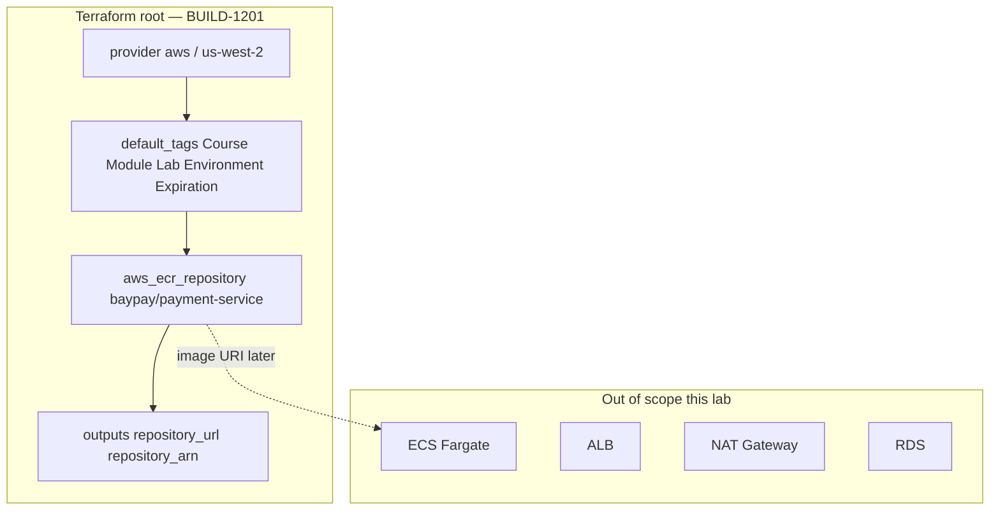

# BUILD-1201 — Terraform AWS environment

**Type:** BUILD  
**Module:** 12 — Terraform, Ansible and CI/CD  
**Duration:** 45–75 minutes  
**Cost:** **$0** for `terraform validate`. **Real AWS bills if you apply.**  
**awsLab:** yes  
**Region:** `us-west-2`  
**Lessons:** L-12.4  
**Account notes:** [datasets/baypay-aws/ACCOUNT.md](../../datasets/baypay-aws/ACCOUNT.md)  
**Starter:** [starter/](starter/)  
**Healthy example:** [infrastructure/terraform/baypay-ecs/](../../infrastructure/terraform/baypay-ecs/)  
**Worksheet:** [student/worksheets/PF-iac.md](../../student/worksheets/PF-iac.md)

This lab is an **environment skeleton**. You finish a small Terraform root: provider, tags, one cheap ECR repository, and outputs. You are **not** standing up ECS, an ALB, NAT, EKS, or RDS. If BUILD-1101 already applied Fargate, still complete this root — it is the tagged sandbox other Module 12 work assumes.

**Cost warning:** `terraform apply` in a real account creates billable AWS resources. Prefer `terraform validate` if you cannot spend. Destroy what you create. Empty ECR still has storage cost after you push an image. Do not leave an ALB or Fargate service running from a later experiment.

---

## Scenario

Sam Okada wants a student sandbox in `us-west-2` that Finance can find in the bill: tags `Course=AEJE`, `Module`, `Lab`, `Environment=student`, and an `Expiration` date. Jordan Voss left a starter that points the AWS provider at the wrong region and never declares `required_providers`. Riley Okonkwo will not accept a root that can only create a repository if someone pastes an access key into a `.tf` file.

Your job is to complete `provider.tf`, `variables.tf`, `ecr.tf`, and `outputs.tf` so `terraform validate` succeeds. Full ECS is out of scope. Paper plus validate is enough to pass.

---

## Business context

Avery Chen (`11111111-1111-1111-1111-111111111111`) still posts `25.00 USD` through `/api/v1/payments` on port `8080`. Harbor Bike Co does not care whether the image lives in a teaching registry or in ECR. Finance cares that the repository is named `baypay/payment-service`, that tags are immutable, and that a student experiment does not become an overnight ALB.

The application is still `reference-apps/baypay` (Java 21, Spring Boot 3.5.5). Liveness remains `/actuator/health/liveness`. This lab does **not** run that process. It creates the **registry contract** other labs push into.

---

## Learning objectives

- Write a Terraform 1.x root with `terraform { required_providers { aws } }` and `variable "region" { default = "us-west-2" }`.
- Apply default tags required by [ACCOUNT.md](../../datasets/baypay-aws/ACCOUNT.md): `Course`, `Module`, `Lab`, `Environment`, `Expiration`.
- Declare one `aws_ecr_repository` (cheap). Do not add a VPC, NAT Gateway, ALB, or ECS service here.
- Output `repository_url` and `repository_arn`.
- Validate with `terraform validate`. Treat `apply` as optional and expensive.
- Start the Module 12 portfolio page: root layout, region, tags, what you refused to create.

---

## Architecture

Until a course PNG is on disk, use the mermaid below plus ACCOUNT.md.



Alt text: A small Terraform root in us-west-2 tags an ECR repository for baypay/payment-service. ECS, ALB, NAT, and RDS are explicitly out of scope.

### Service list

| Service | In this lab? | Why |
|---|---|---|
| ECR | Yes — one repository | Cheap; needed to name the image |
| IAM | Your existing principal only | No `aws_iam_user` access keys in git |
| ECS / Fargate | No | BUILD-1101 / later apply |
| Elastic Load Balancing (ALB) | No | Dollars per day; ACCOUNT.md forbids overnight ALB |
| NAT Gateway / EKS / RDS / OpenSearch | No | Expensive; not this skeleton |

### Region assumptions

`us-west-2` only. The starter’s `us-east-1` provider is a defect. Do not “fix” it by applying in two regions.

### Least-privilege / security notes

- The operator identity needs ECR create/describe/tag on `baypay/payment-service`, not `AdministratorAccess`.
- Never commit access keys, session tokens, or `changeme` passwords.
- Prefer immutable tags on the repository so a later pipeline cannot overwrite `3.8.0` with `:latest`.
- `BAYPAY_DB_*` do not belong in this root. Secrets Manager is Module 11; this lab has no secret resources.

### Failure scenario

A root that applies in `us-east-1`, skips tags, or adds an ALB “so we can demo Avery” fails the lab even if `validate` is green. A `.tf` file that embeds `AKIA...` or a secret fails Security regardless of ECR syntax.

---

## Prerequisites

- [datasets/baypay-aws/ACCOUNT.md](../../datasets/baypay-aws/ACCOUNT.md) open beside the starter.
- Terraform CLI 1.5+ (`terraform version`). You do **not** need AWS credentials to `validate`.
- Optional student sandbox account you are allowed to spend in. Not required to pass.
- Lessons L-12.4 if present. Module 11 platform choice (ECS vs EKS) is already decided for the default: **ECS on Fargate** — you still do not apply it here.

---

## Environment setup

Copy the starter so classmates keep the incomplete original:

```bash
mkdir -p /tmp/aeje-build-1201
cp labs/BUILD-1201/starter/*.tf /tmp/aeje-build-1201/
cd /tmp/aeje-build-1201
```

Initialize and validate (no account required):

```bash
terraform init -backend=false
terraform validate
```

The starter is **expected to fail** validate until you add `required_providers` and finish the repository. The instructor key is `solutions/BUILD-1201/`. The course-level healthy skeleton is `infrastructure/terraform/baypay-ecs/`. Do not open either until your checklist is green.

If you choose to apply (optional, costs money):

```bash
# extra credit only — not the grade path
# terraform plan
# terraform apply
# terraform destroy
```

---

## Challenge/tasks

1. **Read the starter.** Open `labs/BUILD-1201/starter/`. List gaps against ACCOUNT.md before you edit: provider block, region, tags, ECR, outputs.
2. **Provider.** Add `terraform { required_providers { aws = { source = "hashicorp/aws" } } }`. Configure `provider "aws"` with `region = var.region`.
3. **Region variable.** `variable "region" { type = string, default = "us-west-2" }`. Do not leave `us-east-1` as a hardcoded provider region.
4. **Tags.** `default_tags` (or resource tags) must include `Course=AEJE`, `Module=12`, `Lab=BUILD-1201`, `Environment=student`, and `Expiration` (ISO date).
5. **ECR.** One `aws_ecr_repository` named `baypay/payment-service` (or that name via a variable). Prefer `image_tag_mutability = "IMMUTABLE"` and scan-on-push. A lifecycle rule that expires untagged images is welcome.
6. **Outputs.** `repository_url` and `repository_arn`.
7. **Refuse scope.** Do not add `aws_ecs_cluster`, `aws_lb`, `aws_nat_gateway`, `aws_db_instance`, or EKS. This root is the env skeleton.
8. **No secrets.** No access keys, no `BAYPAY_DB_PASSWORD`, no `changeme`.
9. **Validate.** `terraform init -backend=false` then `terraform validate` must exit 0 on **your** copy.
10. **Worksheet.** Start [PF-iac.md](../../student/worksheets/PF-iac.md) sections for the Terraform root.

---

## Validation

Self-check (this is the grade path — not `terraform apply`):

- [ ] `terraform { required_providers { aws } }` is present.
- [ ] `variable "region"` defaults to `us-west-2`.
- [ ] Provider region is `var.region`, not a hardcoded `us-east-1`.
- [ ] Tags include Course, Module, Lab, Environment, Expiration.
- [ ] One `aws_ecr_repository` for `baypay/payment-service`.
- [ ] Outputs include `repository_url` and `repository_arn`.
- [ ] No VPC, NAT, ALB, ECS service, RDS, or EKS resources.
- [ ] No access keys or passwords in any `.tf` file.
- [ ] `terraform validate` succeeds on your working copy.
- [ ] You did not require a live AWS apply to pass.

Instructor scores the files with [instructor/rubrics/BUILD-1201.md](../../instructor/rubrics/BUILD-1201.md).

---

## Troubleshooting

| Symptom | What to check |
|---|---|
| `terraform validate` wants init | Run `terraform init -backend=false` first. |
| Missing required providers | The starter omitted the `terraform` block. Add `hashicorp/aws`. |
| Provider still `us-east-1` | That was the defect. Use `var.region` defaulting to `us-west-2`. |
| Duplicate `variable "region"` | Declare it once per module (in `variables.tf`). |
| Tempted to add an ALB so Avery can curl | Stop. ACCOUNT.md: ALB is dollars/day. Not this lab. |
| Tempted to paste an access key so apply works | Stop. Use the shared sandbox profile or skip apply. |
| `Error: Insufficient IAM` on optional apply | Your principal needs ECR only. Do not attach AdministratorAccess to “unblock” class. |
| State file appeared after optional apply | Do not commit `terraform.tfstate`. Destroy, then delete local state if the lab says so. |

---

## Expected outcome

A completed four-file root a Staff engineer could later `plan` in `us-west-2` without inventing a VPC. Files match the intent of `solutions/BUILD-1201/` even if tag values or the lifecycle JSON differ slightly. `terraform validate` is green. Optional apply, if used, created only ECR and was destroyed.

---

## Interview questions

1. Why does `terraform validate` not prove that `apply` will be cheap?
2. What does `required_providers` prevent that a bare `provider "aws"` does not?
3. Why is `us-west-2` a course contract and not a personal preference this week?
4. Why is an immutable ECR tag safer for a payment image than `:latest`?

---

## Architecture/trade-off questions

1. One root that creates ECR versus a module you will write in BUILD-1202 — when is each honest?
2. `default_tags` on the provider versus tags on each resource — what happens to an untagged leftover?
3. Why keep ECS and ALB out of this skeleton even though the folder is named like an ECS lab later?
4. Local state versus a remote backend for a 75-minute student sandbox — what do you lose either way?

---

## Cleanup

No cloud resources if you only validated. If you applied, destroy **in this root** before you leave:

```bash
terraform destroy
# confirm the ECR repository is gone in us-west-2
rm -rf /tmp/aeje-build-1201
```

Delete local `terraform.tfstate*` if it exists in your working copy. Do not “fix” `labs/BUILD-1201/starter/` in place for classmates if you were asked to keep the incomplete original. Do not leave images in ECR; empty repos still cost after a push.

---

## Cost estimate

**Grade path: $0.** `terraform validate` uses no AWS API.

**Optional apply:** one ECR repository. Storage is cents after you push layers; an empty unused repo is typically negligible, but **you still destroy it**. Do not add ALB (~dollars/day), Fargate (cents-to-dollars per hour), NAT Gateway, EKS, or RDS. If you cannot spend, do not apply.

---

## Hidden/revealable solution

Attempt the checklist on **your** files first. The instructor copy lives in `solutions/BUILD-1201/` (`*.tf` and a README). Opening it before you edit is a failed Diagnostic method score.

<details>
<summary>Reveal checklist — after you have edited the starter</summary>

Required: `required_providers.aws`; `variable "region"` default `us-west-2`; provider uses `var.region`; ACCOUNT.md tags; one ECR repository; `repository_url` / `repository_arn` outputs; `terraform validate` exits 0; no keys; no ALB/ECS/NAT/RDS. If any of those fail, fix your files before you read `solutions/`.

</details>

---

## What you learned

A Terraform root is a contract: provider pin, region, tags Finance can query, and the cheapest resource that unblocks a later push. The starter that “looks like Terraform” in `us-east-1` without `required_providers` is not a BayPay sandbox. `validate` is the deliverable; `apply` is a privilege you pay for and then destroy.

---

## Portfolio deliverable

Complete the **Terraform root** section of [student/worksheets/PF-iac.md](../../student/worksheets/PF-iac.md). Cite ACCOUNT.md tags and `us-west-2`. Attach your working `.tf` files (not `terraform.tfstate`). This lab starts the Module 12 portfolio artifact; BUILD-1202 modules it.
