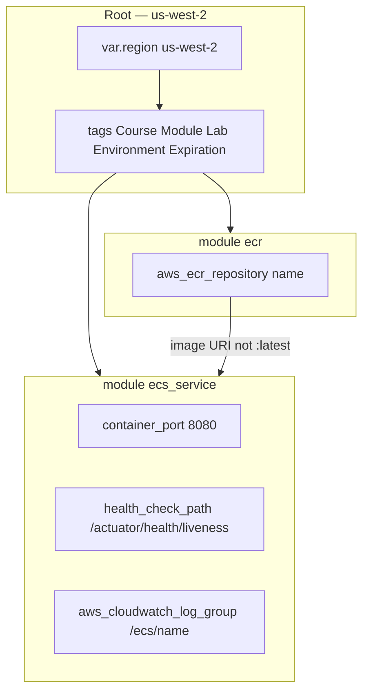

# BUILD-1202 — Reusable Terraform modules

**Type:** BUILD  
**Module:** 12 — Terraform, Ansible and CI/CD  
**Duration:** 60–90 minutes  
**Cost:** **$0** for `terraform validate`. **Real AWS bills if you apply.**  
**awsLab:** yes  
**Region:** `us-west-2`  
**Lessons:** L-12.4  
**Diagram:** AEJE-D-055 (Reusable Terraform modules)  
**Account notes:** [datasets/baypay-aws/ACCOUNT.md](../../datasets/baypay-aws/ACCOUNT.md)  
**Starter:** [starter/](starter/)  
**Worksheet:** [student/worksheets/PF-iac.md](../../student/worksheets/PF-iac.md)

This lab turns the BUILD-1201 root into **called modules**. You write `modules/ecr` and `modules/ecs_service` with variables for name, port **8080**, and health path. You do **not** apply a live Fargate service or an ALB. `terraform validate` is the grade path.

**Cost warning:** Optional `apply` still creates ECR (and a CloudWatch log group in the reference module). Destroy them. Do not add NAT, EKS, or an ALB to “make the module real.”

---

## Scenario

Priya Nair refused to copy-paste BUILD-1201’s repository block into every student folder. Sam Okada wants a module that can name `baypay/payment-service` once. Jordan Voss wants the **service contract** in Terraform so a later task definition cannot quietly listen on a debug port: container port `8080`, health `/actuator/health/liveness`.

The starter calls two modules that barely exist. `modules/ecs_service` does not even declare port or health path. Your job is to finish the modules so the root validates and the contract is visible in variables and outputs.

---

## Business context

Avery Chen’s client (`11111111-1111-1111-1111-111111111111`) retries when `/api/v1/payments` does not return. Finance does not read HCL. They care that every environment — student sandbox or `pay-alb-student.baypay.example` — advertises the **same** listen port and liveness path ACCOUNT.md locked.

A module that only wraps ECR is useful. A module named `ecs_service` that forgets port `8080` is how INCIDENT-1205 gets written. You are not required to register a live ECS service. You are required to make the contract reusable.

---

## Learning objectives

- Split a root into `modules/ecr` and `modules/ecs_service` with their own `variables.tf` / `outputs.tf`.
- Give `ecs_service` variables `name`, `container_port` (default `8080`), and `health_check_path` (default `/actuator/health/liveness`).
- Keep `terraform { required_providers { aws } }` and `variable "region" { default = "us-west-2" }` on the root **and** on each module.
- Call both modules from `main.tf` with ACCOUNT.md tags.
- Validate with `terraform validate`. Do not apply ALB or Fargate.
- Record the module boundary on [PF-iac.md](../../student/worksheets/PF-iac.md).

---

## Architecture

Course diagram **AEJE-D-055** is this module split. Until the PNG is on disk, use the mermaid below.



Alt text: A Terraform root in us-west-2 calls an ECR module and an ecs_service module. The service module exposes port 8080 and the BayPay liveness path; it does not create an ALB.

### Service list

| Service | In this lab? | Why |
|---|---|---|
| ECR | Yes — via `modules/ecr` | Reusable repository |
| CloudWatch Logs | Yes — one log group in `modules/ecs_service` | Cheap stand-in so the module has a real resource |
| ECS Fargate service / task | Interface only | Live service is BUILD-1101 / optional later apply |
| ALB | No | Cost; health path is a **variable**, not a listener |
| NAT / EKS / RDS | No | ACCOUNT.md cost rules |

### Region assumptions

`us-west-2`. Each module accepts `variable "region"` with that default even if the resource is global-shaped (ECR is regional).

### Least-privilege / security notes

- Apply-time IAM: `ecr:*` on the named repository, `logs:CreateLogGroup` / `logs:TagResource` / `logs:DeleteLogGroup` on `/ecs/payment-service`. Not `iam:*`, not `ec2:*`.
- Image references must be **immutable tags**, never `:latest`.
- No access keys in module sources. No `BAYPAY_DB_*` literals.

### Failure scenario

A module that hardcodes port `80` or omits the health path “because the ALB can be added later” fails Technical accuracy. A root that inlines the repository again and leaves `modules/` empty fails the point of the lab. Applying an ALB from this folder fails Cost and Cleanup.

---

## Prerequisites

- BUILD-1201 concepts (provider pin, tags, ECR). You may start from this starter; you do not have to copy your 1201 root.
- [ACCOUNT.md](../../datasets/baypay-aws/ACCOUNT.md) port `8080` and liveness `/actuator/health/liveness`.
- Terraform 1.5+. AWS credentials optional.
- Diagram AEJE-D-055.

---

## Environment setup

```bash
mkdir -p /tmp/aeje-build-1202
cp -R labs/BUILD-1202/starter/. /tmp/aeje-build-1202/
cd /tmp/aeje-build-1202
terraform init -backend=false
terraform validate
```

The starter may validate as a hollow tree. That is not a passing module. Finish `modules/ecr` and `modules/ecs_service` until the checklist is green.

Instructor key: `solutions/BUILD-1202/`. Do not open it first.

---

## Challenge/tasks

1. **Read the starter.** List what `modules/ecr` and `modules/ecs_service` are missing against AEJE-D-055 and ACCOUNT.md (repository, port, health path, region variable, outputs).
2. **Root pin.** Keep `terraform { required_providers { aws } }` and `variable "region" { default = "us-west-2" }` on the root. Provider region is `var.region`. Tags match ACCOUNT.md with `Lab=BUILD-1202`.
3. **Module `ecr`.** Variables: `name`, `region` (default `us-west-2`), `tags`. Resource: `aws_ecr_repository`. Outputs: `repository_url`, `repository_arn`. Prefer immutable tags.
4. **Module `ecs_service`.** Variables: `name`, `region` (default `us-west-2`), `container_port` (default `8080`), `health_check_path` (default `/actuator/health/liveness`), `image`, `tags`. Create a CloudWatch log group `/ecs/<name>` (retention 7 days). Do **not** create `aws_lb` or `aws_ecs_service`.
5. **Outputs from `ecs_service`.** Export `container_port`, `health_check_path`, `log_group_name`, and a `service_contract` map a reviewer can read without opening `main.tf`.
6. **Root `main.tf`.** Call both modules. Pass `container_port = 8080` and the ACCOUNT.md liveness path explicitly (defaults exist; passing them is the teaching point). Image must not be `:latest`.
7. **Validate.** `terraform validate` on your copy.
8. **Refuse scope.** No NAT, EKS, RDS, ALB, or access keys.
9. **Worksheet.** Fill the **modules** section of PF-iac.md. Cite AEJE-D-055.

---

## Validation

- [ ] Root and both modules declare `required_providers { aws }`.
- [ ] Root and both modules declare `variable "region"` default `us-west-2`.
- [ ] `modules/ecr` creates `aws_ecr_repository` and outputs URL/ARN.
- [ ] `modules/ecs_service` has `container_port` default `8080` and `health_check_path` default `/actuator/health/liveness`.
- [ ] Root calls both modules; image is not `:latest`.
- [ ] No ALB, NAT, EKS, RDS, or access keys.
- [ ] `terraform validate` succeeds.
- [ ] You did not require `terraform apply` to pass.

Instructor scores with [instructor/rubrics/BUILD-1202.md](../../instructor/rubrics/BUILD-1202.md).

---

## Troubleshooting

| Symptom | What to check |
|---|---|
| `module.ecs_service` has only `name` | That is the starter. Add port and health path variables. |
| Duplicate `variable "region"` inside one module | Declare it once (module `versions.tf` or `variables.tf`, not both). |
| Validate fails on missing child outputs | Root `outputs.tf` cannot reference attributes you never exported. |
| Wanted to add `aws_ecs_service` to “finish” the name | Not required. Log group + contract outputs are the cheap resource. |
| Image set to `:latest` so plan looks familiar | Change it. INCIDENT-1205 exists because of floating tags. |
| Module source path wrong | From the root, `source = "./modules/ecr"` (relative). |
| Optional apply: AccessDenied on logs | Least-privilege is logs on `/ecs/*`, not `AdministratorAccess`. |

---

## Expected outcome

Two reusable modules plus a thin root. `terraform validate` is green. A reviewer can see port `8080` and the liveness path without reading a blog. Files match the intent of `solutions/BUILD-1202/` even if you named the health variable `health_path` instead of `health_check_path`.

---

## Interview questions

1. What belongs in a module variable versus a `local` only the root knows?
2. Why pass `container_port` even when the default is already `8080`?
3. How does a module output help a pipeline smoke test later?
4. Why is `:latest` a broken input to `modules/ecs_service`?

---

## Architecture/trade-off questions

1. One `ecs_service` module versus separate `task_definition` and `alb` modules — what do you postpone on purpose?
2. Hardcoding the health path in the ALB listener versus taking it as a variable — which drift did AEJE-D-055 try to prevent?
3. Should student sandboxes share one ECR module instance or one per lab tag?
4. When does wrapping a single `aws_ecr_repository` still earn a module (this lab’s answer: the second caller in the next environment)?

---

## Cleanup

Validate-only: delete `/tmp/aeje-build-1202`. Optional apply: `terraform destroy` in **this** root, then confirm ECR and the log group are gone in `us-west-2`. Do not leave images. Do not edit the class starter in place.

---

## Cost estimate

**Grade path: $0** (`validate` only).

**Optional apply:** ECR + one CloudWatch log group (idle log groups are typically free or cents). Destroy both. ALB, Fargate, NAT, EKS, and RDS are out of scope and must not appear on the bill from this lab.

---

## Hidden/revealable solution

Work your copy first. Instructor files: `solutions/BUILD-1202/`. Opening them before you declare port and health path is a failed Diagnostic method score.

<details>
<summary>Reveal checklist — after you have edited the starter</summary>

Required: two modules; ECR resource; `ecs_service` variables for name, port 8080, health path; `region` default `us-west-2` on root and modules; `required_providers.aws`; no `:latest`; `terraform validate` exits 0. If any fail, fix your tree before `solutions/`.

</details>

---

## What you learned

A module is a contract other roots can call without copying tags and ports. ECR is the cheap resource. `ecs_service` in this lab is the **port and health interface**, not a license to apply an ALB. AEJE-D-055 is that split.

---

## Portfolio deliverable

Complete the **Reusable modules** section of [PF-iac.md](../../student/worksheets/PF-iac.md). Cite AEJE-D-055, port `8080`, and the liveness path. Attach your module `variables.tf` files.
