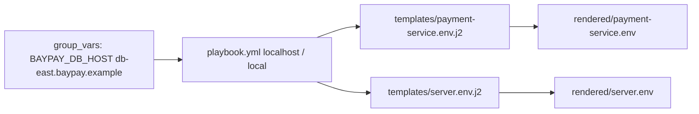

# BUILD-1203 — Configuration automation

**Type:** BUILD  
**Module:** 12 — Terraform, Ansible and CI/CD  
**Duration:** 45–60 minutes  
**Cost:** **$0**  
**awsLab:** no  
**Lessons:** L-12.5  
**Diagram:** AEJE-D-058 (Ansible configuration automation)  
**Starter:** [starter/playbook.yml](starter/playbook.yml)  
**Worksheet:** [student/worksheets/PF-iac.md](../../student/worksheets/PF-iac.md)

This lab is **file-first**. You finish an Ansible playbook that templates a payment `*.env` and a Liberty `server.env` from variables (`BAYPAY_DB_HOST`). You are **not** SSHing to a host. `ansible-playbook --syntax-check` is extra credit if Ansible is installed; reading a complete playbook is enough to pass.

---

## Scenario

BayPay still has a Liberty cell that reads `server.env` and a Spring Boot `payment-service` that reads the same host through `BAYPAY_DB_*`. Sam Okada will not keep those files as hand-edited copies on two jump hosts. Jordan Voss left a playbook that creates a directory and then stops. Riley Okonkwo will not accept a password literal in the role.

Your job is to template env files from vars. `connection: local` and `gather_facts: false`. No live SSH. No AWS account.

---

## Business context

Avery Chen (`11111111-1111-1111-1111-111111111111`) posts through whichever process is on port `8080` this week — Boot on Fargate or Liberty on the remaining cell. Finance cares that **both** processes receive the same `BAYPAY_DB_HOST` and that the password is not sitting in git as `changeme`.

The teaching host is `db-east.baypay.example` (synthetic). JDBC URL is `jdbc:postgresql://<host>:5432/baypay`. User is `baypay`. Password arrives from the environment or an Ansible vault at **runtime**, never as a commit.

---

## Learning objectives

- Write a playbook that runs against `localhost` with `ansible_connection=local` (or `connection: local`).
- Template `payment-service.env` and Liberty `server.env` from the same vars, including `BAYPAY_DB_HOST`.
- Keep `BAYPAY_DB_PASSWORD` out of the repo (lookup / empty / vault — not a literal).
- Validate by reading the playbook and templates. Optional: `ansible-playbook --syntax-check`.
- Record the automation boundary on PF-iac.md.

---

## Architecture

Course diagram **AEJE-D-058** is this render. Until the PNG is on disk, use the mermaid below.



Alt text: An Ansible playbook on localhost templates the same BAYPAY_DB_HOST into a Spring Boot env file and a Liberty server.env. No SSH and no AWS apply.

Liberty `server.env` is `KEY=value` lines, same as the Boot file. This lab does not start a JVM.

---

## Prerequisites

- Ability to read YAML and Jinja2 (`{{ var }}`).
- Optional: Ansible 2.14+ for `--syntax-check`. Not required to pass.
- Lessons L-12.5 if present. Terraform labs 1201–1202 are useful context, not a dependency.
- Diagram AEJE-D-058.

---

## Environment setup

Copy the starter:

```bash
mkdir -p /tmp/aeje-build-1203
cp labs/BUILD-1203/starter/playbook.yml /tmp/aeje-build-1203/playbook.yml
cd /tmp/aeje-build-1203
```

You will add `inventory.ini`, `group_vars/`, and `templates/`. Optional syntax check (skip if `ansible-playbook` is missing):

```bash
# extra credit — not the grade path
ansible-playbook -i inventory.ini playbook.yml --syntax-check
```

Do not open `solutions/BUILD-1203/` until your checklist is green. Do not SSH to anything.

---

## Challenge/tasks

1. **Read the starter.** `labs/BUILD-1203/starter/playbook.yml` creates a directory and stops. List what is missing: inventory, vars, two templates, `template` tasks.
2. **Inventory.** `localhost` with `ansible_connection=local`. No `ansible_ssh_pass`, no host keys.
3. **Vars.** Set `baypay_db_host` (teaching value `db-east.baypay.example`), port `5432`, database `baypay`, user `baypay`, listen port `8080`. Password must **not** be a committed literal — `lookup('env', 'BAYPAY_DB_PASSWORD')` or an empty default is acceptable.
4. **Templates.** `payment-service.env.j2` must emit `BAYPAY_DB_HOST`, `BAYPAY_DB_URL`, `BAYPAY_DB_USER`, and a password line that comes from the var. `server.env.j2` is the Liberty equivalent (same keys).
5. **Playbook.** After the directory task, add `ansible.builtin.template` for both files. `gather_facts: false`. Hosts: localhost / local.
6. **No live run required.** You may run the playbook locally if Ansible exists; the grade is the files.
7. **No secrets.** No `changeme`, no AWS keys, no real customer data.
8. **Worksheet.** Fill the **Configuration automation** section of PF-iac.md. Cite AEJE-D-058.

---

## Validation

- [ ] Playbook targets localhost with local connection; `gather_facts` is false.
- [ ] A var named for the host becomes `BAYPAY_DB_HOST` in **both** rendered files.
- [ ] `BAYPAY_DB_URL` is built from that host (JDBC postgres, database `baypay`).
- [ ] Password is not a plaintext commit.
- [ ] Liberty `server.env` and payment env share the host contract.
- [ ] Inventory has no SSH password.
- [ ] Optional `--syntax-check` is green **or** you completed the read-the-playbook checklist without Ansible installed.
- [ ] You did not require a remote host or AWS to pass.

Instructor scores with [instructor/rubrics/BUILD-1203.md](../../instructor/rubrics/BUILD-1203.md).

---

## Troubleshooting

| Symptom | What to check |
|---|---|
| Starter has only a `file` task | That is the gap. Add `template` tasks. |
| `ansible-playbook` not found | Use the file checklist. Do not install a paid control node. |
| Tempted to put `changeme` in group_vars so Boot “has a default” | Stop. ACCOUNT.md and Module 9 already forbade that. |
| Wanted `hosts: all` and a real jump box | Not this lab. Local connection only. |
| Jinja `{{ }}` inside an unquoted YAML value broke parse | Quote the dest or use a keyed `vars:` map. |
| Only templated Boot and skipped Liberty | The diagram is two consumers, one var. Add `server.env`. |
| Syntax-check fails on `lookup` | The lookup is evaluated at run; syntax-check should still pass a valid play. |

---

## Expected outcome

A playbook plus two templates a Staff engineer could `--syntax-check` and then run on a laptop to emit env files. Files match the intent of `solutions/BUILD-1203/` even if you used `host_vars` instead of `group_vars`.

---

## Interview questions

1. Why is templating `BAYPAY_DB_HOST` safer than committing two slightly different `server.env` files?
2. Where should `BAYPAY_DB_PASSWORD` live if it must never be in git?
3. What does `connection: local` change about blast radius versus SSH to `dmgr-east`?
4. Why keep Liberty `server.env` and Boot `.env` on the same variable names?

---

## Architecture/trade-off questions

1. Ansible template versus baking env into a container image — which incident does each prevent?
2. `group_vars/all.yml` versus `--extra-vars` at deploy time — who can see the host?
3. When does Terraform `templatefile` replace this playbook, and when do you still want Ansible?
4. Why is “run the playbook against prod over SSH from a laptop” the wrong completion for a $0 lab?

---

## Cleanup

No cloud resources. Delete `/tmp/aeje-build-1203` if you used it. Do not commit rendered files that contain a real password. Leave the class starter incomplete.

```bash
rm -rf /tmp/aeje-build-1203
```

---

## Cost estimate

**$0.** YAML and Jinja on disk. No AWS. No required Ansible license. No SSH session. Optional local `ansible-playbook` stays on your machine.

---

## Hidden/revealable solution

Edit your copy first. Instructor files: `solutions/BUILD-1203/`. Opening them before you add a `template` task is a failed Diagnostic method score.

<details>
<summary>Reveal checklist — after you have edited the starter</summary>

Required: local connection; `BAYPAY_DB_HOST` from a var; both payment env and Liberty `server.env`; JDBC URL uses that host; no password literal; no SSH inventory secrets. If any fail, fix your files before `solutions/`.

</details>

---

## What you learned

Configuration automation is rendering the same host contract into every process that still exists — Boot and Liberty — without pasting passwords into git. AEJE-D-058 is that render. SSH is a tool you did not need to prove the playbook.

---

## Portfolio deliverable

Complete the **Configuration automation** section of [PF-iac.md](../../student/worksheets/PF-iac.md). Cite AEJE-D-058 and `BAYPAY_DB_HOST`. Attach your playbook and templates (redact any password you accidentally rendered).
