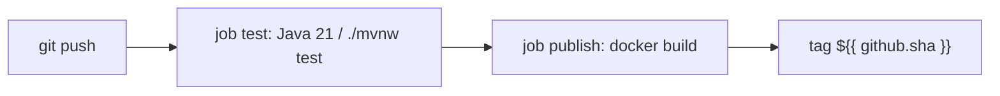

# BUILD-1204 — CI/CD pipeline

**Type:** BUILD  
**Module:** 12 — Terraform, Ansible and CI/CD  
**Duration:** 45–75 minutes  
**Cost:** **$0**  
**awsLab:** no  
**Lessons:** L-12.1, L-12.2, L-12.3, L-12.6  
**Diagram:** AEJE-D-056 (CI/CD pipeline)  
**Starter:** [starter/.github/workflows/baypay.yml](starter/.github/workflows/baypay.yml)  
**Worksheet:** [student/worksheets/PF-iac.md](../../student/worksheets/PF-iac.md)

This lab is **YAML-first**. You finish a GitHub Actions workflow: Java 21, `./mvnw test`, build an image, push tag `${{ github.sha }}`. You are **not** required to run the workflow on GitHub. You are **not** applying ECS. Read-the-workflow is enough to pass.

---

## Scenario

Jordan Voss published a workflow that builds `baypay/payment-service` and pushes it. Priya Nair opened a ticket: there is **no test job**. Riley Okonkwo will not deploy a tag that skipped `./mvnw test`. Sam Okada will not accept `:latest` as the only tag the pipeline knows.

Your job is to add a Java 21 test job that the publish job **needs**, and to push `${{ github.sha }}` as an immutable tag. No AWS keys in the file. No live Actions runner required.

---

## Business context

Avery Chen (`11111111-1111-1111-1111-111111111111`) retries when a bad build reaches `pay-alb-student.baypay.example`. Finance treats “we pushed and the ALB went red” as a release failure, not a merchant decline. The application is `reference-apps/baypay` (Java 21, Spring Boot 3.5.5, Maven Wrapper). Tests already live behind `./mvnw -pl payment-service -am test`.

A pipeline that only `docker build` is how a debug image ships. INCIDENT-1205 is the pager version of that sentence. This lab is the prevention.

---

## Learning objectives

- Author a GitHub Actions workflow with a **test** job: Temurin 21, `./mvnw test` from `reference-apps/baypay`.
- Make **publish** depend on test (`needs: test`).
- Build an image and tag it `${{ github.sha }}`. Do not treat `:latest` as the release tag.
- Keep registry credentials as `${{ secrets.* }}` names only — no key material in YAML.
- Validate by reading the workflow. A live GitHub push is extra credit.
- Record the pipeline on PF-iac.md. Cite AEJE-D-056.

---

## Architecture

Course diagram **AEJE-D-056** is this pipeline. Until the PNG is on disk, use the mermaid below.



Alt text: A GitHub Actions pipeline runs Java 21 tests with the Maven Wrapper, then builds and pushes payment-service tagged with the git SHA. Publish cannot run if tests did not pass.

The starter’s publish job is the defect, not a hint to skip tests.

---

## Prerequisites

- Ability to read GitHub Actions YAML (`jobs`, `needs`, `runs-on`, `steps`).
- Maven Wrapper at `reference-apps/baypay/mvnw` (you do not have to run it).
- Lessons L-12.1–L-12.3 / L-12.6 if present.
- Diagram AEJE-D-056.
- Optional GitHub account. Not required to pass.

---

## Environment setup

Copy the starter:

```bash
mkdir -p /tmp/aeje-build-1204/.github/workflows
cp labs/BUILD-1204/starter/.github/workflows/baypay.yml \
  /tmp/aeje-build-1204/.github/workflows/baypay.yml
```

Confirm the Wrapper exists (you do not have to run tests unless you want to):

```bash
test -x reference-apps/baypay/mvnw && echo "wrapper present"
```

Instructor key: `solutions/BUILD-1204/.github/workflows/baypay.yml`. Do not open it first. Do not paste AWS access keys into the workflow “so push works.”

---

## Challenge/tasks

1. **Read the starter.** List what is missing against AEJE-D-056: test job, Java 21, `./mvnw test`, `needs`, immutable SHA tag.
2. **Test job.** `runs-on: ubuntu-latest`. `actions/checkout`. `actions/setup-java` with Temurin **21**. Working directory `reference-apps/baypay`. Run `./mvnw -B -pl payment-service -am test`.
3. **Publish job.** `needs: test`. Build an image named `baypay/payment-service:${{ github.sha }}` (teaching registry prefix allowed). Do not make `:latest` the tag you would deploy to ECS.
4. **Push.** A push step may echo the tag or call `docker push` against a teaching registry. Credentials, if mentioned, are `${{ secrets.REGISTRY_USERNAME }}` / `${{ secrets.REGISTRY_PASSWORD }}` only.
5. **Order.** A pull request should still run **test**. Publish may be limited to `main` — say so in comments if you gate it.
6. **No keys.** No `AKIA...`, no `aws_secret_access_key` literals, no `changeme`.
7. **Parseable YAML.** Balanced jobs, no broken indent. A reviewer must see `java-version: "21"` and `./mvnw`.
8. **Worksheet.** Fill the **CI/CD** section of PF-iac.md.

---

## Validation

- [ ] A job exists whose purpose is **test** (name can vary; the steps cannot).
- [ ] Java **21** is configured (`setup-java` or equivalent).
- [ ] `./mvnw` runs `test` (not only `-DskipTests package`).
- [ ] Publish `needs` the test job.
- [ ] Image tag includes `${{ github.sha }}`.
- [ ] `:latest` is not the only tag, and is not required.
- [ ] No access keys or passwords in the YAML.
- [ ] You did not require a live GitHub Actions minute to pass.

Instructor scores with [instructor/rubrics/BUILD-1204.md](../../instructor/rubrics/BUILD-1204.md).

---

## Troubleshooting

| Symptom | What to check |
|---|---|
| Starter has only `publish` | That is the gap. Add `test` and `needs`. |
| `mvn` on the runner instead of `./mvnw` | Course contract is the Wrapper. |
| Java 17 because a blog used it | BayPay is Java 21. |
| Publish runs on every PR and skips tests | Invert that. Tests always; publish after tests. |
| Tagged only `:latest` | Add `${{ github.sha }}`. INCIDENT-1205 is the failure mode. |
| Pasted an AWS key so ECR push “works” | Delete it. Use secret **names**. This lab is not an apply. |
| `working-directory` wrong | Wrapper lives in `reference-apps/baypay`. |
| Wanted to deploy ECS from this YAML | Out of scope. Tag + test is the contract. |

---

## Expected outcome

A workflow a Staff engineer could drop into `.github/workflows/baypay.yml` and reason about without running it. Files match the intent of `solutions/BUILD-1204/` even if job names differ (`unit` versus `test`) as long as Java 21, Wrapper tests, `needs`, and SHA tags are present.

---

## Interview questions

1. Why is “the image built” a weak release gate if `./mvnw test` never ran?
2. What does tagging `${{ github.sha }}` give you that `:latest` does not?
3. Why does publish `needs: test` instead of running both jobs in parallel?
4. Where do registry passwords live if they must not appear in this YAML?

---

## Architecture/trade-off questions

1. GitHub Actions versus a generic Jenkins/Tekton YAML with the same jobs — what did you keep identical?
2. Skip tests on `main` to ship faster versus blocking publish — who pays when Avery retries?
3. Build the image in the test job versus a later job — cache versus isolation?
4. Why is a pipeline smoke GET on port 8080 a remediation you will write in INCIDENT-1205, not a substitute for `./mvnw test`?

---

## Cleanup

No cloud resources. Delete `/tmp/aeje-build-1204` if you used it. Do not commit a workflow that contains a real key. Leave the class starter missing the test job.

```bash
rm -rf /tmp/aeje-build-1204
```

---

## Cost estimate

**$0.** YAML on disk. No AWS. No required GitHub-hosted runner minutes. Optional Actions use is extra and still must not embed keys.

---

## Hidden/revealable solution

Edit your copy first. Instructor file: `solutions/BUILD-1204/.github/workflows/baypay.yml`. Opening it before you add the test job is a failed Diagnostic method score.

<details>
<summary>Reveal checklist — after you have edited the starter</summary>

Required: test job; Java 21; `./mvnw` `test`; publish `needs` test; tag `${{ github.sha }}`; no key literals. If any fail, fix your YAML before `solutions/`.

</details>

---

## What you learned

A pipeline is a gate: Java 21 tests, then an immutable SHA tag. A publish-only workflow is how a debug image reaches ECS. AEJE-D-056 is the order. GitHub is a tool you may use; the YAML is the deliverable.

---

## Portfolio deliverable

Complete the **CI/CD** section of [PF-iac.md](../../student/worksheets/PF-iac.md). Cite AEJE-D-056, Java 21, `./mvnw test`, and `${{ github.sha }}`. Attach your workflow.
