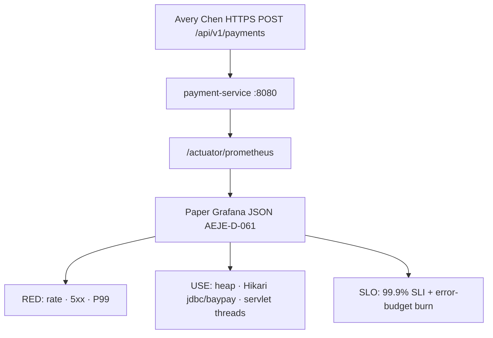

# BUILD-1300 — BayPay operations dashboard

**Type:** BUILD  
**Module:** 13 — Production Engineering and Observability  
**Duration:** 45–60 minutes  
**Cost:** **$0**  
**awsLab:** no  
**Lessons:** L-13.1, L-13.2, L-13.3, L-13.4  
**Diagram:** AEJE-D-061 (BayPay operations dashboard)  
**Starter:** [starter/dashboard.json](starter/dashboard.json)  
**Worksheet:** [student/worksheets/PF-ops.md](../../student/worksheets/PF-ops.md)  
**Contract:** [datasets/baypay-ops/OBSERVABILITY.md](../../datasets/baypay-ops/OBSERVABILITY.md)

This lab is **file-first**. You finish a paper Grafana dashboard JSON that matches the Module 13 operations contract. You are **not** standing up Grafana, Prometheus, Amazon Managed Prometheus, or CloudWatch. Reading a complete JSON on disk is enough to pass.

---

## Scenario

Riley Okonkwo opened the teaching ops board and found one useful panel: request rate for `POST /api/v1/payments`. Jordan Voss called that “a start.” Priya Nair will not page from a lonely rate graph. Sam Okada will not accept a merchant identifier as a Prometheus label. Finance asked for the **99.9%** create-payment SLO, not a Module 14 poster.

Your job is to complete `dashboard.json` so a Staff engineer can brief from it: RED, USE, and SLO burn. No live scrape. No AWS account.

---

## Business context

Avery Chen (`11111111-1111-1111-1111-111111111111`, active USD account `22222222-2222-2222-2222-222222222221`) posts `POST /api/v1/payments` with an `Idempotency-Key`. Harbor Market retries when a create is late. Example payment id for this module: `c1300a11-0000-4000-8000-111111111300`.

A rate-only board cannot tell Priya whether completions are failing, slow, or just quiet. A 99.99% tile belongs in ARCHITECT-1401, not on this home board. A panel that groups time series by customer or account is a compliance incident, not “richer observability.”

The teaching process is `payment-service` (Java 21, Spring Boot 3.5.5) on port `8080` in `us-west-2` when AWS is named. Metrics arrive on `/actuator/prometheus`. Hikari pool name is `jdbc/baypay`. You will not open that endpoint for a grade.

---

## Learning objectives

- Complete a Grafana-style dashboard JSON that implements RED for `POST /api/v1/payments`: rate, 5xx errors, P99 duration.
- Add USE panels for JVM heap, Hikari active/pending, and servlet / Tomcat threads.
- Express the payment-create SLI and the **99.9%** monthly SLO, plus an error-budget / burn panel.
- Keep metric labels to the allowed set in OBSERVABILITY.md (`uri`, `method`, `outcome`, `status`, coarse `exception`).
- Validate by reading the JSON. Do not require a live Grafana or AMP workspace.
- Record the board on PF-ops.md and cite AEJE-D-061.

---

## Architecture

Course diagram **AEJE-D-061** is this render. Until the PNG is on disk, use the mermaid below plus OBSERVABILITY.md.



Alt text: Merchants call payment-service. Micrometer exposes Prometheus text on actuator. A paper Grafana dashboard on disk shows RED for the create-payment URI, USE for heap, Hikari, and servlet threads, and a 99.9 percent SLO with an error-budget burn panel. No live Grafana process is required.

The board is a **file**. Importing it into a real Grafana is extra credit you do not need.

---

## Prerequisites

- Ability to read Grafana dashboard JSON and PromQL-shaped `expr` strings.
- [OBSERVABILITY.md](../../datasets/baypay-ops/OBSERVABILITY.md) — locked names, SLI, SLO, label rules.
- Lessons L-13.1–L-13.4 if present. They stand alone; this lab does not wait on a live cluster.
- Diagram AEJE-D-061.

---

## Environment setup

Copy the starter:

```bash
mkdir -p /tmp/aeje-build-1300
cp labs/BUILD-1300/starter/dashboard.json /tmp/aeje-build-1300/dashboard.json
cd /tmp/aeje-build-1300
```

Open OBSERVABILITY.md in another pane. Edit `/tmp/aeje-build-1300/dashboard.json` (or a copy under your notes). Leave the class starter incomplete.

You will **not** run Grafana, `promtool`, `aws amp`, or CloudWatch. Optional JSON parse (skip if `python3` is missing):

```bash
# extra credit — not the grade path
python3 -c "import json; json.load(open('dashboard.json')); print('ok')"
```

Do not open `solutions/BUILD-1300/` until your checklist is green. Do not create an AMP workspace to “see the panels.”

---

## Challenge/tasks

1. **Read the starter.** `labs/BUILD-1300/starter/dashboard.json` has a title, a paper Prometheus datasource, and a **rate** panel for `POST /api/v1/payments`. List what is missing before you add panels: 5xx errors, P99 duration, SLO / burn, Hikari USE (and the rest of USE if you only see rate).
2. **RED.** Add panels that use the teaching names from OBSERVABILITY.md:
   - Rate: `http_server_requests_seconds_count` for `uri="/api/v1/payments"`, `method="POST"`.
   - Errors: **5xx** (and timeout-as-server-failure if you model it). 4xx are client, not default SLO burn, except 429 if you call that out.
   - Duration: histogram → **P99**, not average, not P50 as the only latency tile.
3. **USE.** Add JVM heap used/max; Hikari `jdbc/baypay` **active** and **pending**; servlet / Tomcat threads busy/max. Saturation that predicts burn belongs on this row.
4. **SLO.** Add a 99.9% availability SLI panel for payment create and an **error-budget / burn** panel. Do **not** upgrade the tile to 99.99%. Window is 30 days rolling unless you label a short burn window as short.
5. **Labels.** Query labels may include `uri`, `method`, `outcome`, `status`, and coarse `exception`. Do not add `customerId`, `accountId`, `Idempotency-Key`, raw `paymentId`, or PAN. Do not put Avery’s UUID in a `legendFormat`.
6. **No live stack.** You may paste the JSON into a local Grafana later. The grade is the file.
7. **No secrets.** No `BAYPAY_DB_PASSWORD`, no access keys, no real card numbers.
8. **Worksheet.** Fill the **dashboard panels**, **SLO / error budget**, and **labels you refused** sections of PF-ops.md. Cite AEJE-D-061.

---

## Validation

- [ ] Rate panel still (or still) targets `POST /api/v1/payments`.
- [ ] A 5xx / server-error panel exists. It does not treat ordinary 4xx as SLO burn.
- [ ] A P99 duration panel exists (histogram quantile). Average-only latency fails this row.
- [ ] JVM heap used versus max is on the board.
- [ ] Hikari `jdbc/baypay` shows active **and** pending (or active/max plus pending). Missing Hikari fails this lab even if heap is pretty.
- [ ] Servlet / Tomcat thread busy versus max is on the board.
- [ ] SLO target is **99.9%**, not 99.99%. An error-budget or burn panel is present.
- [ ] Metric labels in `expr` / legends stay on the allowed set. No customer, account, payment id, idempotency key, or PAN.
- [ ] JSON parses. You did not require Grafana Cloud, AMP, or an AWS apply to pass.
- [ ] PF-ops.md dashboard sections are filled in your words.

Instructor scores with [instructor/rubrics/BUILD-1300.md](../../instructor/rubrics/BUILD-1300.md).

---

## Troubleshooting

| Symptom | What to check |
|---|---|
| Starter only has rate | That is the gap. Add errors, P99, SLO/burn, Hikari, heap, threads. |
| Tempted to add a 99.99% stat so it “matches HA talk” | Wrong module. OBSERVABILITY.md locks 99.9% here. |
| Used `avg(...)` for latency because P99 looked hard | Teaching tail is P99 of the histogram. `histogram_quantile(0.99, ...)`. |
| Put `customerId` in the query so Avery “shows up” | Stop. That is a label you refuse. Use logs / traces for one payment. |
| Added CPU > 80% as the page tile | Ticket or secondary. Page on SLO burn and saturation that predicts burn. |
| Wanted to stand up Docker Grafana to “validate” | Optional. The checklist is the grade path. |
| Hikari panel uses a pool name you invented | Pool is `jdbc/baypay`. |
| Copied a vendor dashboard with 40 labels | Strip down to the contract. This is a teaching home board. |
| JSON invalid after an edit | Trailing commas. Re-parse with `python3` if you have it. |

---

## Expected outcome

A dashboard JSON a Staff engineer could import later and already brief from: RED for the create URI, USE for heap / Hikari / threads, 99.9% SLI and burn. Files match the intent of `solutions/BUILD-1300/` even if you used `stat` instead of `timeseries` for the SLO tile or named the Tomcat metric slightly differently.

---

## Interview questions

1. Why is rate alone a weak home board when Harbor Market says “pay is down”?
2. Why is P99 the teaching tail instead of average latency?
3. What is the payment-create SLI, and why are most 4xx excluded from burn?
4. Why page on SLO burn and Hikari pending rather than “CPU > 80%”?
5. Why must Avery Chen’s `customerId` stay off the metric labels even if you need to debug her payment?

---

## Architecture/trade-off questions

1. Paper Grafana JSON versus Amazon Managed Grafana / AMP — what does each cost, and what does this lab refuse to require?
2. Histogram + `histogram_quantile` versus a client-side summary — who pays for P99 after a scrape?
3. Recording rules versus raw `/actuator/prometheus` on every panel — when do you add a rule?
4. 99.9% this month versus a 99.99% architecture target — which file is allowed to change, and which lab is not this one?
5. Why is a per-`paymentId` label worse than a missing panel?

---

## Cleanup

No cloud resources. Delete `/tmp/aeje-build-1300` if you used it. Leave the class starter incomplete. Do not commit a dashboard that includes a real customer id in a query.

```bash
rm -rf /tmp/aeje-build-1300
```

---

## Cost estimate

**$0.** JSON on disk. No Grafana Cloud. No AMP workspace. No CloudWatch dashboard. No required Prometheus. Optional local Grafana stays on your machine and is not the grade path.

---

## Hidden/revealable solution

Edit your copy first. Instructor files: `solutions/BUILD-1300/`. Opening them before you add P99, SLO, and Hikari is a failed Diagnostic method score.

<details>
<summary>Reveal checklist — after you have edited the starter</summary>

Required: RED rate + 5xx + P99 for `POST /api/v1/payments`; USE heap + Hikari `jdbc/baypay` active/pending + servlet threads; SLO **99.9%** and an error-budget / burn panel; labels limited to `uri` / `method` / `outcome` / `status` (optional coarse `exception`); no customer, account, payment id, idempotency key, or PAN; no live Grafana required. If any fail, fix your JSON before `solutions/`.

</details>

---

## What you learned

An operations home board is RED plus USE plus the SLO you actually pledged — 99.9% for payment create — not a single rate tile and not a 99.99% banner. AEJE-D-061 is that board. Merchant identifiers belong in logs and traces, not in series labels. You did not need a live Grafana to prove the contract.

---

## Portfolio deliverable

Complete the **dashboard panels**, **SLO / error budget**, and **labels you refused** sections of [PF-ops.md](../../student/worksheets/PF-ops.md). Cite AEJE-D-061 and the 99.9% SLO. Attach your `dashboard.json` (redact any identifier you accidentally put in a query).
