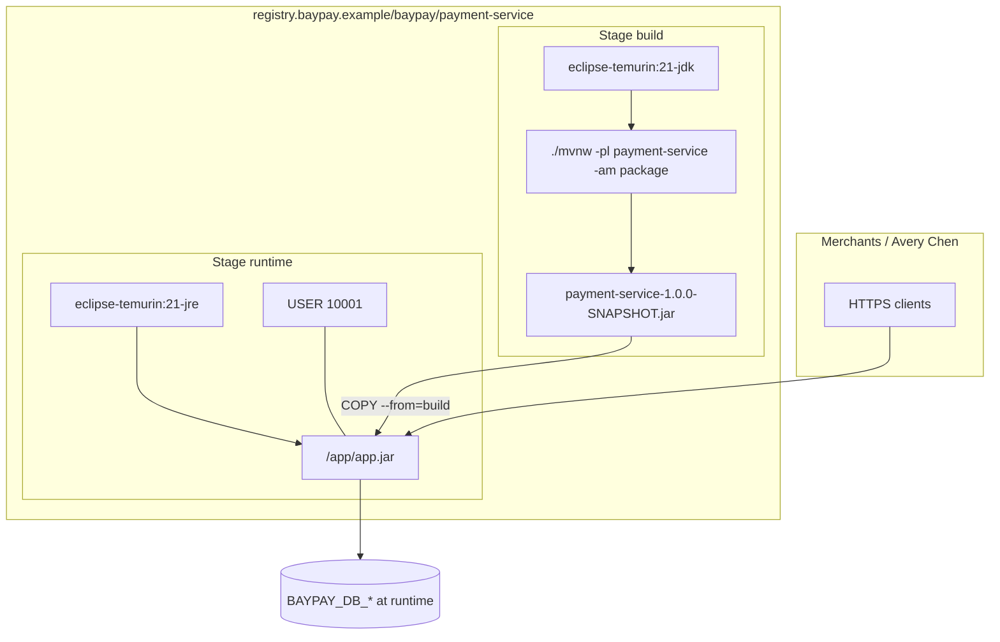

# BUILD-901 — Containerize BayPay

**Type:** BUILD  
**Module:** 09 — Containers for Java  
**Duration:** 60–90 minutes  
**Cost:** $0  
**Lessons:** L-9.1, L-9.2, L-9.3  
**Diagram:** AEJE-D-039 (BayPay container image)  
**Cluster notes:** [datasets/baypay-k8s/CLUSTER.md](../../datasets/baypay-k8s/CLUSTER.md)  
**Starter:** [starter/Dockerfile](starter/Dockerfile)  
**Worksheet:** [student/worksheets/PF-container.md](../../student/worksheets/PF-container.md)

This lab is **file-first**. You write a multi-stage Dockerfile and a checklist. Docker or Podman is useful and **not required** to pass.

---

## Scenario

Sam Okada wants `payment-service` in a registry-shaped image so Module 10 can talk about pods without inventing a build. Jordan Voss left a starter that compiles inside `eclipse-temurin:21-jdk` and then *runs* that same JDK image. Riley Okonkwo will not ship a root process. Priya Nair will not accept a password in a layer.

Your job is to finish a parseable Dockerfile that builds with the Maven Wrapper and runs on a JRE as UID `10001`. You are not opening an AWS account. You are not standing up a cluster.

---

## Business context

Avery Chen (`11111111-1111-1111-1111-111111111111`) still posts `25.00 USD` through `/api/v1/payments` on port `8080`. Harbor Bike Co does not care whether the process started from `java -jar` on a laptop or from a container entrypoint. Finance cares that the image name is `registry.baypay.example/baypay/payment-service:<tag>`, that the database password is not baked in, and that the runtime is not a full JDK “because we already had it for Maven.”

The application is still `reference-apps/baypay` (Java 21, Spring Boot 3.5.5). Liveness remains `/actuator/health/liveness`. Readiness remains `/actuator/health/readiness`. Those paths are the **process** contract. This lab is the **image** contract.

---

## Learning objectives

- Write a multi-stage Dockerfile: Maven Wrapper in a JDK **build** stage, `eclipse-temurin:21-jre` in the **runtime** stage.
- `EXPOSE 8080` and run as numeric `USER 10001` (non-root).
- Keep `BAYPAY_DB_*` out of the image. Credentials arrive at runtime.
- Validate by reading the file and completing a checklist. A live `docker build` is extra credit.
- Start the Module 9 portfolio page: image, user, JVM flags, secrets.

---

## Architecture

Course diagram **AEJE-D-039** is this image. Until the PNG is on disk, use the mermaid below plus CLUSTER.md.



Alt text: A JDK build stage packages payment-service with the Maven Wrapper; a JRE runtime stage copies only the JAR, exposes 8080, and runs as UID 10001. Database credentials are runtime environment, not image layers.

The starter is a **single** JDK stage. That is the defect you repair, not a hint to keep the compiler in production.

---

## Prerequisites

- [datasets/baypay-k8s/CLUSTER.md](../../datasets/baypay-k8s/CLUSTER.md) open beside the starter.
- Ability to read a Dockerfile (`FROM`, `WORKDIR`, `COPY`, `USER`, `EXPOSE`).
- Optional: Docker or Podman on the laptop. Not required to pass.
- Lessons L-9.1 / L-9.2 / L-9.3 if present. Module 7 already forbade `-Xmx` equal to a memory limit; do not “solve” this lab with a heap flag.

---

## Environment setup

Confirm the starter and the Maven Wrapper exist. You do **not** have to start a daemon.

```bash
test -f labs/BUILD-901/starter/Dockerfile && echo "starter present"
test -x reference-apps/baypay/mvnw && echo "wrapper present"
```

Copy the starter so you can diff:

```bash
mkdir -p /tmp/aeje-build-901
cp labs/BUILD-901/starter/Dockerfile /tmp/aeje-build-901/Dockerfile
```

If you choose to build (optional):

```bash
# extra credit only — not the grade path
cd reference-apps/baypay
docker build -f ../../labs/BUILD-901/starter/Dockerfile -t baypay/payment-service:lab901-starter .
```

The instructor key is `solutions/BUILD-901/`. Do not open it until your checklist is green.

---

## Challenge/tasks

1. **Read the starter.** Open `labs/BUILD-901/starter/Dockerfile`. List what is missing against CLUSTER.md before you edit: runtime base, user, stage split.
2. **Build stage.** Use `eclipse-temurin:21-jdk` (or equivalent JDK 21) as a named stage. `WORKDIR` must exist. Copy the Maven Wrapper (`mvnw`, `.mvn/`) and the BayPay modules. Run `./mvnw -pl payment-service -am -DskipTests package`.
3. **Runtime stage.** Use `eclipse-temurin:21-jre` — not a full JDK. Copy only the packaged JAR from the build stage. Do not copy source, `.git`, or `target/` test classes.
4. **Port.** `EXPOSE 8080`. That is the process port from CLUSTER.md and the Boot app.
5. **User.** `USER 10001` before the entrypoint. Numeric UID, not `root`, not a name you invent without the UID.
6. **Secrets.** No `ENV BAYPAY_DB_PASSWORD=...`. No `ARG` that becomes a password layer. Document that `BAYPAY_DB_URL`, `BAYPAY_DB_USER`, and `BAYPAY_DB_PASSWORD` are supplied when the container starts.
7. **Entrypoint.** `java -jar` on the copied JAR (for example `/app/app.jar`). You may use `ENTRYPOINT` exec form.
8. **Parseable file.** A reviewer must see `FROM`, `WORKDIR`, `COPY`, and `USER` in your result. Balanced instructions, no broken line continuations.
9. **Checklist only.** Do not require Docker to “prove” the image. Optional engine use is extra.
10. **Worksheet.** Start [PF-container.md](../../student/worksheets/PF-container.md) sections for image and user. JVM flags and secrets get more ink in PERFORMANCE-904 and SECURITY-903; you still name the rules now.

---

## Validation

Self-check (this is the grade path — not `docker run`):

- [ ] More than one `FROM` (a build stage and a runtime stage).
- [ ] Runtime `FROM` is `eclipse-temurin:21-jre` (or that image plus a digest). Not `21-jdk` as the final stage.
- [ ] `WORKDIR` is present in the runtime stage.
- [ ] `COPY --from=<build-stage>` brings a JAR, not the whole source tree.
- [ ] `EXPOSE 8080` is present.
- [ ] `USER 10001` appears **after** the last `COPY` that needs root, and before the process starts.
- [ ] No password, token, or `changeme` string in the Dockerfile.
- [ ] Maven Wrapper is how the build stage compiles (`./mvnw`), not a host `mvn` you assume on the laptop.
- [ ] You did not set `-Xmx` equal to a memory limit (this lab should not set `-Xmx` at all).
- [ ] You did not require a live Docker daemon to pass.

Instructor scores the files with [instructor/rubrics/BUILD-901.md](../../instructor/rubrics/BUILD-901.md).

---

## Troubleshooting

| Symptom | What to check |
|---|---|
| Starter has one `FROM` | That is the incomplete file. Add a second stage. |
| Runtime is still `21-jdk` | You packaged, then forgot to switch the final `FROM`. |
| No `USER` line | The starter omitted it. Add `USER 10001`. |
| `COPY . .` in the final stage | You are shipping source and the JDK build tree. Copy the JAR only. |
| `mvnw: not found` if you built | Build context must be `reference-apps/baypay`, not `labs/BUILD-901/starter`. |
| Tempted to add `ENV BAYPAY_DB_PASSWORD` so Boot “has a default” | Stop. That is FIX-902’s incident, not a convenience. |
| Optional `docker build` fails on network | Ignore the engine. The checklist still stands. |
| Want to set `-Xmx2048m` “for production” | Not this lab. Heap equal to a limit is forbidden in this course. |

---

## Expected outcome

A completed multi-stage Dockerfile a Staff engineer could later `docker build` from `reference-apps/baypay` without reintroducing a JDK runtime or a root user. Files match the intent of `solutions/BUILD-901/` even if `WORKDIR` paths or JAR names differ slightly.

---

## Interview questions

1. Why is a JDK image the wrong **runtime** for `payment-service` if Maven needed a JDK to compile?
2. What does `USER 10001` change about a container escape versus `USER root`?
3. Where do `BAYPAY_DB_USER` and `BAYPAY_DB_PASSWORD` live after this lab — image, git, or runtime?
4. Why is `EXPOSE 8080` not the same thing as “the Service is open to the internet”?

---

## Architecture/trade-off questions

1. Multi-stage versus a single JRE image that `COPY`s a JAR you built on the laptop — when is each honest?
2. Fat JAR versus exploding the Boot layers (`BOOT-INF/lib`) for cache — what did you defer to PERFORMANCE-904?
3. Numeric `10001` versus a named user in `/etc/passwd` — what does Kubernetes `runAsNonRoot` still need?
4. Why is `registry.baypay.example` a teaching registry and not a reason to open ECR this week?

---

## Cleanup

No cloud resources. If you used `/tmp/aeje-build-901`, you may delete it. If you used optional Docker, you may `docker image rm` the local tag; it was never required. Do not “fix” `labs/BUILD-901/starter/Dockerfile` in place for classmates if you were asked to keep the incomplete original.

```bash
rm -rf /tmp/aeje-build-901
```

Local cost remains $0.

---

## Cost estimate

**$0.** Dockerfile and checklist on disk. No AWS. No paid registry. No required Docker or Podman license. Optional local engine use still stays on your machine.

---

## Hidden/revealable solution

Attempt the checklist on **your** file first. The instructor copy lives in `solutions/BUILD-901/` (`Dockerfile` and a README). Opening it before you edit is a failed Diagnostic method score.

<details>
<summary>Reveal checklist — after you have edited the starter</summary>

Required: two stages; build uses `./mvnw`; runtime is `eclipse-temurin:21-jre`; `EXPOSE 8080`; `USER 10001`; JAR copied from the build stage; no password `ENV`. If any of those fail, fix your file before you read `solutions/`.

</details>

---

## What you learned

An image is a contract: compiler in one stage, JRE in the next, non-root UID, port 8080, secrets at runtime. The starter that “works” on a JDK as root is not a production payment image. Docker is a tool you may use; the file is the deliverable.

---

## Portfolio deliverable

Complete the **image** and **user** sections of [student/worksheets/PF-container.md](../../student/worksheets/PF-container.md). Cite AEJE-D-039. Attach your Dockerfile (working copy). This lab starts the Module 9 portfolio artifact; SECURITY-903 hardens it.
