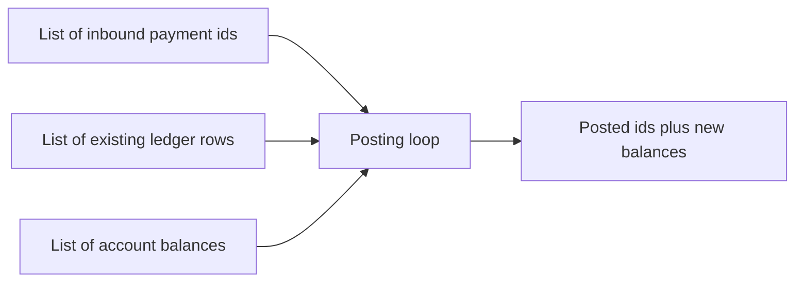

# CHALLENGE-104 — Optimize transaction processing

**Type:** PERFORMANCE  
**Module:** 1 — Enterprise Java Engineering  
**Duration:** 45–75 minutes  
**Lesson:** [L-1.5](../../course/modules/01-enterprise-java-engineering/lessons/L-1.5.md)  
**Starter:** [starter/NaivePostingLoop.java](starter/NaivePostingLoop.java)

---

## Scenario

BayPay’s first end-of-day posting job “works” for the demo merchant list and falls over when operations replay a day of synthetic traffic. The job walks payments and, for each one, walks the entire ledger and the entire balance list. CPU climbs. Young-gen allocations climb. The business result (which payments post, which balances change) must stay identical.

Your challenge is to make the job fast enough for a 50_000-payment replay on a laptop **without** changing outcomes. This page does not describe the optimized algorithm. That lives in the instructor pack.

---

## Business context

Ledger posting is how `AUTHORIZED` payments become `COMPLETED` in production (`PaymentPostingService`). This lab isolates the **batch** anti-pattern: treating the ledger like a list you search with your eyes. Finance still requires:

- A payment id posts at most once.
- Balances are updated only for payments that actually post.
- Amounts stay exact (no `double` drift in the result you report).

Avery’s ids may appear in the fixture data. Do not special-case them; the slowdown is algorithmic, not “Avery-shaped.”

---

## Learning objectives

- Measure before and after with a simple wall-clock on a generated workload.
- Keep the functional contract stable while changing the access pattern.
- Explain (in interview language) why a nested list scan explodes with N and M.
- Avoid introducing a wrong balance because you “optimized” with `double` addition.

---

## Architecture



Production posting is one payment per API call today. This lab is the batch cousin you will meet the first time finance asks for a backfill. The modular monolith will still need an efficient in-memory index if that backfill runs in-process.

---

## Prerequisites

- L-1.3 (collections) and L-1.5 (enterprise habits).
- JDK 21.
- Comfort writing a `main` or a JUnit test that prints elapsed milliseconds.

---

## Environment setup

```bash
export JAVA_HOME="${JAVA_HOME:-/opt/homebrew/opt/openjdk@21}"
cd labs/CHALLENGE-104
javac --release 21 starter/NaivePostingLoop.java
java -cp starter com.baypay.labs.challenge104.NaivePostingLoop
```

The starter’s `main` builds a synthetic workload and prints elapsed time. Use it as the baseline. Copy to your own class for the improved version; leave the starter naive.

---

## Challenge/tasks

1. Run the starter. Record elapsed time and the checksum it prints (posted count + balance fingerprint).
2. Read the loop. In private notes, name the costs you see (you will be asked in interview; do not publish a solution write-up in the student channel).
3. Implement a faster class that:
   - returns the same posted ids (same set)
   - returns the same per-account balances
   - does not use `double` as the source of truth for money in the **result** (cents as `long` or `BigDecimal` are acceptable)
   - completes the default workload in a small fraction of the starter time on the same machine
4. Increase payments to 50_000 if your machine allows; the starter may become painful — that is the point.
5. Write two or three sentences on what you changed **without** turning this README into a spoiler for others.

Do not expect an optimized listing in this folder.

---

## Validation

- Checksum / posted count matches the starter on the same seed.
- Your implementation is correct for: already-posted ids (skip), unknown account (skip or record as skipped — match the starter’s rule), multiple payments to one account (sum).
- Time is substantially lower at N ≥ 10_000.
- You did not change the starter file.

---

## Troubleshooting

| Symptom | What to check |
|---|---|
| Faster but checksum differs | You dropped a duplicate rule or used `double` addition |
| Still slow | You still scan a list inside the payment loop |
| Out of memory | The generator is allocating too many leftover copies; keep one workload |
| “It is fast on 100 rows” | Scale N; micro-workloads lie |

---

## Expected outcome

A faster posting loop, a before/after time pair, and an unchanged business checksum. No cloud profile, no profiler license required (a profiler is welcome if you already have one).

---

## Interview questions

1. Why does a correct unit test with 10 payments hide this defect?
2. What do you say when a teammate argues “the JVM JIT will fix the nested loop”?
3. How would you describe the production risk of `Double` balances to a finance partner?

---

## Architecture/trade-off questions

1. When should this job move from in-memory indexes to SQL (`WHERE payment_id IN (...)`) instead of a smarter Java loop?
2. Is pre-sizing collections a real win here compared to changing the access pattern?
3. If Module 2 makes this loop concurrent, what breaks first?

---

## Cleanup

No services to tear down. Discard large generated dumps if you wrote any to disk.

---

## Cost estimate

**$0** local CPU. Do not start an EMR cluster or an RDS instance for this exercise.

---

## Hidden/revealable solution

This is a PERFORMANCE challenge. The student guide does not include the optimized approach or a line-by-line rewrite.

See the instructor pack (`solutions/CHALLENGE-104/` and `instructor/rubrics/CHALLENGE-104.md`) after you have your own timings.

---

## What you learned

- Access pattern dominates micro-tweaks.
- Correctness checksums keep a performance lab honest.
- Batch posting is part of enterprise Java even when the live path is one payment per request.

---

## Portfolio deliverable

Record in your notes: baseline ms, improved ms, N, and the checksum. One paragraph on the risk of shipping the naive loop to a backfill. Do not paste the instructor’s class into the portfolio.
