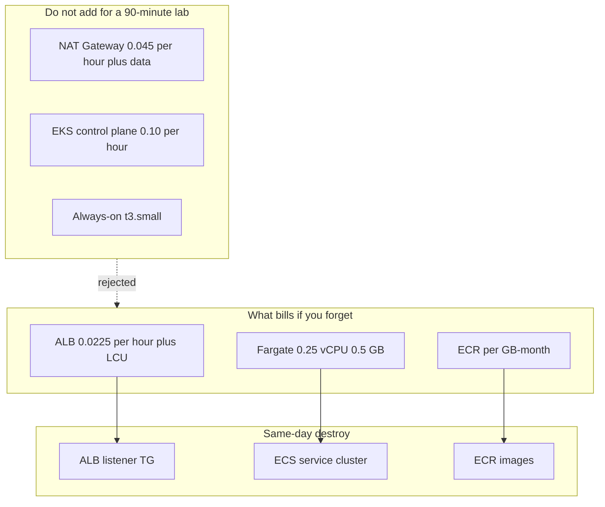

# COST-1105 — Cost optimization

**Type:** COST (awsLab — paper + pricing; apply **not** required)  
**Module:** 11 — AWS Container Platforms  
**Duration:** 60–90 minutes  
**Cost:** $0 paper; **billable only if leftovers still exist**  
**Lessons:** L-11.8  
**Diagram:** AEJE-D-052 (Cost optimization levers)  
**Account notes:** [datasets/baypay-aws/ACCOUNT.md](../../datasets/baypay-aws/ACCOUNT.md)  
**Worksheet:** [student/worksheets/PF-aws-cost.md](../../student/worksheets/PF-aws-cost.md) (also a short table on [PF-aws-platform.md](../../student/worksheets/PF-aws-platform.md))

You pass by arithmetic and a destroy checklist. You do **not** need Cost Explorer, a live account, or another `terraform apply`.

---

## Scenario

Finance saw a sandbox invoice with an Application Load Balancer that ran from Thursday night through Monday morning and a NAT Gateway someone added “so Fargate could be private.” Sam Okada wants Container Insights and an EKS cluster “to compare.” Jordan Voss asks whether Fargate at 0.25 vCPU is more expensive than leaving a `t3.small` on all week. Priya Nair wants a page that says **destroy the ALB the same day** in a sentence a Staff engineer will follow.

You price the BUILD-1101 shape, refuse NAT and EKS for a 90-minute lab, and write the destroy list.

---

## Business context

Avery Chen’s `$84.00` authorization does not get cheaper because the ALB sat idle. Harbor Bike Co does not pay for your curiosity NAT. ACCOUNT.md already forbade EKS, NAT Gateway, OpenSearch, and multi-AZ RDS in a 90-minute lab. This lab is the **invoice** version of that sentence.

Teaching rates below are **estimates in USD** for `us-west-2` (2026 course figures). Your live invoice can differ. Use them as the shared arithmetic so graders can check the math.

---

## Learning objectives

- Price an **idle ALB** (~$0.0225/hour + LCU) over 90 minutes, 24 hours, and 7 days.
- Compare Fargate 0.25 vCPU / 0.5 GB to an always-on `t3.small` for a lab that should be destroyed the same day.
- Price leftover **ECR** storage (~$0.10/GB-month) and say why an empty repo still bills.
- Write “do not add NAT for a 90-minute lab” with hours × rate, not a slogan.
- Complete a destroy checklist: ALB, ECS service/cluster, ECR images, log groups.
- Record levers on AEJE-D-052 and on PF-aws-cost.md.

---

## Architecture

Course diagram **AEJE-D-052** is this cost picture. Until the PNG is on disk, use the mermaid plus ACCOUNT.md.

**Region:** `us-west-2`.

**Service list (what you price):** ALB, Fargate (256/512), ECR storage, CloudWatch logs (3-day retention). **Do not add:** NAT Gateway, EKS control plane, RDS, always-on EC2, Container Insights. BUILD-1101 already drew the deploy.



Alt text: The student bill is an idle ALB, a tiny Fargate task, and ECR storage. NAT, EKS, and always-on EC2 are rejected for a 90-minute lab. Cleanup destroys ALB, ECS, and ECR the same day.

**Least privilege:** Cost Explorer is optional literacy. You do not need `ce:Get*` to pass. Do not attach `AdministratorAccess` to read a price list.

**Failure scenario:** an ALB left over a weekend (~$0.54 × 3 days) plus a NAT (~$1/day) plus an EKS control plane (~$2.40/day). That is a lab failure, not “realism.”

---

## Prerequisites

- BUILD-1101 attempted (you know which resources the starter would create).
- ARCHITECT-1102 attempted (you already refused EKS as a 90-minute apply).
- ACCOUNT.md cost rules. L-11.8 if present.
- Calculator or a scrap of paper. Optional: AWS public pricing page — do not require a login.

---

## Environment setup

```bash
test -f student/worksheets/PF-aws-cost.md && echo "cost worksheet present"
test -f labs/BUILD-1101/starter/main.tf && echo "know what would have been created"
```

No `terraform apply`. If `/tmp/aeje-build-1101` still has state, that is leftover spend — jump to Cleanup.

Use these **teaching rates** (USD, `us-west-2`, course figures):

| Resource | Teaching rate |
|---|---|
| ALB-hour | $0.0225 + LCU (treat lab LCU as ~$0 for 90 minutes) |
| Fargate vCPU-hour | $0.04048 |
| Fargate GB-hour | $0.004445 |
| t3.small-hour | $0.0208 |
| NAT Gateway-hour | $0.045 + data (treat curiosity data as extra, not zero) |
| EKS control-plane-hour | $0.10 |
| ECR GB-month | $0.10 |

Fargate 0.25 vCPU / 0.5 GB ≈ `0.25 × 0.04048 + 0.5 × 0.004445` = **$0.01234/hour**.

---

## Challenge/tasks

1. **Idle ALB.** Compute 1.5 hours, 24 hours, and 7 days at $0.0225/hour. Write one sentence: the ALB bills even when Harbor Market sends zero traffic.
2. **Fargate vs always-on EC2.** Price one Fargate task (256/512) for 1.5 hours and for 7 days at `desired_count = 1`. Price one `t3.small` for the same windows. Say which wins for a **same-day destroy** lab, and which wins only if someone leaves compute up all week (still refuse always-on EC2 as the student default).
3. **ECR.** Price 2 GB of images for 7 days (`2 × 0.10 × 7/30`). Say why `force_delete` and deleting images still matter after the service is gone.
4. **Refuse NAT.** Price NAT at $0.045/hour for 1.5 hours and for 24 hours. Write why public subnets + `assign_public_ip` + IGW is the locked student shape (SECURITY trade-off one sentence — isolation vs invoice).
5. **Refuse EKS and RDS.** One line each: control-plane dollars/day; RDS is literacy (L-11.7), not this apply.
6. **Destroy checklist.** List ALB + listener + target group, ECS service + cluster + task definition, ECR repo **and images**, log group. Tags `Expiration` are not a substitute for `terraform destroy`.
7. **Transfer** numbers into [PF-aws-cost.md](../../student/worksheets/PF-aws-cost.md) and the short cost table on [PF-aws-platform.md](../../student/worksheets/PF-aws-platform.md).

---

## Validation

Self-check before you open the instructor folder:

- ALB 24-hour figure is about **$0.54** (show the multiply).
- Fargate hourly figure is about **$0.012** (show vCPU + GB).
- NAT 24-hour figure is about **$1.08** before data — and you refused it.
- EKS is refused with a dollars/day number, not a slogan.
- Destroy list names **ALB, ECS, ECR** explicitly.
- You did not apply anything new to “measure” Cost Explorer.
- Worksheet arithmetic is yours, not a screenshot of someone else’s table.

Instructor scores with [instructor/rubrics/COST-1105.md](../../instructor/rubrics/COST-1105.md).

**Expected final state:** a filled PF-aws-cost.md a Staff engineer could use as a pre-apply briefing. If any BUILD-1101 stack still exists, it is **destroyed**.

---

## Troubleshooting

- You used list prices from another region: convert to the teaching table so the grader can check. Note the source if you looked up a live page.
- You added LCU as $10 “to be safe”: for a 90-minute student lab, LCU is near zero. Do not invent load.
- You recommended Reserved Instances or Savings Plans for a weekend lab: out of scope.
- You want to create NAT “and then destroy it to see the bill”: no. Paper the $0.045/hour.
- AEJE-D-052 PNG missing: the mermaid on this page is enough.
- Tempted to enable Container Insights to “get the metrics”: that is another bill. CloudWatch logs at 3-day retention are enough.

---

## Expected outcome

A one-page cost brief with shown arithmetic, a NAT/EKS refusal, and a destroy checklist that names ALB, ECS, and ECR. Files match the intent of `solutions/COST-1105/` even if you used a slightly different public list price and showed your source.

---

## Interview questions

1. Why does an idle ALB cost more over a weekend than a 90-minute Fargate task?
2. When is Fargate more expensive than EC2, and why is that the wrong comparison for a lab you destroy the same day?
3. What still bills after `aws ecs update-service --desired-count 0`?
4. Why are `Expiration` tags necessary but not sufficient?

---

## Architecture/trade-off questions

1. Public subnet + IGW versus NAT — invoice versus isolation for a student sandbox?
2. One shared ALB for many labs versus one ALB per student — blast radius versus dollars/hour?
3. ECR immutable tags versus overwriting `:latest` — storage versus incident forensics?
4. 3-day log retention versus Container Insights — which signal did L-11.6 already give you without the extra SKU?

---

## Cleanup

**Paper path:** leave the worksheets in `student/worksheets/`. Delete scratch paper if you want.

**If anything was applied in this module:** destroy **the same day**.

```bash
# example — only if you still have a working tree with state
cd /tmp/aeje-build-1101
terraform destroy -auto-approve
```

Confirm gone in `us-west-2`:

- Application Load Balancer, listener, target group
- ECS service, cluster, task definition
- ECR repository **and images**
- CloudWatch log groups you created
- NAT Gateway (should never have existed)
- EKS cluster (should never have existed)

Empty ECR still has storage cost. An idle ALB still bills overnight.

---

## Cost estimate

**$0** if you stay on paper (the grade path).

**Warning — leftover apply is a real bill.** ALB ~**$0.0225/hour + LCU**. Fargate 0.25 vCPU / 0.5 GB ~**$0.012/hour**. Same-day BUILD-1101 session: about **$0.15–$2.00**. Overnight idle ALB: about **$0.54**. Forgotten ALB + Fargate + ECR for a week: about **$5–$15**. A NAT you should not have added: about **$1.08/day** plus data. An EKS control plane you should not have added: about **$2.40/day**. **Destroy the same day.** Teaching estimates in USD for `us-west-2`.

---

## Hidden/revealable solution

Do the arithmetic first. The filled table lives in `solutions/COST-1105/`. Opening that folder before you multiply is a failed Diagnostic method score.

<details>
<summary>Reveal check figures — after you have multiplied</summary>

ALB 24h ≈ $0.54. Fargate 256/512 ≈ $0.01234/h. NAT 24h ≈ $1.08 before data. EKS control plane 24h ≈ $2.40. If your ALB day is $0.00 or your NAT is “free with the VPC,” fix the worksheet before you read `solutions/`.

</details>

---

## What you learned

The surprising line item is the idle ALB, not the tiny Fargate task. NAT and EKS are how a 90-minute lab becomes a week of invoice. ECR still bills after the service is gone. Tags do not destroy resources. Destroy ALB, ECS, and ECR the same day.

---

## Portfolio deliverable

Completed [student/worksheets/PF-aws-cost.md](../../student/worksheets/PF-aws-cost.md) plus the short cost table on [PF-aws-platform.md](../../student/worksheets/PF-aws-platform.md). Together with the ARCHITECT-1102 decision this is the Module 11 portfolio artifact.
