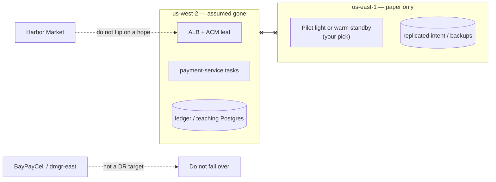

# DR-1403 — Regional outage tabletop

**Type:** ARCHITECT (tabletop — not an injected outage)  
**Module:** 14 — Security, High Availability and Disaster Recovery  
**Duration:** 60–90 minutes  
**Cost:** $0 (paper — **not** an awsLab apply)  
**Lessons:** L-14.6 (RTO, RPO and DR). Stands alone with TRUST.md.  
**Diagram:** AEJE-D-066 (Regional DR, RTO and RPO)  
**Trust notes:** [datasets/baypay-security/TRUST.md](../../datasets/baypay-security/TRUST.md)  
**Worksheet:** [student/worksheets/PF-dr.md](../../student/worksheets/PF-dr.md)

This is a **paper tabletop**. `us-west-2` is gone. You do not apply a stack in `us-east-1`. You do not fail over to `BayPayCell` / `dmgr-east`. You do not create multi-AZ RDS, NAT, or EKS “so DR is real.”

---

## Scenario

Priya Nair runs a 90-minute tabletop: the `us-west-2` control plane and data plane for `payment-service` are unreachable. Harbor Market is still trying to POST as Avery Chen (`11111111-1111-1111-1111-111111111111`, account `22222222-2222-2222-2222-222222222221`). Example in-flight payment `c1402b22-0000-4000-8000-111111111402` may be retried with the same `Idempotency-Key`.

Jordan Voss wants to “just flip DNS to `us-east-1`.” Sam Okada wants to apply a second-region copy of BUILD-1101 during the exercise. Morgan Hale offers `PaymentCluster` on `dmgr-east` “because the cell is already multi-member.” Riley Okonkwo wants RTO and RPO in writing before anyone touches a hosted zone.

You write the DR page so those three offers fail.

The page is [PF-dr.md](../../student/worksheets/PF-dr.md).

---

## Business context

Payments and merchant reporting are **different** workloads. A payment authorize/complete that double-charges Avery is worse than a reporting warehouse that is 12 hours stale. TRUST.md gives **starting** RPO/RTO numbers. You may argue with them if you write the business reason (Harbor Bike Co settlement window, chargeback risk, who pages).

Module 13’s operated SLO is still **99.9%**. ARCHITECT-1401’s architecture goal is **99.99%** in-region. A regional loss is a **DR / RTO** conversation. It is not proof that 99.99% “requires” a hot second region you apply in lab.

Leftover WebSphere ND (`BayPayCell`, `dmgr-east`, `PaymentCluster`) is on a Module 6 decommission path. It is **not** a DR target.

---

## Learning objectives

- Set **RPO** and **RTO** for payment authorize/complete versus merchant reporting, using TRUST.md as the start and arguing only with justification.
- Pick **one** regional pattern for payments: pilot light, warm standby, or backup-restore. Defend why the other two lost **this quarter**.
- Write the **data and idempotency** story: what is replicated, what Avery’s client retries, what you do with `c1402b22-0000-4000-8000-111111111402`.
- Write what you **do not** fail over: `BayPayCell`, `dmgr-east`, `PaymentCluster`, a student `apply` in `us-east-1`.
- Sequence the first 60 minutes on paper (declare, communicate, do not cut DNS on a hope).
- Record the tabletop on AEJE-D-066 and on PF-dr.md.

---

## Architecture

Course diagram **AEJE-D-066** is this regional split. Until the PNG is on disk, use the mermaid plus TRUST.md. Do not invent a second DNS zone or a second KMS alias (`alias/baypay-payments` stays the teaching name; say how you would **plan** a replica key, do not create one).



Alt text: us-west-2 holds the production ALB, payment-service tasks, and teaching datastore and is assumed gone. us-east-1 is a paper pilot light or warm standby with replicated intent or backups. BayPayCell and dmgr-east are marked as not a failover target. Merchants must not have DNS flipped on hope.

```text
Primary          us-west-2
Paper secondary  us-east-1
Payments host    payments.apps.baypay.example
Payments RTO     start at 60 minutes regional (TRUST.md)
Payments RPO     start at seconds (idempotent retry + replicated ledger intent)
Reporting        start at 24h RPO / 24h RTO, backup restore
ND cell          not a DR target
```

Serving path after a real failover (not this lab) would still be HTTPS on the teaching host, port `8080` in the task, Actuator liveness. It would not be `/payment` on `payment.ear`.

---

## Prerequisites

- TRUST.md DR table and “What you must not do.”
- ARCHITECT-1401 attempted (you know 99.99% ≠ automatic multi-region). You may still sit this tabletop first if you write that sentence here.
- Module 6 literacy: `BayPayCell` / `dmgr-east` are leftover, not a bunker.
- L-14.6 if present. This lab stands alone without a live account.

---

## Environment setup

```bash
test -f datasets/baypay-security/TRUST.md && echo "trust notes present"
test -f student/worksheets/PF-dr.md && echo "worksheet present"
```

No runtime. No `terraform apply` in `us-east-1`. No Route 53 failover record. No RDS read replica. Copy the worksheet or fill it in place. Do not open `solutions/DR-1403/` until RTO/RPO and a pattern pick have sentences.

Optional PAKS: `docs/16-cloud-architecture/multi-region-architecture.md`, `docs/18-reliability-and-resilience/overview.md`.

---

## Challenge/tasks

1. **Declare the scenario.** On PF-dr.md, write one paragraph: `us-west-2` is gone. Tasks, ALB, and the teaching datastore in that region are unreachable. Avery’s client will retry. You are not going to apply anything.
2. **RTO/RPO table.** Fill three rows: payment authorize/complete; merchant reporting; leftover `BayPayCell` / `dmgr-east`. Start from TRUST.md. If you change a number, write the Harbor Market / settlement justification in the same cell.
3. **Pattern pick.** Choose **pilot light**, **warm standby**, or **backup-restore** for **payments**. Write why that pattern matches your RTO. Write why the other two lost this quarter (cost, data freshness, or RTO miss). Reporting may keep backup-restore even if payments do not.
4. **Data and idempotency.** What is replicated or backed up (ledger intent, not PAN)? What happens when Avery retries `Idempotency-Key` for `c1402b22-0000-4000-8000-111111111402` after a regional cut? What must not double-authorize?
5. **Do-not-fail-over list.** Explicit sentences: no `PaymentCluster`, no `dmgr-east`, no student apply in `us-east-1`, no NAT/EKS/RDS apply, no disable-TLS “because DR.”
6. **First 60 minutes.** Numbered paper runbook: who declares SEV, who talks to merchant success, what you verify before any DNS thought, what you refuse. Priya, Riley, Sam, Jordan — use their roles; do not invent a new incident commander title unless you define it.
7. **99.99% vs DR.** One paragraph that does not collapse ARCHITECT-1401 into this page. In-region four nines can be multi-AZ. This page is “the region is gone.”
8. Transfer the table and paragraphs into [PF-dr.md](../../student/worksheets/PF-dr.md). Cite AEJE-D-066.

---

## Validation

Self-check before you open the instructor folder:

- Payments and reporting have different RTO/RPO (or you justified making them the same).
- `BayPayCell` / `dmgr-east` are **not** a failover target.
- One named pattern for payments, with losers written down.
- Idempotency / in-flight payment `c1402b22-…1402` is addressed.
- You did not apply `us-east-1`, Route 53, RDS, NAT, or EKS.
- 99.99% in-region and regional DR are separate sentences.
- Module 13 SLO is not silently rewritten to 99.99%.

Instructor scores with [instructor/rubrics/DR-1403.md](../../instructor/rubrics/DR-1403.md).

---

## Troubleshooting

- You only wrote “warm standby in us-east-1” with no RTO: pick numbers first. Pattern follows budget.
- You failed over to `PaymentCluster`: TRUST.md and Module 6 forbid it. Rewrite the do-not list.
- You applied a second-region ALB “to time the RTO”: that is a lab failure, not a measurement.
- You used the same 24-hour RPO for authorize and for reporting: explain chargeback risk or change payments.
- You treated this tabletop as proof that ARCHITECT-1401 was wrong: four nines is still allowed to be single-region multi-AZ.
- AEJE-D-066 PNG missing: the mermaid on this page is enough.
- You planned to store PAN in the replica: tokenize or never persist PAN (TRUST.md).

---

## Expected outcome

A one- to two-page DR strategy a Staff engineer could run the next tabletop from without opening `solutions/`. This is the **DR strategy** half of the Module 14 portfolio artifact. Security model and 99.99% stay on PF-security.md.

---

## Interview questions

1. What is the first sentence you say if someone offers `dmgr-east` as the DR site?
2. Why might payments be pilot light while reporting stays backup-restore?
3. What does Avery’s `Idempotency-Key` save you from after a regional retry storm?
4. Why is “flip Route 53 now” a poor first action in a tabletop?
5. How is this page different from ARCHITECT-1401’s 52-minute year?

---

## Architecture/trade-off questions

1. Pilot light versus warm standby — where does the money sit when `us-west-2` is healthy?
2. Backup-restore for payments — which TRUST.md RTO do you miss, and is that acceptable if you argue?
3. Replicated ledger intent versus async warehouse dumps — what is the RPO you are actually buying?
4. Why is a second KMS key alias a planning item and not a lab apply?
5. Active-active two-region payments — what new failure domain (split brain, dual authorize) did you just buy?

---

## Cleanup

No cloud resources. No second region to delete. Leave PF-dr.md in `student/worksheets/`. Do not delete TRUST.md. If a teammate applied `us-east-1` “to rehearse,” destroy it; this lab did not ask for it.

---

## Cost estimate

**$0.** Paper tabletop, locked synthetic trust notes, worksheet. No AWS. No Route 53 failover. No RDS replica. No required Terraform apply.

Warm standby in two regions is a **production** bill (second ALB, second Fargate, possibly a replica datastore). Pricing that sentence is literacy. Applying it in this lab is a failure. Forgotten ALB from Module 11 is still ~$0.54/day — not part of this grade path.

---

## Hidden/revealable solution

Write the RTO/RPO table and the pattern pick first. The full narrative lives in `solutions/DR-1403/`. Opening that folder before you write is a failed Diagnostic method score. After you have attempted the worksheet, you may reveal the compact starting numbers — they are not the scored argument.

<details>
<summary>Reveal TRUST.md starting numbers — after you have filled your table</summary>

| Workload | Starting RPO | Starting RTO | Starting pattern |
|---|---|---|---|
| Payment authorize / complete | Seconds (idempotent retry + replicated intent) | 60 minutes regional | Pilot light or warm standby |
| Merchant reporting | 24 hours | 24 hours | Backup restore |
| `BayPayCell` / `dmgr-east` | Not a DR target | Do not fail over to ND | Decommission (Module 6) |

If your page says “fail over to PaymentCluster” or “apply us-east-1 in the lab,” fix the worksheet before you read `solutions/`. The scored work is the argument and the do-not list — not this row.

</details>

---

## What you learned

A region gone is an RTO/RPO problem, not a slogan about four nines. Payments and reporting can (and usually should) buy different patterns. Idempotency is part of the data story. `BayPayCell` is not a bunker. Paper `us-east-1` is enough to pass. Active-active is a new failure domain, not extra credit.

---

## Portfolio deliverable

Completed [student/worksheets/PF-dr.md](../../student/worksheets/PF-dr.md). This is the Module 14 portfolio artifact: **DR strategy**. Do not paste `solutions/DR-1403/`.
