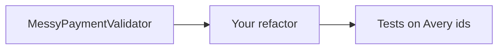

# FIX-103 — Refactor deliberately poor Java code

**Type:** BREAK/FIX  
**Module:** 1 — Enterprise Java Engineering  
**Duration:** 45–75 minutes  
**Lessons:** [L-1.4](../../course/modules/01-enterprise-java-engineering/lessons/L-1.4.md), [L-1.5](../../course/modules/01-enterprise-java-engineering/lessons/L-1.5.md)  
**Starter:** [starter/MessyPaymentValidator.java](starter/MessyPaymentValidator.java)

---

## Scenario

A contractor left BayPay a “temporary” validator that has been declining the wrong payments and occasionally reporting success after an internal error. Support cannot tell a frozen account from a `ClassCastException`. You must refactor the starter **without** changing the intended business rules from BUILD-102: amount, currency, active account, customer match, authorization ceiling.

This lab is a review simulation. The root-cause write-up lives in the instructor pack, not in this page.

---

## Business context

Avery Chen’s frozen account must still decline. Avery’s active account must still approve `25.00 USD`. A malformed amount must not return `true`. A mismatch between Avery and another customer’s account must fail closed.

Finance will not accept a validator that stores the last result in public fields on a shared instance. That is both a concurrency preview (Module 2) and a lying API.

---

## Learning objectives

- Identify production defects in Java that look like “it works in the demo.”
- Replace raw types, mutable shared state, null-unsafe calls, and swallowed exceptions.
- Split a God method into typed checks that throw or decline on purpose.
- Write tests that would have caught the contractor’s code.

---

## Architecture

The starter is a single class with one method that mutates `lastOk` / `lastReason` and a raw `List` / `Map`. Your result should look like a small domain service: immutable inputs, a typed result, no leftover scratch fields.

You may introduce records and exceptions. You may not add a Spring context.



---

## Prerequisites

- BUILD-102 attempted (you know the intended rules).
- JDK 21.

---

## Environment setup

```bash
export JAVA_HOME="${JAVA_HOME:-/opt/homebrew/opt/openjdk@21}"
cd labs/FIX-103
# compile the starter to confirm it is valid (if ugly) Java
javac --release 21 starter/MessyPaymentValidator.java
```

Copy the starter into your working file and refactor. Keep the original starter untouched so you can diff.

---

## Challenge/tasks

1. Read `starter/MessyPaymentValidator.java` end to end. List defects in your notes (do not publish a root-cause essay in a PR description that spoils classmates).
2. Refactor so that:
   - inputs are typed (`UUID`, `BigDecimal`, `String`, an account view)
   - results are a return value, not public mutable fields
   - exceptions are not swallowed
   - null money or null status fails closed with a clear error
   - no raw `List` / `Map`
   - no `==` on strings, no `double` amount compares
3. Cover Avery active approve, Avery frozen decline, mismatch, `JPY`, zero, null amount.
4. Confirm the starter’s method can still be used as a foil: your tests should fail if you point them at the unfixed class for the null-amount case.

Do not look for a clean file in this directory. There is not one.

---

## Validation

- `javac --release 21` succeeds on your refactored class.
- Tests express BUILD-102 outcomes.
- Grep your result for `catch (Exception` — that pattern should be gone.
- Grep for raw `List ` / `Map ` fields — gone.
- No public `lastOk` remaining.

---

## Troubleshooting

| Symptom | What to check |
|---|---|
| Null amount still “succeeds” | You kept a broad catch |
| Intermittent test order failures | You still store results on the instance |
| `usd` vs `USD` | Production currencies are exact uppercase codes |
| Cannot compile records | `--release 21` and a `record` inside the class or a sibling file |

---

## Expected outcome

A typed validator and a short defect list in your private notes. The student README does not include the cleaned class.

---

## Interview questions

1. Why are public `lastOk` fields a production defect even on a single thread?
2. What does `catch (Exception e) { return false; }` do to operations?
3. How do you explain a refactor to a staff engineer in three sentences without listing every smell?

---

## Architecture/trade-off questions

1. When is a God method a time-box compromise, and when is it a merge blocker on a payments service?
2. Should this validator be a Spring bean now, or stay a pure class until Module 3?
3. What would you still want in Module 2 even after this refactor?

---

## Cleanup

Leave `starter/MessyPaymentValidator.java` as the broken original. Do not “fix” the starter in place for classmates.

---

## Cost estimate

**$0** local.

---

## Hidden/revealable solution

This is a BREAK/FIX lab. The student guide does not include the cleaned implementation or a root-cause walkthrough.

See the instructor pack (`solutions/FIX-103/` and `instructor/rubrics/FIX-103.md`) after you have submitted your refactor.

---

## What you learned

- Review is a production skill: raw types, swallows, and mutable leftovers are incident fuel.
- A validator must not lie.
- Tests on synthetic Avery ids make the refactor measurable.

---

## Portfolio deliverable

Attach your refactored class and a five-bullet “defects I removed” list to your Module 1 folder. Do not paste the instructor solution. Optional: note one defect you would still want a senior to re-review.
