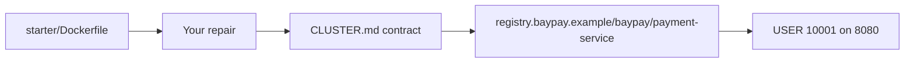

# FIX-902 — Repair poor Dockerfile

**Type:** BREAK/FIX  
**Module:** 09 — Containers for Java  
**Duration:** 45–75 minutes  
**Cost:** $0  
**Lessons:** L-9.3, L-9.5, L-9.7  
**Cluster notes:** [datasets/baypay-k8s/CLUSTER.md](../../datasets/baypay-k8s/CLUSTER.md)  
**Starter:** [starter/Dockerfile](starter/Dockerfile)

This lab is a review simulation. The student guide does **not** include a root-cause write-up or a cleaned Dockerfile. Docker or Podman is optional. You pass by repairing the file and a checklist.

---

## Scenario

A contractor dropped a “temporary” image recipe so Harbor Market could demo Avery Chen’s payment on a laptop. Sam Okada pulled the image and immediately opened a ticket: the artifact is enormous, `docker history` shows a database password, and the process is running as root. Riley Okonkwo will not put that tag on `pay-prod-east-2`.

You repair `labs/FIX-902/starter/Dockerfile` so it meets the CLUSTER.md image contract. You do not publish a defect essay that spoils classmates. The instructor pack holds the RCA.

---

## Business context

Avery Chen’s client (`11111111-1111-1111-1111-111111111111`) will keep retrying if the canary image is too slow to pull or too dangerous to run. A multi-gigabyte Ubuntu-shaped layer set delays every replica. A password in image history is a rotation incident the moment the tag is copied. A root JVM is the opposite of the UID `10001` contract operations already wrote down.

Finance will not accept “it started on my machine” as a registry review. The starter is valid-looking syntax that fails production review. That is the point.

---

## Learning objectives

- Observe production symptoms of a bad image (size, history, user) without being handed an answer key.
- Rewrite the Dockerfile so the runtime matches CLUSTER.md: JRE base, non-root user, no baked secret, no floating `latest` runtime.
- Keep the Maven Wrapper build; do not install a JDK with `apt` as the production story.
- Leave the starter file intact for the next student if you were asked to copy-out first.

---

## Architecture

The starter is one file that claims to run `payment-service`. Your result should look like BUILD-901’s intended shape: a JDK **build** stage (if you compile in-image) and a JRE **runtime** stage, numeric `USER`, credentials only at process start.



You may start from what you learned in BUILD-901. You may not paste `solutions/FIX-902/` before you inventory the starter yourself.

---

## Prerequisites

- BUILD-901 attempted (you know the intended image contract).
- CLUSTER.md for base, port, user, and config rules.
- A text editor. Docker is optional.

---

## Environment setup

```bash
test -f labs/FIX-902/starter/Dockerfile && echo "starter present"
```

Copy the starter. Keep the original for diff:

```bash
mkdir -p /tmp/aeje-fix-902
cp labs/FIX-902/starter/Dockerfile /tmp/aeje-fix-902/Dockerfile
```

Optional, not required — inspect symptoms if you already have an engine:

```bash
# extra credit: history and user, if you built a tag
# docker history <tag>
# docker inspect --format '{{.Config.User}}' <tag>
```

Do not open `solutions/FIX-902/` until you have a repaired file and a private defect list.

---

## Challenge/tasks

1. Read `starter/Dockerfile` end to end. In **private notes**, list what you would fail in a registry review. Do not publish that list in a PR description that classmates will copy.
2. Repair your working copy so the image can meet CLUSTER.md:
   - runtime base is a JRE 21 image, not a general desktop OS you then fill with packages
   - the process does not run as root
   - no database password is written into the file as an `ENV` (or `ARG` that becomes a layer)
   - the runtime tag is not `latest`
   - you do not copy the entire build context into the **runtime** stage
   - `WORKDIR`, `COPY`, and `USER` are present and the file stays parseable
3. If you compile in the image, use the Maven Wrapper from `reference-apps/baypay`, not `apt-get install maven`.
4. Confirm your file would fail a grep for the fake password string used in earlier modules.
5. Confirm a reviewer can still open the **unfixed** starter as a foil.

Do not look for a clean file in `labs/FIX-902/`. There is not one.

---

## Validation

You pass when all of the following are true on **your** Dockerfile (checklist — not a required build):

- [ ] Runtime `FROM` matches CLUSTER.md (`eclipse-temurin:21-jre`, tag or digest — not a floating `latest`).
- [ ] `USER` is a non-root numeric UID (course example `10001`).
- [ ] No database password literal remains in the file.
- [ ] The runtime stage copies the packaged JAR (or equivalent), not the whole build context.
- [ ] `FROM`, `WORKDIR`, `COPY`, and `USER` are present.
- [ ] `EXPOSE 8080` remains.
- [ ] You did not require Docker to pass.
- [ ] You did not set `-Xmx` equal to a memory limit.

Instructor scores with [instructor/rubrics/FIX-902.md](../../instructor/rubrics/FIX-902.md) after you submit.

---

## Troubleshooting

| Symptom | What to check |
|---|---|
| Image would be huge | You are still starting from a general OS and installing a JDK with the package manager, or you copied the whole tree into the final stage. |
| Secret appears in history | A credential was assigned in the Dockerfile. Removing a later line does not erase earlier layers if you already built; the file must not contain the assignment. |
| Process runs as root | There is no non-root `USER`, or `USER` comes too late, or you left `USER root`. |
| Tag keeps moving | The runtime `FROM` still says `latest`. |
| Optional build cannot find `mvnw` | Context is `reference-apps/baypay` if you compile in-image. |
| Tempted to `apt-get install curl vim` “for debug” | Out of scope and the next lab’s finding. |

The table names **symptoms** operations already reported. It is not an inventory of every starter line.

---

## Expected outcome

A repaired Dockerfile and a short defect list in your private notes. The student README does not include the cleaned file. A reviewer can diff your copy against the starter without opening the instructor pack.

---

## Interview questions

1. Why is “the container started” not a registry review?
2. What does a password in `docker history` do to rotation?
3. How do you explain a Dockerfile rewrite to a Staff engineer in three sentences without listing every smell?
4. Why is `USER root` a reliability problem as well as a security problem?

---

## Architecture/trade-off questions

1. When is a fat Ubuntu debug image a time-box compromise, and when is it a merge blocker on a payments service?
2. Rebuild in CI from `eclipse-temurin` versus “we already have a company Ubuntu golden image” — what do you owe reviewers either way?
3. Should FIX-902 also add a HEALTHCHECK now, or wait for Module 10 probes?
4. What would you still want SECURITY-903 to add after this repair?

---

## Cleanup

Leave `starter/Dockerfile` as the broken original. Do not “fix” the starter in place for classmates.

```bash
rm -rf /tmp/aeje-fix-902
```

If you built an optional local tag of the **broken** starter, delete that tag so you do not push it.

---

## Cost estimate

**$0** local. No AWS. No paid registry scan product. Optional Docker Desktop or Podman stays on the laptop.

---

## Hidden/revealable solution

This is a BREAK/FIX lab. The student guide does not include the cleaned Dockerfile or a root-cause walkthrough.

See the instructor pack (`solutions/FIX-902/` and `instructor/rubrics/FIX-902.md`) after you have submitted your repair.

---

## What you learned

- Review is a production skill: size, history, and user are incident fuel.
- A Dockerfile must not lie about secrets or identity.
- CLUSTER.md is the contract you repair toward, not a blog default of Ubuntu-plus-apt.

---

## Portfolio deliverable

Attach your repaired Dockerfile and a five-bullet “defects I removed” list to your Module 9 folder. Do not paste the instructor solution. Optional: note one defect you would still want SECURITY-903 to re-review. The written portfolio page remains [PF-container.md](../../student/worksheets/PF-container.md).
