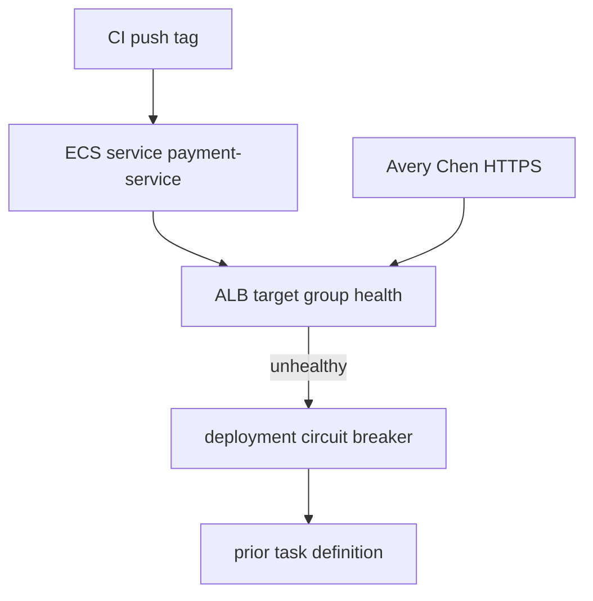

# INCIDENT-1205 — Failed deployment and rollback

**Type:** INCIDENT  
**Module:** 12 — Terraform, Ansible and CI/CD  
**Duration:** 45–75 minutes  
**Cost:** **$0** (pack path). **Real AWS bills if you poke a live account.**  
**awsLab:** yes — paper plus files; do not apply  
**Region:** `us-west-2`  
**Lessons:** L-12.6  
**Diagram:** AEJE-D-057 (Failed deployment and rollback)  
**Pack:** [incidents/aws/INC-AWS-1205](../../incidents/aws/INC-AWS-1205/README.md)  
**Account notes:** [datasets/baypay-aws/ACCOUNT.md](../../datasets/baypay-aws/ACCOUNT.md)

This student guide does **not** contain a root-cause answer. Work the evidence in gate order. Do not open `solutions/INCIDENT-1205/` until the worksheet is filled through remediation.

**Cost warning:** This lab is synthetic files. Do not `terraform apply`, do not create an ALB, and do not roll a live ECS service “to reproduce.” If you already have leftover Module 11 resources, destroy them on the lab’s cleanup path — not as an experiment during this incident.

---

## Scenario

14:07 Pacific on a synthetic `baypay-prod` afternoon in December 2026. Harbor Market reports HTTP 502/503 on `pay-alb-student.baypay.example` after a pipeline deploy. The pager names `payment-service` on ECS in `us-west-2`. Jordan Voss says CI went green. Priya Nair says the deployment is not staying healthy. You are the engineer on call. The incident pack is synthetic BayPay data.

---

## Business context

Avery Chen’s client (`11111111-1111-1111-1111-111111111111`, active USD account `22222222-2222-2222-2222-222222222221`) retries when a create payment does not return. A 502 from the ALB is not a domain decline. Finance does not care that the GitHub check was green. They care that the last **healthy** task definition is not what merchants are hitting — or that the roll is stuck failing health.

Do not bounce Postgres. Do not bounce `dmgr-east`. Do not push `:latest` from your laptop to “fix prod.” Intended port and health path live in [ACCOUNT.md](../../datasets/baypay-aws/ACCOUNT.md). A live AWS account is **not** required.

---

## Learning objectives

- Follow gated evidence: pipeline log first, then ECS deployments, then task-definition diff.
- Separate “CI was green” from “the target group is healthy.”
- Write stabilization that restores the last healthy task definition / image without inventing a new tag.
- Write remediation that belongs in the pipeline (BUILD-1204), not in a one-off console click.
- Produce a comms update that does not invent a database outage the files do not show.

---

## Architecture

Course diagram **AEJE-D-057** is this failure path. Until the PNG is on disk, use the mermaid below plus ACCOUNT.md.



Alt text: A CI tag reaches the ECS service. The ALB health check fails. The deployment circuit breaker moves the service back toward the prior task definition. Merchants hit the ALB, not the pipeline log.

### Service list

| Service | In this pack? | Live apply? |
|---|---|---|
| GitHub Actions / CI log | Yes — `pipeline.log` | No |
| ECS (Fargate) | Yes — describe-services paste | No |
| Elastic Load Balancing (ALB) | Yes — health on the teaching host | No |
| ECR | Named in the pipeline | No |
| RDS / NAT / EKS | No | Do not create |

### Region assumptions

`us-west-2`. Cluster `baypay-prod-west`. Service `payment-service`. Teaching ALB host `pay-alb-student.baypay.example`.

### Least-privilege / security notes

- On-call needs `ecs:DescribeServices`, `ecs:DescribeTaskDefinition`, `ecs:UpdateService` (rollback), and read on the pipeline. Not `AdministratorAccess`. Not `iam:CreateAccessKey`.
- Do not bake `BAYPAY_DB_*` into a new task def to “make health pass.”
- Do not commit AWS keys while you screenshot the console.

### Failure scenario

Skipping to the task-definition file before a written hypothesis, or “fixing” prod by pushing `:latest` from a laptop, fails Diagnostic method and Production awareness even if your eventual label matches the lab title.

---

## Prerequisites

- [ACCOUNT.md](../../datasets/baypay-aws/ACCOUNT.md) port and health paths.
- Incident worksheet: [student-worksheet.md](../../incidents/aws/INC-AWS-1205/student-worksheet.md).
- BUILD-1204 literacy (test job, SHA tags) helps; you may still work this pack first.
- Optional PAKS: `docs/17-kubernetes-and-platform-engineering/platform-engineering-and-gitops.md`. Lessons stand alone without it.

---

## Environment setup

No runtime required. Open the pack:

```text
incidents/aws/INC-AWS-1205/
  README.md
  timeline.json
  student-worksheet.md
  evidence/          # gated — see timeline.json "gates"
```

This pack is a **gated subset**. Gate 1 is the pipeline log. Gate 2 is ECS deployments. Gate 3 is the task-definition diff. The pack README documents what shipped and what was omitted.

Do not open `solutions/INCIDENT-1205/` until you have filled the worksheet through remediation.

Do not run `aws ecs update-service` against a paid account. The files are the cluster.

---

## Challenge/tasks

1. Read the pack README and `timeline.json`. Note who shipped, and when merchants saw 502/503.
2. **Gate 1:** open `evidence/pipeline.log` only. Record what was built, what was tagged, and whether a smoke step ran. Write a first hypothesis and the next investigation.
3. **Gate 2:** after that hypothesis, open `evidence/ecs-deployments.txt`. Update the hypothesis. Quote deployment status and the health check the target group uses. Do not close the RCA on “CI was green” alone.
4. **Gate 3:** open `evidence/task-def-diff.txt` only if it answers a question you already wrote about the new revision versus the last healthy one.
5. Write stabilization, remediation, and a 5-line comms update. Name people only as they appear in the timeline (Jordan Voss, Riley Okonkwo, Priya Nair, Sam Okada).
6. Optional: one sentence on pipeline smoke versus ECS circuit breaker — literacy only.

---

## Validation

A complete worksheet has all six fields: hypothesis (updated per gate), evidence, next investigation, stabilization, remediation, comms. A lucky “bad tag” with no quoted pipeline line and no quoted health check scores low on Diagnostic method (see rubric). Skipping to the task-definition diff before a written question also scores low. Opening the solution first fails Diagnostic method.

Instructor scores with [instructor/rubrics/INCIDENT-1205.md](../../instructor/rubrics/INCIDENT-1205.md).

---

## Troubleshooting

- You jumped to later files: stop, write what you *would* have asked, then continue.
- CI is green and merchants see 502: the pipeline log is not the target group. Read deployments next.
- You want to bounce Postgres or `dmgr-east`: re-read ACCOUNT.md. This pack omitted database metrics on purpose.
- You want to push `:latest` from a laptop: write the blast radius. Prefer the last healthy task definition.
- You copied INCIDENT-1104’s ALB story (if you have taken it): this pack’s first file is a **pipeline** log, not a security-group paste.
- You want `aws ecs update-service` against a shared account: write the change on paper. This lab does not require AWS.

---

## Expected outcome

A written diagnosis path an instructor can score. You may be wrong on the first hypothesis; you may not skip gates. The student guide will not tell you which tag or port is wrong.

---

## Interview questions

1. Why is “the pipeline was green” a weak first sentence when the ALB is 502?
2. What does an ECS deployment circuit breaker actually roll back to?
3. Why can a container be Running and still fail the target group?
4. When do you revert the task definition versus shipping a new image?
5. How would a pipeline smoke test have failed this roll before merchants saw 502?

---

## Architecture/trade-off questions

1. Circuit-breaker rollback versus a manual `update-service --task-definition` — who is faster, who leaves a stuck PRIMARY?
2. Immutable SHA tags versus `:latest` on the same repository — what can you no longer prove in ECR?
3. Should the smoke test hit the **task** port or only `/actuator/health` on localhost in CI?
4. Why is “scale the service to zero and back” a poor stabilization when a prior revision is already healthy?

---

## Cleanup

None for the pack. Do not delete the evidence files. No cloud resources to tear down on the grade path.

If you ignored the cost warning and touched a live account, destroy leftover ALB, ECS services, and ECR images in `us-west-2` now. Empty ECR still has storage cost after a push.

---

## Cost estimate

**Grade path: $0.** Synthetic files only. No AWS API. No required GitHub runner.

**Misuse path:** live ECS/ALB experiments are dollars per day (ALB) plus Fargate hours. Do not do that for this lab.

---

## Hidden/revealable solution

The student guide does not include the answer. Submit the worksheet first. Instructors use `solutions/INCIDENT-1205/` and `instructor/rubrics/INCIDENT-1205.md`. Opening the solution before you write is a failed diagnostic method score.

---

## What you learned

A green pipeline is not a healthy target group. Stabilization (last healthy task definition) is a different sentence from remediation (smoke on the ACCOUNT.md port; immutable tags). A lucky “rollback” label does not replace gate order. AEJE-D-057 is that split.

---

## Portfolio deliverable

Attach the completed INC-AWS-1205 worksheet. The Module 12 portfolio artifact is [student/worksheets/PF-iac.md](../../student/worksheets/PF-iac.md): record stabilize versus remediate there **in your words**, not by pasting the instructor RCA.
