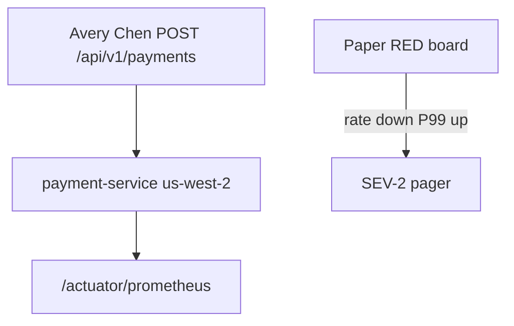

# INCIDENT-1301 — Throughput collapse and P99 latency spike

**Type:** INCIDENT  
**Module:** 13 — Production Engineering and Observability  
**Duration:** 45–75 minutes  
**Cost:** **$0** (pack path). **Real AWS or AMP bills if you poke a live account.**  
**awsLab:** no — paper plus files; do not apply  
**Region:** `us-west-2` if named  
**Lessons:** L-13.2, L-13.4, L-13.6  
**Diagram:** AEJE-D-062 (Throughput collapse and P99 spike)  
**Pack:** [incidents/production/INC-PROD-1301](../../incidents/production/INC-PROD-1301/README.md)  
**Ops notes:** [datasets/baypay-ops/OBSERVABILITY.md](../../datasets/baypay-ops/OBSERVABILITY.md)  
**Worksheet (portfolio):** [student/worksheets/PF-ops.md](../../student/worksheets/PF-ops.md)

This student guide does **not** contain a root-cause answer. Work the evidence in gate order. Do not open `solutions/INCIDENT-1301/` until the worksheet is filled through remediation.

**Cost warning:** This lab is synthetic files. Do not create an AMP workspace, do not scrape a paid Prometheus, and do not bounce a live `payment-service` “to reproduce.” If you already have leftover Module 11–12 resources, destroy them on those labs’ cleanup paths — not as an experiment during this incident.

---

## Scenario

10:22 Pacific (18:22 UTC) on a synthetic `baypay-prod` afternoon, **2026-12-18**. Harbor Market reports that `POST /api/v1/payments` feels stuck: creates that usually return in about a tenth of a second now take several seconds. Completions have dropped hard. The pager names `payment-service` in `us-west-2`. 5xx are **not** what merchant success is calling about. Jordan Voss says a 3.9.0 roll went out on ticket BAYPAY-13011. Priya Nair says the RED board looks wrong in a way a typical error page does not. You are the engineer on call. The incident pack is synthetic BayPay data.

---

## Business context

Avery Chen’s client (`11111111-1111-1111-1111-111111111111`, active USD account `22222222-2222-2222-2222-222222222221`) retries when a create payment does not return. Example payment `c1300a11-0000-4000-8000-111111111300`. A late **201** is still a missed authorization window for Harbor Market. Finance does not care that actuator still answers. They care that throughput collapsed and P99 left the 400 ms teaching SLO.

Do not bounce Postgres. Do not bounce `dmgr-east`. Do not treat the first red graph as “the database” or as the Module 8 DEBUG-toString pack until a file you have already opened supports that sentence. A live AWS account is **not** required. A live Grafana is **not** required.

---

## Learning objectives

- Follow gated evidence: RED dashboard first, then scrape/JVM numbers, then the last file only if it answers a question you already wrote.
- Separate “throughput and P99 moved” from “5xx is the page.”
- Write stabilization that restores the last healthy image (or removes the change the files support) without inventing a database outage.
- Write remediation that belongs in meter/dashboard review, not in a one-off console bounce.
- Produce a comms update that does not announce GC, a leak, or a Postgres stall the files do not show.

---

## Architecture

Course diagram **AEJE-D-062** is this failure path. Until the PNG is on disk, use the mermaid below plus OBSERVABILITY.md.



Alt text: Merchants call payment-service in us-west-2. The paper RED board shows completions down and P99 up. The pager fires. Actuator scrape is part of the path. The student guide does not name a root cause.

### Service list

| Service | In this pack? | Live apply? |
|---|---|---|
| payment-service (Boot) | Yes — symptoms and scrapes | No |
| Paper Grafana / RED | Yes — `dashboards-red.txt` | No |
| JVM / scrape paste | Yes — gated file | No |
| Meter / config snippet | Yes — last gate | No |
| RDS / Postgres | No | Do not bounce |
| `dmgr-east` / Liberty cell | No | Do not bounce |
| AMP / CloudWatch | Named only | Do not create |

### Region assumptions

`us-west-2`. Service `payment-service`. Golden URI `POST /api/v1/payments`. Teaching SLO: P99 **< 400 ms**, availability **99.9%** (OBSERVABILITY.md). Last image named on the timeline is **3.8.4** before the 3.9.0 roll.

### Least-privilege / security notes

- On-call needs read on dashboards, scrape targets, and the release ticket. Deploy rollback if you have it. Not `AdministratorAccess`.
- Do not put PAN or a live `BAYPAY_DB_PASSWORD` on the worksheet.
- Do not dump heap or attach a profiler to a paid JVM “to be thorough.”

### Failure scenario

Skipping to the last evidence file before a written hypothesis, or “fixing” prod by bouncing Postgres or `dmgr-east`, fails Diagnostic method and Production awareness even if your eventual label matches a hallway rumor.

---

## Prerequisites

- [OBSERVABILITY.md](../../datasets/baypay-ops/OBSERVABILITY.md) RED/USE/SLO names.
- Incident worksheet: [student-worksheet.md](../../incidents/production/INC-PROD-1301/student-worksheet.md).
- BUILD-1300 literacy (what the home board should show) helps; you may still work this pack first.
- Optional PAKS: `docs/19-observability/overview.md`, `docs/27-production-failures/overview.md`. Lessons stand alone without them.

---

## Environment setup

No runtime required. Open the pack:

```text
incidents/production/INC-PROD-1301/
  README.md
  timeline.json
  student-worksheet.md
  evidence/          # gated — see timeline.json "gates"
```

This pack is a **gated subset**. Gate 1 is the RED dashboard paste. Gate 2 is scrape and JVM numbers. Gate 3 is the meter-registration snippet. The pack README documents what shipped and what was omitted.

Do not open `solutions/INCIDENT-1301/` until you have filled the worksheet through remediation.

Do not run `aws` or `kubectl` against a paid account. The files are the cluster.

---

## Challenge/tasks

1. Read the pack README and `timeline.json`. Note who shipped, which image is on the board, and when merchants felt the stall. Quote times in UTC or Pacific; stay consistent.
2. **Gate 1:** open `evidence/dashboards-red.txt` only. Record rate, P99, and whether 5xx dominate. Write a first hypothesis and the next investigation.
3. **Gate 2:** after that hypothesis, open `evidence/scrape-and-jvm.txt`. Update the hypothesis. Quote scrape duration, series count, and heap/CPU. Do not close the RCA on “bad deploy” or “GC” alone.
4. **Gate 3:** open `evidence/meter-registration.txt` only if it answers a question you already wrote about what 3.9.0 registered.
5. Write stabilization, remediation, and a 5-line comms update. Name people only as they appear in the timeline (Jordan Voss, Riley Okonkwo, Priya Nair, Sam Okada).
6. Optional: one sentence contrasting this pack with INCIDENT-805 (DEBUG overlay / allocation) — literacy only, and only if a file you opened actually differs.

---

## Validation

A complete worksheet has all six fields: hypothesis (updated per gate), evidence, next investigation, stabilization, remediation, comms. A lucky “database,” “GC,” or “just a bad deploy” with no quoted scrape duration, no quoted series count, and no quoted label names from the last file scores low on Diagnostic method (see rubric). Skipping to `meter-registration.txt` before a written question also scores low. Opening the solution first fails Diagnostic method.

Instructor scores with [instructor/rubrics/INCIDENT-1301.md](../../instructor/rubrics/INCIDENT-1301.md).

---

## Troubleshooting

- You jumped to later files: stop, write what you *would* have asked, then continue.
- Throughput is down and 5xx are quiet: the error tile is not the only RED signal. Re-read rate and P99.
- Heap and CPU are up: that is a measurement, not yet INCIDENT-805. Ask what the scrape file shows that a GC log would not.
- You want to bounce Postgres or `dmgr-east`: re-read OBSERVABILITY.md. This pack omitted database metrics on purpose.
- You want to scale the service to 20 tasks from your laptop: write the blast radius. Prefer the last healthy image named on the timeline.
- You copied INCIDENT-1205’s port-mismatch story: this pack’s first file is a **RED dashboard**, not a pipeline log.
- You want a live Prometheus to “confirm series”: write the numbers from the paste. This lab does not require AMP.

---

## Expected outcome

A written diagnosis path an instructor can score. You may be wrong on the first hypothesis; you may not skip gates. The student guide will not tell you which meter tags or which scrape budget broke.

---

## Interview questions

1. Why can P99 and throughput move together while 5xx stay boring?
2. What does a scrape-duration jump tell you that a heap graph does not?
3. When do you roll back to the last healthy image versus “tune GC” on the new one?
4. Why is “the deploy is bad” a weak sentence if you cannot quote a file?
5. How would BUILD-1300’s home board have changed the first five minutes of this page?

---

## Architecture/trade-off questions

1. Roll back the image versus disable a meter tag in config and stay on 3.9.0 — who is faster, what do you still owe merchants?
2. Recording rules and a scrape budget versus scraping every Micrometer timer raw — what fails first under load?
3. Should on-call page on series count / scrape duration, or only on SLO burn?
4. Why is “take a heap dump now” a poor next step when the omitted-evidence table already said heap dump is out of scope?
5. Why is bouncing `dmgr-east` unrelated even if Liberty still exists in the estate?

---

## Cleanup

None for the pack. Do not delete the evidence files. No cloud resources to tear down on the grade path.

If you ignored the cost warning and touched a live account, destroy leftover AMP workspaces, Grafana Cloud trials, and ECS experiments in `us-west-2` now.

---

## Cost estimate

**Grade path: $0.** Synthetic files only. No AWS API. No required Grafana.

**Misuse path:** live AMP, Managed Grafana, or “reproduce on prod” are dollars per day. Do not do that for this lab.

---

## Hidden/revealable solution

The student guide does not include the answer. Submit the worksheet first. Instructors use `solutions/INCIDENT-1301/` and `instructor/rubrics/INCIDENT-1301.md`. Opening the solution before you write is a failed diagnostic method score.

---

## What you learned

Throughput and P99 can page while 5xx stay quiet. Stabilization (last healthy image, or removing the change the files support) is a different sentence from remediation (what you will not register on a timer next time). A lucky “bad deploy” label does not replace gate order. AEJE-D-062 is that split.

---

## Portfolio deliverable

Attach the completed INC-PROD-1301 worksheet. The Module 13 portfolio artifact is [student/worksheets/PF-ops.md](../../student/worksheets/PF-ops.md): record **your** quotes, stabilize versus remediate, **in your words**, not by pasting the instructor RCA.
